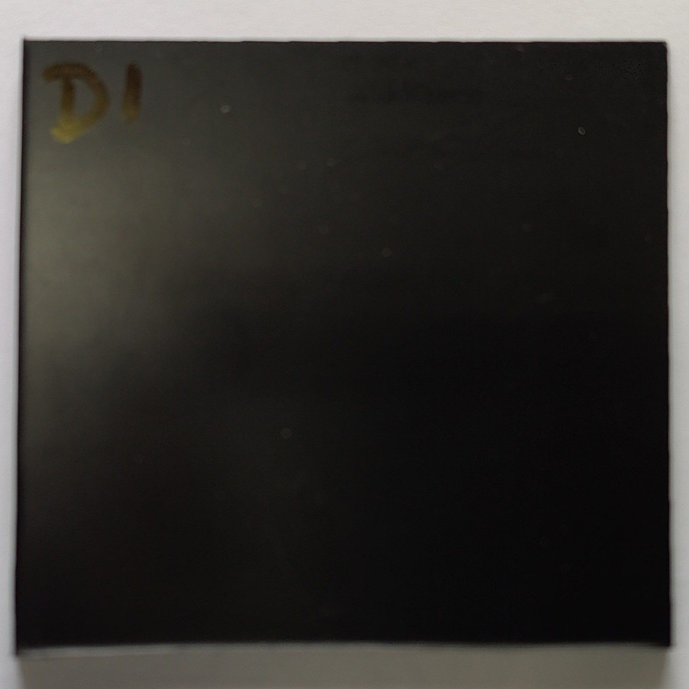
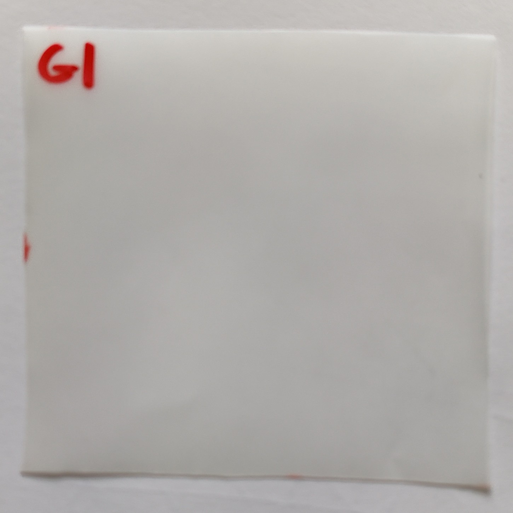
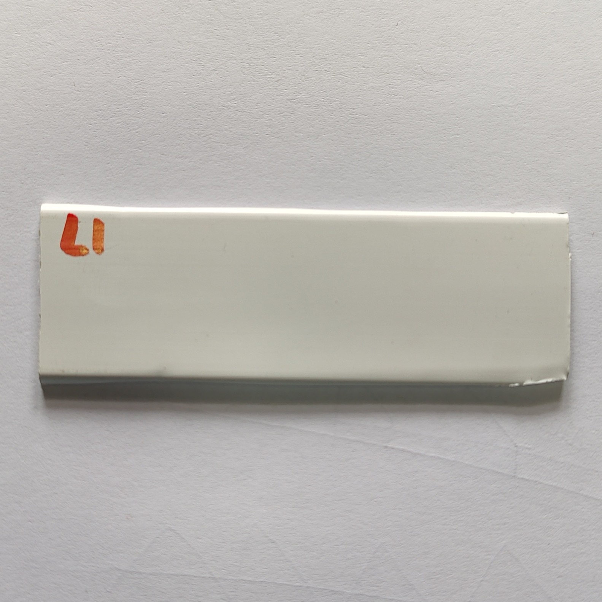
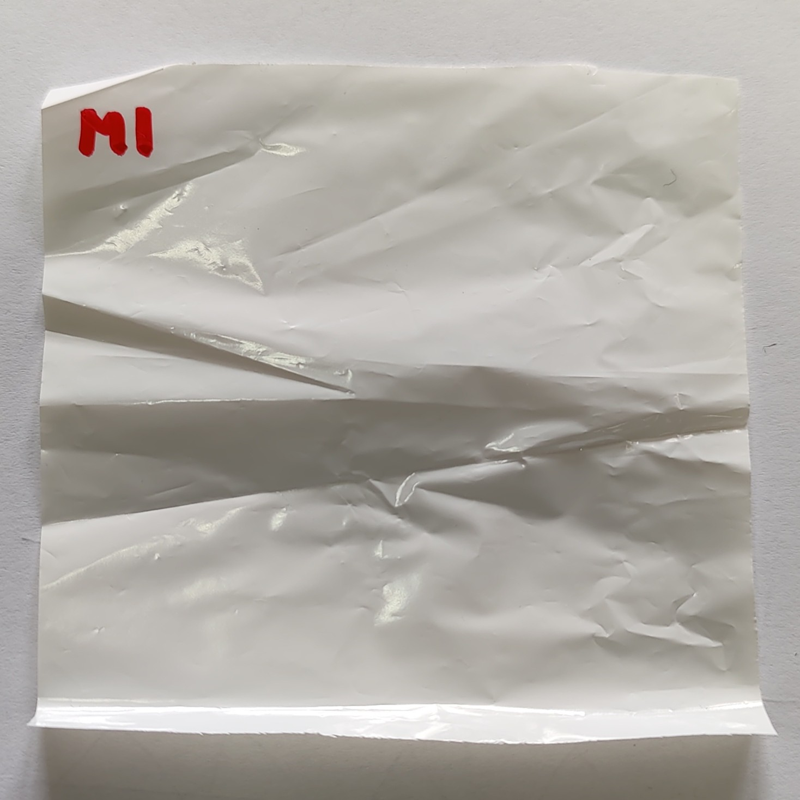
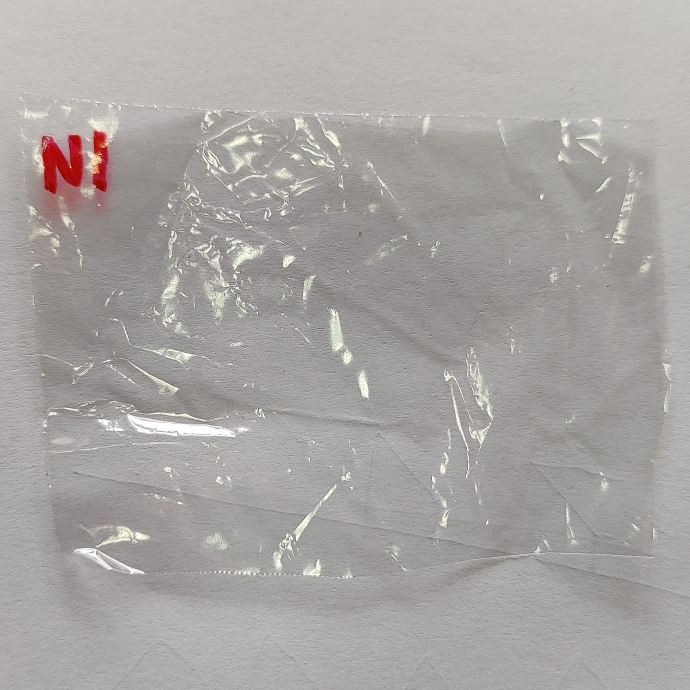

# PLASTICS-THz

## Overview

This project involves a series of **spectroscopy tests** conducted on various plastic samples across multiple experiments, measuring transmission properties in the frequency range from 100GHz to 600GHz.

On [data](data/) folder the raw and processed experimental data can be found.

# [Experiment 1 - Plastics](data/experiment_1_plastics/)

Samples of several plastics materials are measured, from 100GHz to 600Ghz.

## Tests Conducted

- **Test_01**: Sweep without sample
- **Test_02 to Test_15**: Sweeps with different samples (A1 to N1)

All tests consists on two measurement steps:

1. 120s sweep from 100 to 210 GHz
2. 60s sweep from 210 to 600 GHz

## Detailed Information

For more details on the setup, samples, and data collected, please refer to the [data/experiment_1_plastics/README.md](data/experiment_1_plastics/README.md) file.

# [Experiment 2 - Plastics](data/experiment_2_plastics/)

This experiment focuses on a subset of plastic materials (primarily E and H samples) with multiple measurements.

## Tests Conducted

- **Test 1**: Reference sweep without sample
- **Test 2-14**: Sweeps with samples E1, E3, E4, H1, H2, H3

All tests consist of two measurement steps:
1. 65s sweep from 100 to 210 GHz (First 50s and last 3s removed due to stabilization issues)
2. 35s sweep from 210 to 600 GHz (First 20s and last 3s removed due to stabilization issues)

## Detailed Information

For more details on the setup, samples, and data collected, please refer to the [data/experiment_2_plastics/README.md](data/experiment_2_plastics/README.md) file.

# [Experiment 3 - Repeatability](data/experiment_3_repeatibility/)

This experiment focuses on repeatability by conducting multiple reference measurements without samples.

## Tests Conducted

- **Test 1-15**: Sweeps without samples, used as reference measurements

All tests consist of two measurement steps with specific frequency observations.

## Detailed Information

For more details on the setup and data collected, please refer to the [data/experiment_3_repeatibility/README.md](data/experiment_3_repeatibility/README.md) file.

# [Experiment 4 - Plastics](data/experiment_4_plastics/)

This experiment tests a selected subset of plastic samples (B1, E3, C1) with multiple repetitions.

## Tests Conducted

- **Test 1, 8, 15, 16, 23**: Reference sweeps without samples
- **Test 2-7, 9-14, 17-22**: Sweeps with samples B1, E3, and C1

All tests consist of two measurement steps following the same protocol as Experiment 2.

## Detailed Information

For more details on the setup, samples, and data collected, please refer to the [data/experiment_4_plastics/README.md](data/experiment_4_plastics/README.md) file.

# [Experiment 5 - Plastics](data/experiment_5_plastics/)

This is the most extensive experiment, with 60 tests conducted over 5 days, measuring multiple samples with repeated measurements.

## Tests Conducted

- **Test 1-60**: Sweeps with various samples (A1-A5, B1-B5, C1-C5, etc.)

All tests consist of two measurement steps following the same protocol as Experiment 2.

## Detailed Information

For more details on the setup, samples, and data collected, please refer to the [data/experiment_5_plastics/README.md](data/experiment_5_plastics/README.md) file.

## Sample Materials

The project tests various plastic and composite materials including:

| Sample | Description                                                                      | Image |
|:------:| -------------------------------------------------------------------------------- | ----- |
| A      | PE/tie/EVOH/tie/PE/Adhesivo/PE/tie/EVOH/tie/PE (0.2mm)                           |  |
| B      | PE/tie/EVOH/tie/PE (Admer AT1707E) (0.57mm)                                      |  |
| C      | ABS+PC (2.05mm) **white; opaque                                                  |  |
| D      | ABS (3.0mm) **black; opaque                                                      |  |
| E      | Ecovio/PVOH/Ecovio (0.1mm per layer) *Multiple samples (E1-E6)                   |  |
| F      | PP/tie/EVOH/tie/PP (tupper) (0.27-0.31mm)                                        |  |
| G      | PHB/PVOH/Ecovio (0.1mm per layer) *Multiple samples (G1-G6)                      |  |
| H      | PP/tie/EVOH/tie/PP (0.07mm) *Multiple samples (H1-H5)                            |  |
| I      | PS (0.36mm) **scratched                                                          |  |
| J      | LDPE (0.07mm) **wrinkled                                                         |  |
| K      | PC (2.25mm) **half-section                                                       |  |
| L      | PVC (1.85mm) **opaque; white; half-section                                       |  |
| M      | PP carga (0.04mm) **white, wrinkled                                              |  |
| N      | PP (0.04mm) **wrinkled                                                           |  |
| O      | PET (0.12mm)                                                                     |  |

*Additional sample variations (B2, E2, E3, G2, G3, H2) are available in the image folder.*
## Contact

- **Researcher**: Daniel Moreno París
- **Email**: danmoren@pa.uc3m.es
