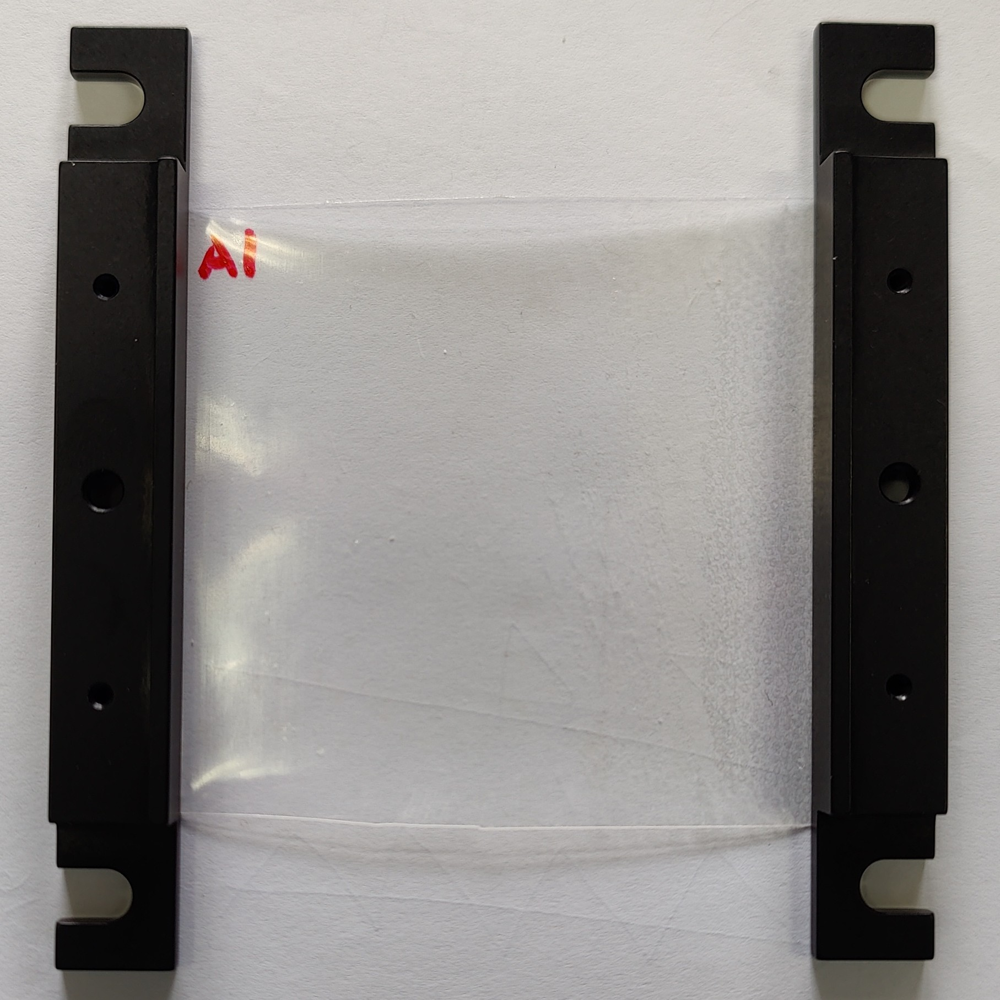
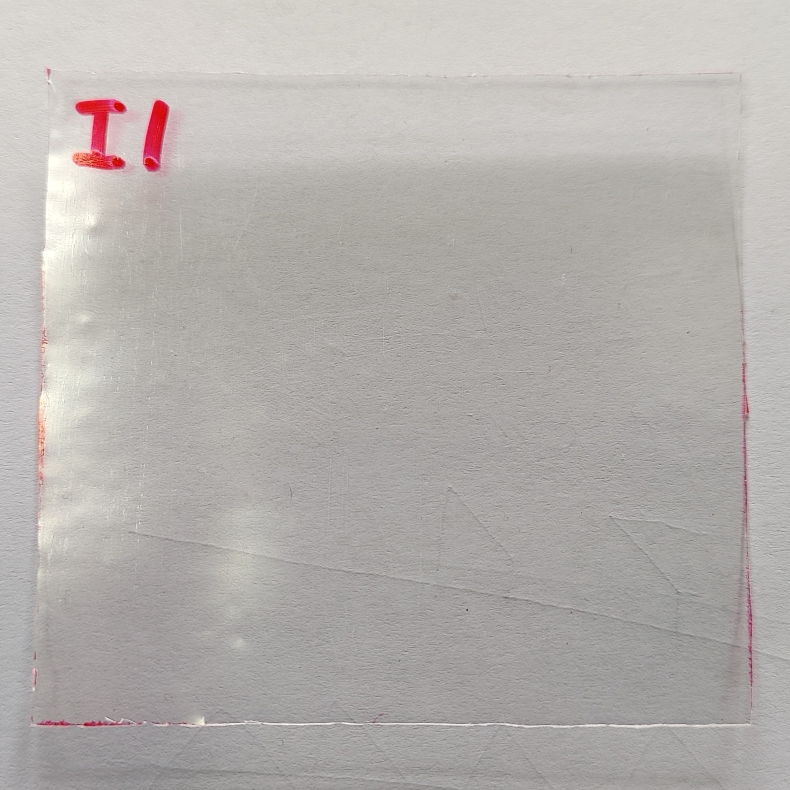
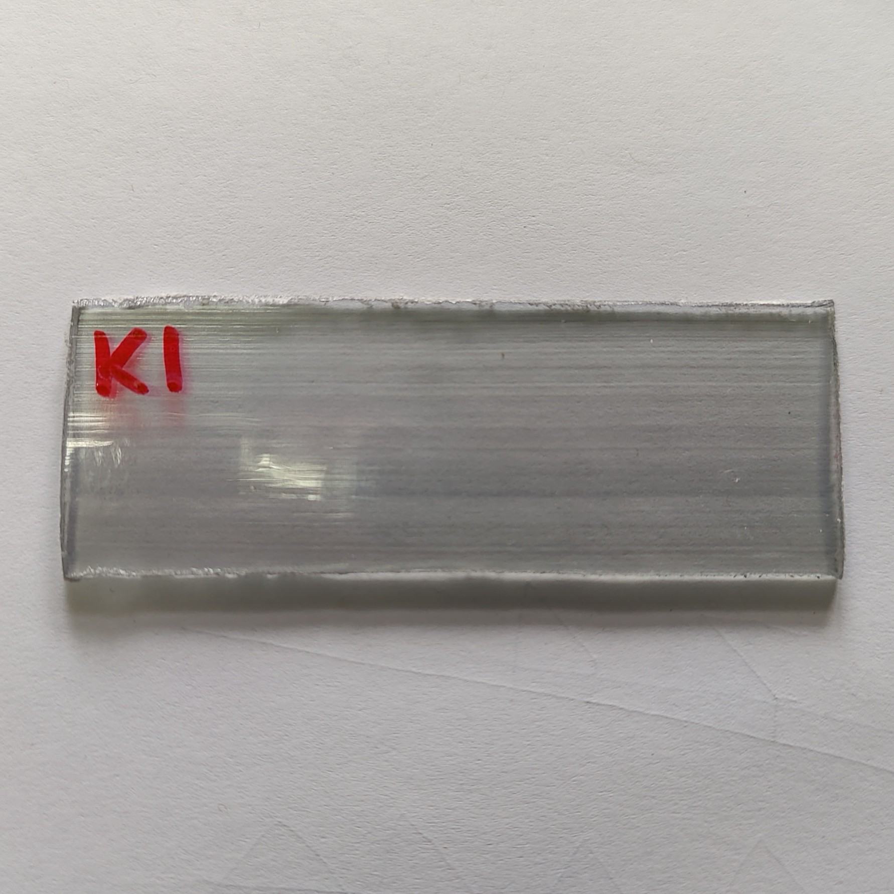

# Experiment 1

## Description
  - Test_01: Sweep without sample

  - Test_02: Sweep with sample A1

  - Test_03: Sweep with sample B1

  - Test_04: Sweep with sample C1

  - Test_05: Sweep with sample D1

  - Test_06: Sweep with samples E1 (1 layer), E2 (2 layers) and E3 (1 layer)

  - Test_07: Sweep with sample F1

  - Test_08: Sweep with sample G1

  - Test_09: Sweep with sample H1

  - Test_10: Sweep with sample I1

  - Test_11: Sweep with sample J1

  - Test_12: Sweep with sample K1

  - Test_13: Sweep with sample L1

  - Test_14: Sweep with sample M1

  - Test_15: Sweep with sample N1

  All tests are carried out in 2 steps:

    1st step: 120s sweep from 100 to 210 GHz
    2nd step: 60s sweep from 210 to 600 GHz

## Date
- 26/09/2024 - Test 01 to 04 (not registered)
- 27/09/2024 - Test 05 (not registered)
- 30/09/2024 - Test 06 to 08 (24ºC, 31.0 %RH)
- 01/10/2024 - Test 09 to 10 (23ºC, 37.0 %RH)
- 02/10/2024 - Test 11 to 15 (25ºC, 49.0 %RH)

## Setup
- **Equipment Used**: Spectroscopy setup with PCA and Schottky detector
- **Environment**: // Any specific environmental conditions (e.g., temperature, humidity, etc.)
- **Experiment Variables**: // Define the independent and dependent variables, and any controlled variables.

## **Sample/Material**: 

| Sample | Description | Image |
|:------:|-------------|-------|
| A      | PE/tie/EVOH/tie/PE/Adhesivo/PE/tie/EVOH/tie/PE (0.2mm) |  |
| B      | PE/tie/EVOH/tie/PE (Admer AT1707E) (0.57mm) |  |
| C      | ABS+PC (2.05mm) **white; opaque|  |
| D      | ABS (3.0mm) **black; opaque |  |
| E      | Ecovio/PVOH/Ecovio (0.1mm per layer) *Available E2 (2x layers) and E3 (1x layer) |  |
| F      | PP/tie/EVOH/tie/PP (tupper) (0.27-0.31mm) |  |
| G      | PHB/PVOH/Ecovio (0.1mm per layer) *Available G2 (2x layers) and G3 (1x layer) |  |
| H      | PP/tie/EVOH/tie/PP (0.07mm) *Available H2 (1x layer) |  |
| I      | PS (0.36mm) **scratched|  |
| J      | LDPE (0.07mm) **wrinkled |  |
| K      | PC (2.25mm) **half-section |  |
| L      | PVC (1.85mm) **opaque; white; half-section |  |
| M      | PP carga (0.04mm) **white, wrinkled |  |
| N      | PP (0.04mm) ** wrinkled |  |

## Data Collection
- **Frequency/Interval**: Integration Time = 5ms
- **Format**: LVM with headers

## Notes
- It gets more data at the end of the recording as the shutdown is manually done

## Performer Contact
- **Researcher**: Daniel Moreno París
- **Email**: danmoren@pa.uc3m.es