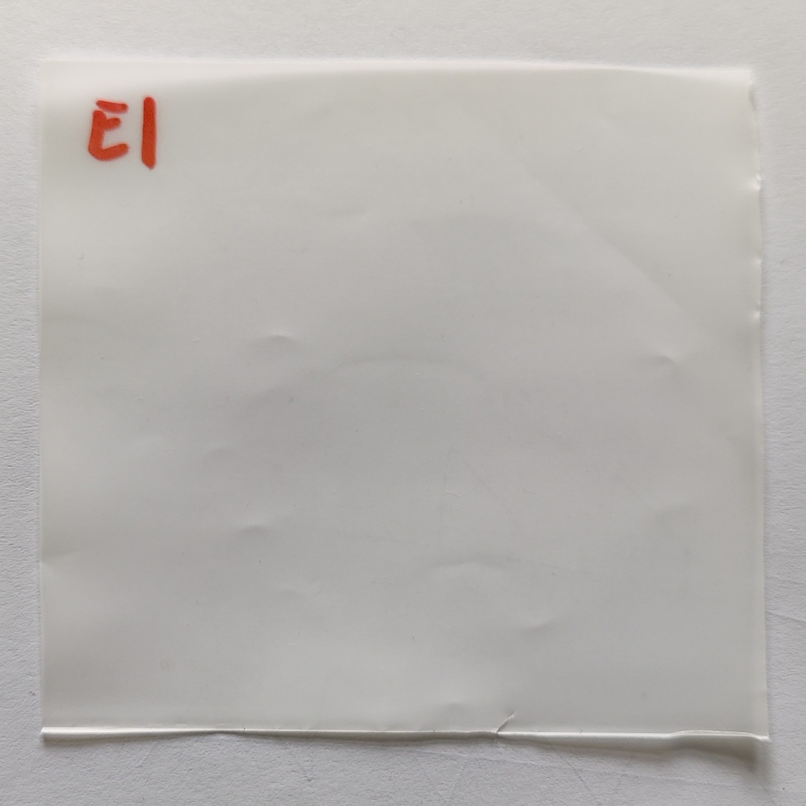

# Experiment 2 

## Description
  - Test 1: Sweep without sample --> REF_1
  - Test 2: Sweep with sample E1 --> E1_1
  - Test 3: Sweep with sample E3 --> E3_1
  - Test 4: Sweep with sample H1 --> H1_1
  - Test 5: Sweep with sample H1 --> H1_2
  - Test 6: Sweep with sample E4 --> E4_1
  - Test 7: Sweep with sample H3 --> H3_1
  - Test 8: Sweep with sample H2 --> H2_1
  - Test 9: Sweep without sample --> REF_2
  - Test 10: Sweep with sample E1 --> E1_2
  - Test 11: Sweep with sample E4 --> E4_2
  - Test 12: Sweep with sample H3 --> H3_2
  - Test 13: Sweep with sample H2 --> H2_2
  - Test 14: Sweep with sample E3 --> E3_2

  All tests are carried out in 2 steps:

    1st step: 65s sweep from 100 to 210 GHz (First 50s and last 3s are removed due to stabilization issues)
    2nd step: 35s sweep from 210 to 600 GHz (First 20s and last 3s are removed due to stabilization issues)

## Date
- 17/10/2024 - Test 1 to 4 (21.5ºC, 52.0-61.0 %RH)
- 18/10/2024 - Test 5 to 10 (21.0ºC, 46.0-50.0 %RH)
- 21/10/2024 - Test 11 to 14 (22.5ºC, 54.0-55.0 %RH)

## Setup
- **Equipment Used**: Spectroscopy setup with PCA and Schottky detector
- **Environment**: // Any specific environmental conditions (e.g., temperature, humidity, etc.)
- **Experiment Variables**: // Define the independent and dependent variables, and any controlled variables.

## **Sample/Material**: 

| Sample | Description | Image |
|:------:|-------------|-------|
| E      | Ecovio/PVOH/Ecovio (0.1mm per layer) *Available E2 (2x layers) and E3, E4 and E5 (1x layer) |  |
| H      | PP/tie/EVOH/tie/PP (0.07mm) *Available H2 and H3 (1x layer) |  |

## Data Collection
- **Frequency/Interval**: Integration Time = 5ms
- **Format**: LVM with headers

## Notes

## Performer Contact
- **Researcher**: Daniel Moreno París
- **Email**: danmoren@pa.uc3m.es