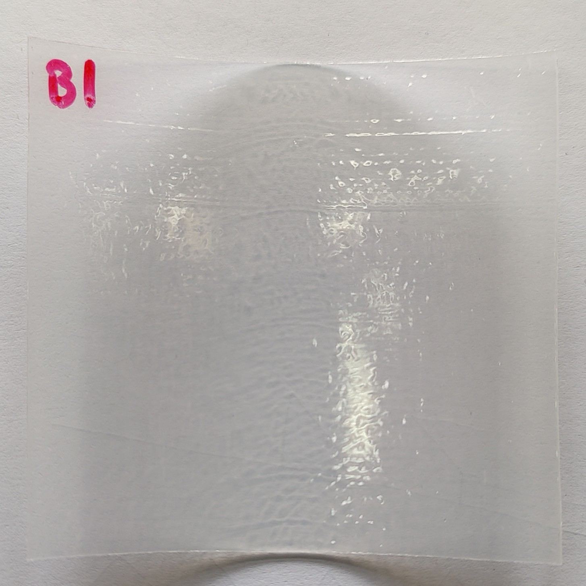

# Experiment 4

## Description
  - Test 1: Sweep without sample --> REF_1
  - Test 2: Sweep with sample B1 --> B1_2
  - Test 3: Sweep with sample E3 --> E3_3
  - Test 4: Sweep with sample C1 --> C1_4
  - Test 5: Sweep with sample B1 --> B1_5
  - Test 6: Sweep with sample E3 --> E3_6
  - Test 7: Sweep with sample C1 --> C1_7
  - Test 8: Sweep without sample --> REF_8
  - Test 9: Sweep with sample B1 --> B1_9
  - Test 10: Sweep with sample E3 --> E3_10
  - Test 11: Sweep with sample C1 --> C1_11
  - Test 12: Sweep with sample B1 --> B1_12
  - Test 13: Sweep with sample E3 --> E3_13
  - Test 14: Sweep with sample C1 --> C1_14

  All tests are carried out in 2 steps:

    1st step: 65s sweep from 100 to 210 GHz (First 50s and last 3s are removed due to stabilization issues)
    2nd step: 35s sweep from 210 to 600 GHz (First 20s and last 3s are removed due to stabilization issues)

## Date
-- 03/12/2024 - Test 1 (24.5ºC, 40.0 %RH), Test 2 (24.2ºC, 40.6 %RH), Test 3 (24.9ºC, 41.1 %RH), Test 4 (24.8ºC, 38.5 %RH), Test 5 (24.8ºC, 40.9 %RH), Test ( 6 (25.0ºC, 40.7 %RH), Test 7 (25.3ºC, 40.8 %RH)
-- 05/12/2024 - Test 8 (22.0ºC, 33.8 %RH), Test 9 (22.8ºC, 32.4 %RH), Test 10 (23.2ºC. 32.6 %RH), Test 11* (24.1ºC, 32.8 %RH), Test 12 (24.4ºC, 31.7 %RH), Test 13 (24.0ºC, 30.9 %RH), Test 14 (23.9ºC, 31.8 %RH), Test 15 (23.7ºC, 33.0 %RH)
*Tiempo de espera de +20 min entre Test 10-11 y 13-14

## Setup
- **Equipment Used**: Spectroscopy setup with PCA and Schottky detector
- **Environment**: // Any specific environmental conditions (e.g., temperature, humidity, etc.)
- **Experiment Variables**: // Define the independent and dependent variables, and any controlled variables.

## **Sample/Material**: 

| Sample | Description | Image |
|:------:|-------------|-------|
| B      | PE/tie/EVOH/tie/PE (Admer AT1707E) (0.57mm) |  |
| C      | ABS+PC (2.05mm) **white; opaque|  |
| E      | Ecovio/PVOH/Ecovio (0.1mm per layer) *Available E2 (2x layers) and E3 (1x layer) |  |

## Data Collection
- **Frequency/Interval**: Integration Time = 20ms
- **Format**: LVM with headers

## Notes

## Performer Contact
- **Researcher**: Daniel Moreno París
- **Email**: danmoren@pa.uc3m.es
