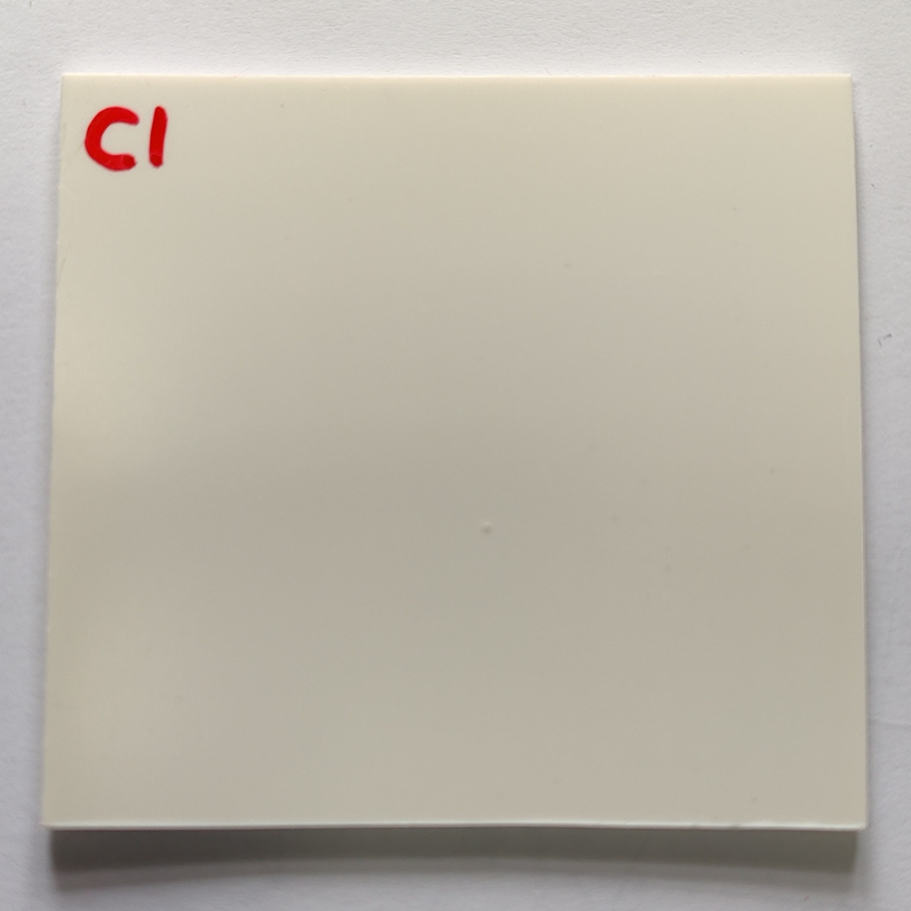
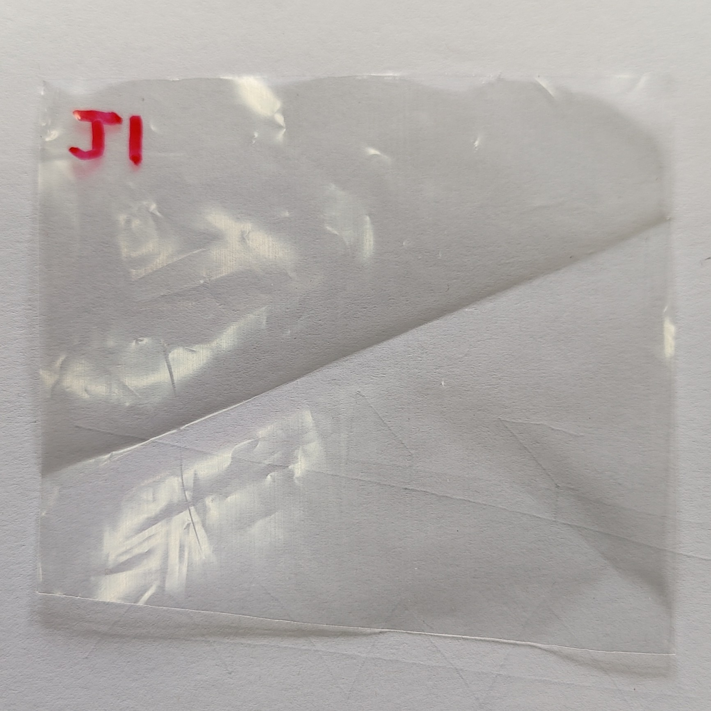
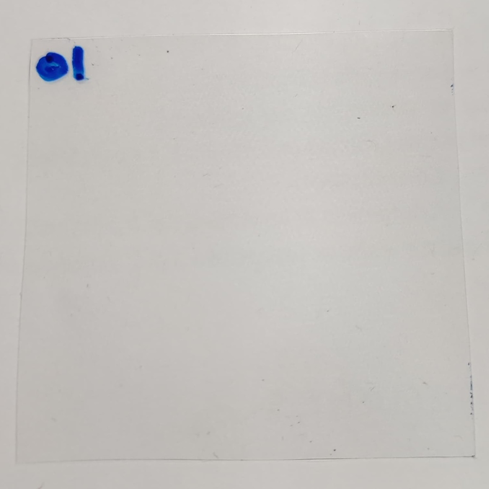

# Experiment 5

## Description

- Day 1:
  - Test 1: Sweep with sample A1 --> A1_1
  - Test 2: Sweep with sample B1 --> B1_2
  - Test 3: Sweep with sample C1 --> C1_3
  - Test 4: Sweep with sample D1 --> D1_4
  - Test 5: Sweep with sample E1 --> E1_5
  - Test 6: Sweep with sample F1 --> F1_6
  - Test 7: Sweep with sample G1 --> G1_7
  - Test 8: Sweep with sample H1 --> H1_8
  - Test 9: Sweep with sample I1 --> I1_9
  - Test 10: Sweep with sample J1 --> J1_10
  - Test 11: Sweep with sample L1 --> L1_11
  - Test 12: Sweep with sample O1 --> O1_12
- Day 2:
  - Test 13: Sweep with sample A2 --> A2_13
  - Test 14: Sweep with sample B2 --> B2_14
  - Test 15: Sweep with sample C2 --> C2_15
  - Test 16: Sweep with sample D2 --> D2_16
  - Test 17: Sweep with sample E3 --> E2_17
  - Test 18: Sweep with sample F2 --> F2_18
  - Test 19: Sweep with sample G3 --> G2_19
  - Test 20: Sweep with sample H2 --> H2_20
  - Test 21: Sweep with sample I2 --> I2_21
  - Test 22: Sweep with sample J2 --> J2_22
  - Test 23: Sweep with sample L2 --> L2_23
  - Test 24: Sweep with sample O2 --> O2_24
  
  All tests are carried out in 2 steps:
  
    1st step: 65s sweep from 100 to 210 GHz (First 50s and last 3s are removed due to stabilization issues)
    2nd step: 35s sweep from 210 to 600 GHz (First 20s and last 3s are removed due to stabilization issues)

## Date

- 16/12/2024:
  - Test 1 (19.7ºC, 33.5 %RH)
  - Test 2 (20.0ºC, 34.1 %RH)
  - Test 3 (20.7ºC, 33.0 %RH)
  - Test 4 (21.5ºC, 34.2 %RH)
  - Test 5 (22.0ºC, 34.0 %RH)
  - Test 6 (22.4ºC, 33.5 %RH)
  - Test 7 (22.6ºC, 32.8 %RH)
  - Test 8 (22.6ºC, 32.6 %RH)
  - Test 9 (22.6ºC, 31.8 %RH)
  - Test 10 (22.4ºC, 31.3 %RH)
  - Test 11 (22.4ºC, 31.4 %RH)
  - Test 12 (22.4ºC, 31.0 %RH)

-17/12/2024:
  - Test 13 (20.0ºC, 32.2 %RH)
  - Test 14 (21.0ºC, 33.3 %RH)
  - Test 15 (21.5ºC, 33.6 %RH)
  - Test 16 (22.1ºC, 32.7 %RH)
  - Test 17 (22.7ºC, 31.8 %RH)
  - Test 18 (22.8ºC, 31.4 %RH)
  - Test 19 (22.7ºC, 31.0 %RH)
  - Test 20 (22.8ºC, 31.0 %RH)
  - Test 21 (22.7ºC, 31.0 %RH)
  - Test 22 (22.6ºC, 31.0 %RH)
  - Test 23 (22.6ºC, 31.3 %RH)
  - Test 24 (22.2ºC, 32.1 %RH)

## Setup

- **Equipment Used**: Spectroscopy setup with PCA and Schottky detector
- **Environment**: // Any specific environmental conditions (e.g., temperature, humidity, etc.)
- **Experiment Variables**: // Define the independent and dependent variables, and any controlled variables.

## **Sample/Material**:

| Sample | Description                                                                      | Image                                                    |
|:------:| -------------------------------------------------------------------------------- | -------------------------------------------------------- |
| A      | PE/tie/EVOH/tie/PE/Adhesivo/PE/tie/EVOH/tie/PE (0.2mm)                           |  |
| B      | PE/tie/EVOH/tie/PE (Admer AT1707E) (0.57mm)                                      |  |
| C      | ABS+PC (2.05mm) **white; opaque                                                  |  |
| D      | ABS (3.0mm) **black; opaque                                                      |  |
| E      | Ecovio/PVOH/Ecovio (0.1mm)							    |  |
| F      | PP/tie/EVOH/tie/PP (tupper) (0.27-0.31mm)                                        |  |
| G      | PHB/PVOH/Ecovio (0.1mm) 							    |  |
| H      | PP/tie/EVOH/tie/PP (0.07mm) 				                            |  |
| I      | PS (0.36mm) **scratched                                                          |  |
| J      | LDPE (0.07mm) **wrinkled                                                         |  |
| L      | PVC (1.85mm) **opaque; white; half-section                                       |  |
| O      | PET (0.12mm)									    |  |

## Data Collection

- **Frequency/Interval**: Integration Time = 5ms
- **Format**: LVM with headers

## Notes

- It gets more data at the end of the recording as the shutdown is manually done

## Performer Contact

- **Researcher**: Daniel Moreno París
- **Email**: danmoren@pa.uc3m.es