# Get the Data


```python
import numpy as np # linear algebra
import pandas as pd # data processing, CSV file I/O (e.g. pd.read_csv)
```

**Doubt**: File size of merged_2.csv and e1_merged.csv are different.  
**Conjeture**: Daniel Moreno: I think that experiment 1 can be greatly affected by the conditions of the day the measurements were taken.  However, if it is combined with other samples of the same plastic, my intuition tells me that it should be much more reliable


```python
#train = pd.read_csv('/kaggle/input/fi-optimun-frecuency/merged_2.csv', sep=';')
train = pd.read_csv('/kaggle/input/fi-optimun-frecuency/e1_merged.csv', sep=';')
train.columns
```


    Index(['Sample', 'Frequency (GHz)', 'LG (mV)', 'HG (mV)', 'Thickness (mm)'], dtype='object')


Samples has serveral Thickness


```python
train['Thickness (mm)'].value_counts().index.sort_values().tolist()
```


    [0.0, 0.04, 0.07, 0.1, 0.2, 0.29, 0.36, 0.57, 1.85, 2.05, 2.25, 3.0]


51 frecuencies (Ghz)


```python
train['Frequency (GHz)'].value_counts().index.sort_values()
```


    Index([100.0, 110.0, 120.0, 130.0, 140.0, 150.0, 160.0, 170.0, 180.0, 190.0,
           200.0, 210.0, 220.0, 230.0, 240.0, 250.0, 260.0, 270.0, 280.0, 290.0,
           300.0, 310.0, 320.0, 330.0, 340.0, 350.0, 360.0, 370.0, 380.0, 390.0,
           400.0, 410.0, 420.0, 430.0, 440.0, 450.0, 460.0, 470.0, 480.0, 490.0,
           500.0, 510.0, 520.0, 530.0, 540.0, 550.0, 560.0, 570.0, 580.0, 590.0,
           600.0],
          dtype='float64', name='Frequency (GHz)')


15 types of plastic


```python
train['Sample'].value_counts().index.sort_values()
```


    Index(['A1', 'B1', 'C1', 'D1', 'E1', 'F1', 'G1', 'H1', 'I1', 'J1', 'K1', 'L1',
           'M1', 'N1', 'REF'],
          dtype='object', name='Sample')


### Add data of Experiments 2, 3 and 4
**TODO**: Add temparature and RH to experiments 3 and 4


```python
train_e1 = train.copy()
train_e1 = train_e1.drop(columns=['Thickness (mm)']) # Remove `Thickness (mm)`

train_e1['num_experiment'] = 'e1'
train_e1['Sample_original'] = 'None'
train_e1['Integration_Time_(msg)'] = 5

# ['E1', 'H1', 'REF']
train_e2 = pd.read_csv('/kaggle/input/fi-optimun-frecuency/e2_merged.csv', sep=';') 
train_e2['num_experiment'] = 'e2'
train_e2['Sample_original'] = 'None'
train_e2['Integration_Time_(msg)'] = 5

# ['REF_1', 'REF_10', 'REF_11', 'REF_12', 'REF_13', 'REF_14', 'REF_15', 'REF_2', 'REF_3', 'REF_4', 'REF_5', 'REF_6', 'REF_7', 'REF_8', 'REF_9']
train_e3 = pd.read_csv('/kaggle/input/fi-optimun-frecuency/e3_merged.csv', sep=',') 
train_e3['num_experiment'] = 'e3'
train_e3['Sample_original'] = train_e3['Sample']
train_e3['Sample'] = 'REF'
train_e3['Integration_Time_(msg)'] = 5

# ['B1_12', 'B1_2', 'B1_5', 'B1_9', 'C1_11', 'C1_14', 'C1_4', 'C1_7', 'E3_10', 'E3_13', 'E3_3', 'E3_6', 'REF_1', 'REF_15', 'REF_8']
train_e4 = pd.read_csv('/kaggle/input/fi-optimun-frecuency/e4_merged.csv', sep=',')
train_e4['num_experiment'] = 'e4'
train_e4['Sample_original'] = train_e4['Sample']
train_e4['Integration_Time_(msg)'] = 20

# ['B1_17', 'B1_20', 'C1_19', 'C1_22', 'E3_18', 'E3_21', 'REF_16', 'REF_23']
train_e4_v2 = pd.read_csv('/kaggle/input/fi-optimun-frecuency/e4_v2_merged.csv', sep=',')
train_e4_v2['num_experiment'] = 'e4_v2'
train_e4_v2['Sample_original'] = train_e4_v2['Sample']
train_e4_v2['Integration_Time_(msg)'] = 20
```

Replace name of Sample from experiment 4 by name of experiment 1


```python
df_temp = train_e4.query('Sample.str.startswith("B1")', engine="python")
df_temp = df_temp.drop(columns=['Sample'])
df_temp['Sample'] = 'B1'
df_temp2 = train_e4.query('Sample.str.startswith("C1")', engine="python")
df_temp2 = df_temp2.drop(columns=['Sample'])
df_temp2['Sample'] = 'C1'
df_temp3 = train_e4.query('Sample.str.startswith("E3")', engine="python")
df_temp3 = df_temp3.drop(columns=['Sample'])
df_temp3['Sample'] = 'E1'
df_temp4 = train_e4.query('Sample.str.startswith("REF")', engine="python")
df_temp4 = df_temp4.drop(columns=['Sample'])
df_temp4['Sample'] = 'REF'
train_e4 = pd.concat([df_temp, df_temp2, df_temp3, df_temp4]).sort_index()
```


```python
df_temp = train_e4_v2.query('Sample.str.startswith("B1")', engine="python")
df_temp = df_temp.drop(columns=['Sample'])
df_temp['Sample'] = 'B1'
df_temp2 = train_e4_v2.query('Sample.str.startswith("C1")', engine="python")
df_temp2 = df_temp2.drop(columns=['Sample'])
df_temp2['Sample'] = 'C1'
df_temp3 = train_e4_v2.query('Sample.str.startswith("E3")', engine="python")
df_temp3 = df_temp3.drop(columns=['Sample'])
df_temp3['Sample'] = 'E1'
df_temp4 = train_e4_v2.query('Sample.str.startswith("REF")', engine="python")
df_temp4 = df_temp4.drop(columns=['Sample'])
df_temp4['Sample'] = 'REF'
train_e4_v2 = pd.concat([df_temp, df_temp2, df_temp3, df_temp4]).sort_index()
```


```python
train_e1['index_original'] = train_e1.index
train_e1.head()

```


<div>
<style scoped>
    .dataframe tbody tr th:only-of-type {
        vertical-align: middle;
    }

    .dataframe tbody tr th {
        vertical-align: top;
    }

    .dataframe thead th {
        text-align: right;
    }
</style>
<table border="1" class="dataframe">
  <thead>
    <tr style="text-align: right;">
      <th></th>
      <th>Sample</th>
      <th>Frequency (GHz)</th>
      <th>LG (mV)</th>
      <th>HG (mV)</th>
      <th>num_experiment</th>
      <th>Sample_original</th>
      <th>Integration_Time_(msg)</th>
      <th>index_original</th>
    </tr>
  </thead>
  <tbody>
    <tr>
      <th>0</th>
      <td>A1</td>
      <td>100.0</td>
      <td>-7.080942</td>
      <td>-0.854611</td>
      <td>e1</td>
      <td>None</td>
      <td>5</td>
      <td>0</td>
    </tr>
    <tr>
      <th>1</th>
      <td>A1</td>
      <td>100.0</td>
      <td>67.024785</td>
      <td>0.244141</td>
      <td>e1</td>
      <td>None</td>
      <td>5</td>
      <td>1</td>
    </tr>
    <tr>
      <th>2</th>
      <td>A1</td>
      <td>100.0</td>
      <td>124.893178</td>
      <td>-1.098776</td>
      <td>e1</td>
      <td>None</td>
      <td>5</td>
      <td>2</td>
    </tr>
    <tr>
      <th>3</th>
      <td>A1</td>
      <td>100.0</td>
      <td>91.075571</td>
      <td>0.000000</td>
      <td>e1</td>
      <td>None</td>
      <td>5</td>
      <td>3</td>
    </tr>
    <tr>
      <th>4</th>
      <td>A1</td>
      <td>100.0</td>
      <td>48.956174</td>
      <td>0.122094</td>
      <td>e1</td>
      <td>None</td>
      <td>5</td>
      <td>4</td>
    </tr>
  </tbody>
</table>
</div>


```python
train_e2['index_original'] = train_e2.index
train_e2.head()
```


<div>
<style scoped>
    .dataframe tbody tr th:only-of-type {
        vertical-align: middle;
    }

    .dataframe tbody tr th {
        vertical-align: top;
    }

    .dataframe thead th {
        text-align: right;
    }
</style>
<table border="1" class="dataframe">
  <thead>
    <tr style="text-align: right;">
      <th></th>
      <th>Sample</th>
      <th>Frequency (GHz)</th>
      <th>LG (mV)</th>
      <th>HG (mV)</th>
      <th>num_experiment</th>
      <th>Sample_original</th>
      <th>Integration_Time_(msg)</th>
      <th>index_original</th>
    </tr>
  </thead>
  <tbody>
    <tr>
      <th>0</th>
      <td>E1</td>
      <td>100.0</td>
      <td>27.469173</td>
      <td>0.976682</td>
      <td>e2</td>
      <td>None</td>
      <td>5</td>
      <td>0</td>
    </tr>
    <tr>
      <th>1</th>
      <td>E1</td>
      <td>100.0</td>
      <td>70.931511</td>
      <td>-0.366259</td>
      <td>e2</td>
      <td>None</td>
      <td>5</td>
      <td>1</td>
    </tr>
    <tr>
      <th>2</th>
      <td>E1</td>
      <td>100.0</td>
      <td>1.342937</td>
      <td>-0.488353</td>
      <td>e2</td>
      <td>None</td>
      <td>5</td>
      <td>2</td>
    </tr>
    <tr>
      <th>3</th>
      <td>E1</td>
      <td>100.0</td>
      <td>31.253815</td>
      <td>-0.122094</td>
      <td>e2</td>
      <td>None</td>
      <td>5</td>
      <td>3</td>
    </tr>
    <tr>
      <th>4</th>
      <td>E1</td>
      <td>100.0</td>
      <td>48.467830</td>
      <td>0.488353</td>
      <td>e2</td>
      <td>None</td>
      <td>5</td>
      <td>4</td>
    </tr>
  </tbody>
</table>
</div>


```python
train_e3['index_original'] = train_e3.index
train_e3.head()

```


<div>
<style scoped>
    .dataframe tbody tr th:only-of-type {
        vertical-align: middle;
    }

    .dataframe tbody tr th {
        vertical-align: top;
    }

    .dataframe thead th {
        text-align: right;
    }
</style>
<table border="1" class="dataframe">
  <thead>
    <tr style="text-align: right;">
      <th></th>
      <th>Sample</th>
      <th>Frequency (GHz)</th>
      <th>LG (mV)</th>
      <th>HG (mV)</th>
      <th>num_experiment</th>
      <th>Sample_original</th>
      <th>Integration_Time_(msg)</th>
      <th>index_original</th>
    </tr>
  </thead>
  <tbody>
    <tr>
      <th>0</th>
      <td>REF</td>
      <td>100.0</td>
      <td>1.098767</td>
      <td>0.000012</td>
      <td>e3</td>
      <td>REF_1</td>
      <td>5</td>
      <td>0</td>
    </tr>
    <tr>
      <th>1</th>
      <td>REF</td>
      <td>100.0</td>
      <td>0.854596</td>
      <td>0.244176</td>
      <td>e3</td>
      <td>REF_1</td>
      <td>5</td>
      <td>1</td>
    </tr>
    <tr>
      <th>2</th>
      <td>REF</td>
      <td>100.0</td>
      <td>0.976682</td>
      <td>0.610411</td>
      <td>e3</td>
      <td>REF_1</td>
      <td>5</td>
      <td>2</td>
    </tr>
    <tr>
      <th>3</th>
      <td>REF</td>
      <td>100.0</td>
      <td>1.709193</td>
      <td>-0.244164</td>
      <td>e3</td>
      <td>REF_1</td>
      <td>5</td>
      <td>3</td>
    </tr>
    <tr>
      <th>4</th>
      <td>REF</td>
      <td>100.0</td>
      <td>-0.122085</td>
      <td>-0.488341</td>
      <td>e3</td>
      <td>REF_1</td>
      <td>5</td>
      <td>4</td>
    </tr>
  </tbody>
</table>
</div>


```python
train_e4['index_original'] = train_e4.index
train_e4.head()

```


<div>
<style scoped>
    .dataframe tbody tr th:only-of-type {
        vertical-align: middle;
    }

    .dataframe tbody tr th {
        vertical-align: top;
    }

    .dataframe thead th {
        text-align: right;
    }
</style>
<table border="1" class="dataframe">
  <thead>
    <tr style="text-align: right;">
      <th></th>
      <th>Frequency (GHz)</th>
      <th>LG (mV)</th>
      <th>HG (mV)</th>
      <th>num_experiment</th>
      <th>Sample_original</th>
      <th>Integration_Time_(msg)</th>
      <th>Sample</th>
      <th>index_original</th>
    </tr>
  </thead>
  <tbody>
    <tr>
      <th>0</th>
      <td>100.0</td>
      <td>35.923574</td>
      <td>-0.335747</td>
      <td>e4</td>
      <td>REF_1</td>
      <td>20</td>
      <td>REF</td>
      <td>0</td>
    </tr>
    <tr>
      <th>1</th>
      <td>100.0</td>
      <td>58.600903</td>
      <td>0.763011</td>
      <td>e4</td>
      <td>REF_1</td>
      <td>20</td>
      <td>REF</td>
      <td>1</td>
    </tr>
    <tr>
      <th>2</th>
      <td>100.0</td>
      <td>70.473691</td>
      <td>0.152630</td>
      <td>e4</td>
      <td>REF_1</td>
      <td>20</td>
      <td>REF</td>
      <td>2</td>
    </tr>
    <tr>
      <th>3</th>
      <td>100.0</td>
      <td>56.220242</td>
      <td>0.061041</td>
      <td>e4</td>
      <td>REF_1</td>
      <td>20</td>
      <td>REF</td>
      <td>3</td>
    </tr>
    <tr>
      <th>4</th>
      <td>100.0</td>
      <td>46.575510</td>
      <td>0.579929</td>
      <td>e4</td>
      <td>REF_1</td>
      <td>20</td>
      <td>REF</td>
      <td>4</td>
    </tr>
  </tbody>
</table>
</div>


```python
train_e4_v2['index_original'] = train_e4_v2.index
train_e4_v2.head()

```


<div>
<style scoped>
    .dataframe tbody tr th:only-of-type {
        vertical-align: middle;
    }

    .dataframe tbody tr th {
        vertical-align: top;
    }

    .dataframe thead th {
        text-align: right;
    }
</style>
<table border="1" class="dataframe">
  <thead>
    <tr style="text-align: right;">
      <th></th>
      <th>Frequency (GHz)</th>
      <th>LG (mV)</th>
      <th>HG (mV)</th>
      <th>num_experiment</th>
      <th>Sample_original</th>
      <th>Integration_Time_(msg)</th>
      <th>Sample</th>
      <th>index_original</th>
    </tr>
  </thead>
  <tbody>
    <tr>
      <th>0</th>
      <td>100.0</td>
      <td>-0.640947</td>
      <td>25.027469</td>
      <td>e4_v2</td>
      <td>B1_17</td>
      <td>20</td>
      <td>B1</td>
      <td>0</td>
    </tr>
    <tr>
      <th>1</th>
      <td>100.0</td>
      <td>0.244170</td>
      <td>23.684531</td>
      <td>e4_v2</td>
      <td>B1_17</td>
      <td>20</td>
      <td>B1</td>
      <td>1</td>
    </tr>
    <tr>
      <th>2</th>
      <td>100.0</td>
      <td>-0.122085</td>
      <td>25.027469</td>
      <td>e4_v2</td>
      <td>B1_17</td>
      <td>20</td>
      <td>B1</td>
      <td>2</td>
    </tr>
    <tr>
      <th>3</th>
      <td>100.0</td>
      <td>1.159810</td>
      <td>21.639604</td>
      <td>e4_v2</td>
      <td>B1_17</td>
      <td>20</td>
      <td>B1</td>
      <td>3</td>
    </tr>
    <tr>
      <th>4</th>
      <td>100.0</td>
      <td>0.213649</td>
      <td>26.248321</td>
      <td>e4_v2</td>
      <td>B1_17</td>
      <td>20</td>
      <td>B1</td>
      <td>4</td>
    </tr>
  </tbody>
</table>
</div>


```python
train_get = pd.concat([train_e1, train_e2, train_e3, train_e4, train_e4_v2])
train_get = train_get.rename(columns = {'Sample':'target', 'Frequency (GHz)': 'freq', 'Integration_Time_(msg)': 'int_time' }).drop(columns=['index_original'])                                                                                  
train_get.head()


```


<div>
<style scoped>
    .dataframe tbody tr th:only-of-type {
        vertical-align: middle;
    }

    .dataframe tbody tr th {
        vertical-align: top;
    }

    .dataframe thead th {
        text-align: right;
    }
</style>
<table border="1" class="dataframe">
  <thead>
    <tr style="text-align: right;">
      <th></th>
      <th>target</th>
      <th>freq</th>
      <th>LG (mV)</th>
      <th>HG (mV)</th>
      <th>num_experiment</th>
      <th>Sample_original</th>
      <th>int_time</th>
    </tr>
  </thead>
  <tbody>
    <tr>
      <th>0</th>
      <td>A1</td>
      <td>100.0</td>
      <td>-7.080942</td>
      <td>-0.854611</td>
      <td>e1</td>
      <td>None</td>
      <td>5</td>
    </tr>
    <tr>
      <th>1</th>
      <td>A1</td>
      <td>100.0</td>
      <td>67.024785</td>
      <td>0.244141</td>
      <td>e1</td>
      <td>None</td>
      <td>5</td>
    </tr>
    <tr>
      <th>2</th>
      <td>A1</td>
      <td>100.0</td>
      <td>124.893178</td>
      <td>-1.098776</td>
      <td>e1</td>
      <td>None</td>
      <td>5</td>
    </tr>
    <tr>
      <th>3</th>
      <td>A1</td>
      <td>100.0</td>
      <td>91.075571</td>
      <td>0.000000</td>
      <td>e1</td>
      <td>None</td>
      <td>5</td>
    </tr>
    <tr>
      <th>4</th>
      <td>A1</td>
      <td>100.0</td>
      <td>48.956174</td>
      <td>0.122094</td>
      <td>e1</td>
      <td>None</td>
      <td>5</td>
    </tr>
  </tbody>
</table>
</div>


```python
train_get['num_experiment'].value_counts()
```


    num_experiment
    e1       2420625
    e2        986224
    e4        439648
    e3        424998
    e4_v2     250646
    Name: count, dtype: int64


## Convert the data to a format you can easily manipulate


```python
#train = pd.concat([train[['Frequency (GHz)', 'LG (mV)', 'HG (mV)']],train[['target']]], axis=1)
#train_get.to_csv('all-experiment_15_types.csv', index=False)

```

Select only tree types of plastic `B1`, `C1`, `E1` and `REF`


```python
#2056910,2307556
train_get = train_get[(train_get.target == 'B1') | (train_get.target == 'C1') | (train_get.target == 'E1') | (train_get.target == 'REF')]
```


    ---------------------------------------------------------------------------

    KeyboardInterrupt                         Traceback (most recent call last)

    Cell In[66], line 2
          1 #2056910,2307556
    ----> 2 train_get = train_get[(train_get.target == 'B1') | (train_get.target == 'C1') | (train_get.target == 'E1') | (train_get.target == 'REF')]
    

    File /opt/conda/lib/python3.10/site-packages/pandas/core/ops/common.py:76, in _unpack_zerodim_and_defer.<locals>.new_method(self, other)
         72             return NotImplemented
         74 other = item_from_zerodim(other)
    ---> 76 return method(self, other)
    

    File /opt/conda/lib/python3.10/site-packages/pandas/core/arraylike.py:40, in OpsMixin.__eq__(self, other)
         38 @unpack_zerodim_and_defer("__eq__")
         39 def __eq__(self, other):
    ---> 40     return self._cmp_method(other, operator.eq)
    

    File /opt/conda/lib/python3.10/site-packages/pandas/core/series.py:6119, in Series._cmp_method(self, other, op)
       6116 lvalues = self._values
       6117 rvalues = extract_array(other, extract_numpy=True, extract_range=True)
    -> 6119 res_values = ops.comparison_op(lvalues, rvalues, op)
       6121 return self._construct_result(res_values, name=res_name)
    

    File /opt/conda/lib/python3.10/site-packages/pandas/core/ops/array_ops.py:344, in comparison_op(left, right, op)
        341     return invalid_comparison(lvalues, rvalues, op)
        343 elif lvalues.dtype == object or isinstance(rvalues, str):
    --> 344     res_values = comp_method_OBJECT_ARRAY(op, lvalues, rvalues)
        346 else:
        347     res_values = _na_arithmetic_op(lvalues, rvalues, op, is_cmp=True)
    

    File /opt/conda/lib/python3.10/site-packages/pandas/core/ops/array_ops.py:129, in comp_method_OBJECT_ARRAY(op, x, y)
        127     result = libops.vec_compare(x.ravel(), y.ravel(), op)
        128 else:
    --> 129     result = libops.scalar_compare(x.ravel(), y, op)
        130 return result.reshape(x.shape)
    

    KeyboardInterrupt: 


Uncomment to only one experiment.


```python
#train_get_e4 = train_get[(train_get.num_experiment == 'e4')] #439648 samples
#train_get = train_get_e4.copy()
```

## Sample a test set, put it aside, and never look at it
The test set is used after the model has been fully trained to assess the model's performance on completely unseen data

Data is split in a stratified fashion, using this at  theTarget as  class labels  
**Conjecture**: It is assumed that there is time independence in the laser measurement..


```python
from sklearn.model_selection import train_test_split
train_set, test_set = train_test_split(train_get, test_size=0.2, random_state=42, stratify=train_get.target)
lst_freq = test_set['freq'].drop_duplicates().sort_values().values.tolist()
```

Check the target distribution of target in a plotted bar. The frequency or proportion are uniform in train and test dataset


```python
import matplotlib.pylab as plt
ax = train_set[['target']].value_counts().transpose().plot.bar(figsize=(8, 4), legend=False)
ax.set_xlabel('Data Distribution of target for train dataset')
ax.set_ylabel('Count')
plt.tight_layout()
plt.show()
```


```python
ax = test_set[['target']].value_counts().transpose().plot.bar(figsize=(8, 4), legend=False)
ax.set_xlabel('Data Distribution of target for test dataset')
ax.set_ylabel('Count')
plt.tight_layout()
plt.show()
```

 # Explore the data


```python
#1846044 
train_ex = train_set.copy()
train_ex.info()
```

## Visualize one HG (mV) a one freq like time series  


```python
train_get.groupby([train_get['target'], train_get['num_experiment']]).count()
```


```python
Y_e1 = train_get[(train_get.target=='E1')&(train_get.freq==350.0)&(train_get.num_experiment=='e1')]['HG (mV)'].values
Y_e2 = train_get[(train_get.target=='E1')&(train_get.freq==350.0)&(train_get.num_experiment=='e2')]['HG (mV)'].values
Y_e4 = train_get[(train_get.target=='E1')&(train_get.freq==350.0)&(train_get.num_experiment=='e4')]['HG (mV)'].values
df_tmp = pd.DataFrame(np.hstack((Y_e1[:2301].reshape(-1, 1),Y_e2[:2301].reshape(-1, 1),Y_e4.reshape(-1, 1))),
                      columns=['e1', 'e2', 'e4'],
                      index=np.arange(0, 2301, 1))
```


```python
#Y_e1 = train_get[(train_get.target=='E1')&(train_get.freq==350.0)&(train_get.num_experiment=='e1')]['HG (mV)'].values
Y_e2 = train_get[(train_get.target=='E1')&(train_get.freq==350.0)&(train_get.num_experiment=='e2')]['HG (mV)'].values
df_tmp = pd.DataFrame(np.hstack((Y_e1[:3138].reshape(-1, 1),Y_e2[:3138].reshape(-1, 1))),
                      columns=['e1', 'e2'],
                      index=np.arange(0, 3138, 1))
```


```python
_ = df_tmp.plot(figsize=(12,4), xlim = ([0,3138]), 
                ylabel = 'HG (mV)',
                xlabel = 'Num of sample',
                title= 'HG (mV) Plastic E1 type to 350 Ghz for three experiments' )
```


```python
train_ts_low_quan = train_ts[(train_ts.target=='E1')&(train_ts.freq==350.0)&(train_ts.num_experiment=='e1')]['HG (mV)'].quantile(0.05)
train_ts_high_quan = train_ts[(train_ts.target=='E1')&(train_ts.freq==350.0)&(train_ts.num_experiment=='e1')]['HG (mV)'].quantile(0.95)
train_ts_filtering = np.where(train_ts[(train_ts.target=='E1')&(train_ts.freq==350.0)&(train_ts.num_experiment=='e1')]['HG (mV)'] < train_ts_low_quan,
                                train_ts_low_quan,
                                train_ts[(train_ts.target=='E1')&(train_ts.freq==350.0)&(train_ts.num_experiment=='e1')]['HG (mV)'])

train_ts_filtering = pd.Series(train_ts_filtering, index=train_ts[(train_ts.target=='E1')&(train_ts.freq==350.0)&(train_ts.num_experiment=='e1')]['HG (mV)'].index.to_numpy())
train_ts_filtering = np.where(train_ts_filtering > train_ts_high_quan,
                              train_ts_high_quan,
                              train_ts_filtering)

fig, ax = plt.subplots(figsize=(12, 4))
ax.plot(X, train_ts_filtering)
ax.set_ylim([380, 525])
ax.set_title('Filtering Outliers of time series of 350 GHz to HG (mV) of plastic type E1 of Experiment 1')
fig.show()

```

## Visualize distributions
Knowledge of various sampling and data generating distributions allows us to quantify potential errors in an estimate that might be due to random variation.


```python
train_ex = train_ex.astype({"freq": int,})
train_ex.info()

```


```python
import seaborn as sns
import warnings
warnings.filterwarnings('ignore')

for f in train_ex['freq'].value_counts().index.sort_values().tolist():
    freq = f
    ncols = 2
    nrows = 2
    nums_plastics = 0
    
    fig, axes = plt.subplots(nrows, ncols, figsize=(12, 8))
    for r in range(nrows):
        for c in range (ncols):
            t = train_ex['target'].value_counts().index.sort_values().tolist()
            df_tmp = train_ex[(train_ex.freq == freq) & (train_ex.target == t[nums_plastics])]
            sns.kdeplot(x=df_tmp['LG (mV)'], ax=axes[r, c], color='#F8766D', label='LG (mV)',  fill =True )
            sns.kdeplot(x=df_tmp['HG (mV)'], ax=axes[r, c], color='#00BFC4', label='HG (mV)',  fill =True )
            axes[r ,c].legend(fontsize="xx-small")
            axes[r, c].set_ylabel('')
            axes[r, c].set_xlabel('')
            axes[r, c].set_title(f"Type {t[nums_plastics]} (mV)",fontsize=7)
            axes[r, c].tick_params(labelsize=5, width=0.5)
            axes[r, c].xaxis.offsetText.set_fontsize(6)
            axes[r, c].yaxis.offsetText.set_fontsize(4)
            nums_plastics = nums_plastics +1
    plt.suptitle(f"All samples. Distribution of LG (mV) and HG (mV) of each plastic to {freq} Ghz", y=0.93,fontsize=10)
    plt.show()        
```

## Study Type of distribution to one frecuency


```python
for f in [320]:
    freq = f
    ncols = 5
    nrows = 3
    nums_plastics = 0
    
    fig, axes = plt.subplots(nrows, ncols, figsize=(12, 8))
    for r in range(nrows):
        for c in range (ncols):
            t = train_ex['target'].value_counts().index.sort_values().tolist()
            df_tmp = train_ex[(train_ex.freq == freq) & (train_ex.target == t[nums_plastics])]
            sns.kdeplot(x=df_tmp['LG (mV)'], ax=axes[r, c], color='#F8766D', label='LG (mV)',  fill =True )
            sns.kdeplot(x=df_tmp['HG (mV)'], ax=axes[r, c], color='#00BFC4', label='HG (mV)',  fill =True )
            axes[r, c].legend(fontsize="xx-small")
            axes[r, c].set_ylabel('')
            axes[r, c].set_xlabel('')
            axes[r, c].set_title(f"Type {t[nums_plastics]} (mV)",fontsize=7)
            axes[r, c].tick_params(labelsize=5, width=0.5)
            axes[r, c].xaxis.offsetText.set_fontsize(6)
            axes[r, c].yaxis.offsetText.set_fontsize(4)
            nums_plastics = nums_plastics +1
    plt.suptitle(f"Distributions of density estimation to {freq} Ghz", y=0.93,fontsize=10)
    plt.show()   
```

#### Summary of the numerical attributes
Compute mean of groups


```python

df_tmp = train_ex[(train_ex.freq == freq)]
grouped = df_tmp['HG (mV)'].groupby(df_tmp['target'])

ax = grouped.mean().plot.bar(figsize=(8, 4), legend=False)
plt.suptitle(f'Mean (mV) by HG filter of each plastic to {freq} Ghz')
ax.set_xlabel(f'Type of plastic')
ax.set_ylabel('mV')
plt.tight_layout()
plt.show()

```


```python

df_tmp = train_ex[(train_ex.freq == freq)]
grouped = df_tmp['LG (mV)'].groupby(df_tmp['target'])

ax = grouped.mean().plot.bar(figsize=(8, 4), legend=False)
plt.suptitle(f'Mean (mV) by LG filter of each plastic to {freq} Ghz')
ax.set_xlabel(f'Type of plastic')
ax.set_ylabel('mV')
plt.tight_layout()
plt.show()

```


```python
ax = grouped.std().plot.bar(figsize=(8, 4), legend=False)
plt.suptitle(f'Standard deviation (mV) by LG filter of each plastic to {freq} Ghz')
ax.set_xlabel(f'Type of plastic')
ax.set_ylabel('mV')
plt.tight_layout()
plt.show()
```

**Insights**: Assuming a normal distribution can lead to underestimation of extreme events 

#### Predicts that anamolous measures
The tails of a distribution correspond to the extreme values (small and large). Long tails, and guarding against them, are widely recognized in practical work. Nassim Taleb has proposed the black swan theory, which predicts that anamolous events, such as a stock market crash, are much more likely to occur than would be predicted by the normal distribution. 


```python
from scipy import stats
temp_t = t[13]
fig, ax = plt.subplots(figsize=(4, 4))
df_tmp = train_ex[(train_ex.freq == freq) & (train_ex.target == temp_t)]
#stats.probplot(df_tmp['LG (mV)'], plot=ax)
stats.probplot(df_tmp['LG (mV)'], plot=ax)

plt.suptitle(f"Sample of {temp_t} data against the quantiles of a specified theoretical distribution {freq} Ghz", y=0.93,fontsize=10)
plt.tight_layout()
plt.show()

```

**Insights**: The points are far below the line for low values and far 
above the line for high value. Theree are much more likely t 
observe extreme values than would be expected if the data had a norm l
distribution

## Promising transformations you may want to apply
### Apply OrdinalEncoder to transform categorical features as an integer
Target variable takes only a limited number of values. Encode target (categorical features) as an integer array.  
**Question**: How does doing this in the previous phase (Convert the data to a format you can easily manipulate) affect the classifier?


```python
from sklearn.preprocessing import OrdinalEncoder
label_train_ex = train_ex.copy()
ordinal_encoder = OrdinalEncoder()
label_train_ex['target'] = ordinal_encoder.fit_transform(train_ex[['target']])
```

### % of missing values
No missing values in each column of training data


```python
print(label_train_ex.shape)
missing_val_count_by_column = (label_train_ex.isnull().sum())
print(missing_val_count_by_column[missing_val_count_by_column > 0])
```

### Type of distribution in frecuency
Representation of the distribution of nums of sample by frecuency. 


```python
ax = label_train_ex['freq'].plot.hist(figsize=(10, 4), bins=408)
ax.set_xlabel('Frequency (GHz)')
ax.set_ylabel('Nums of sample by frecuency')
plt.tight_layout()
plt.show()
```

### Balanced samples of frecuency by min


```python
min = label_train_ex.groupby(['target', 'freq']).size().min()
# Function to reduce samples to the min value
def reduce_to_min(df, target, frequency, min):
    # Filter the DataFrame for the specific sample and frequency
    freq_df = df[(df['target'] == target) & (df['freq'] == frequency)]
    # If the number of samples is greater than the min, sample down to the min
    return freq_df.sample(n=min, random_state=42)

# Apply the function to reduce target for each combination of Sample and Frequency (GHz)
tmp_balanced_data = []
for (target, frequency), group in label_train_ex.groupby(['target', 'freq']):
    tmp_balanced_data.append(reduce_to_min(label_train_ex, target, frequency, min))

# Combine the balanced samples into a single DataFrame
balanced_train_ex = pd.concat(tmp_balanced_data)
```

Check count values within each target and frequency


```python
ax = balanced_train_ex['freq'].plot.hist(figsize=(10, 4), bins=408)
ax.set_xlabel('Frequency (GHz)')
ax.set_ylabel('Nums of sample by frecuency')
ax.set_title('Distribution by minmial')
plt.tight_layout()
plt.show()
```


```python
balanced_train_ex.head() # 301200
```


```python
#grouped = balanced_train_ex.groupby([balanced_train_ex["target"], balanced_train_ex["freq"]]).count()
```

**Doubts**: 
* There are several targets with samples below of mode, i.e: 100.0 Ghz, 130.0 Ghz. How affect `Thickness (mm)` attribute to study.

 ## Study the correlations between attributes

Encodes target labels with values between 0 and ``n_classes-1, so `A1` are `0`, `B1` are `1`,... and so on all categories

`A1`, `B1`, `C1`, `D1`, `E1`, `E2`, `E3`, `F1`, `G1`, `H1`, `I1`, `J1`, `K1`, `L1`, `M1`, `N1`, `REF`


```python
balanced_train_ex.head()
```

It is start to analice PE/tie/EVOH/tie/PE/Adhesivo/PE/tie/EVOH/tie/PE (0.2mm) `A1` category `0`


```python
df_tmp = balanced_train_ex[balanced_train_ex.target==0]

from pandas.plotting import scatter_matrix
attributes = ['freq', 'LG (mV)', 'HG (mV)']
ax = scatter_matrix(df_tmp[attributes], figsize=(12, 8))
```

**Insights**: The correlation coefficient ranges from –1 to 1. When it is close to 1, it means that there is a strong positive correlation; for example, the `HG (mV)` value tends to go up slightly when the `Frequency (GHz)` goes up. When the coefficient is close to –1, it means that there is a strong negative correlation; you can see a big negative correlation between `LG (mV)` and the `Frequency (GHz)` 

**Evidende**: It can be interpreted that to measured plastic PE/tie/EVOH/tie/PE/Adhesivo/PE/tie/EVOH/tie/PE (0.2mm) `A1` category `0` getaworse response to since high frecuencies in the `LG (mV)`. So the measurement obtained in the low-pass filter is lower `LG (mV)` is better to low frecuencies, although it obtains response peaks at 600 GHz that would have to be explained why they occur


7oat64


```python
corr_matrix = df_tmp.corr()
corr_matrix['freq'].sort_values(ascending=False)
```

# Prepare the data to better expose the underlying data patterns


```python
#from 1846044 to 845988 to apply balanced target samples by min
train_pr = balanced_train_ex.copy() 
train_pr.info()

```

## Data Clean: Remove outliers


```python
train_ts_low_quan = train_ts[(train_ts.target=='E1')&(train_ts.freq==350.0)]['HG (mV)'].quantile(0.05)
train_ts_high_quan = train_ts[(train_ts.target=='E1')&(train_ts.freq==350.0)]['HG (mV)'].quantile(0.95)
train_ts_filtering = np.where(train_ts[(train_ts.target=='E1')&(train_ts.freq==350.0)]['HG (mV)'] < train_ts_low_quan,
                                train_ts_low_quan,
                                train_ts[(train_ts.target=='E1')&(train_ts.freq==350.0)]['HG (mV)'])

train_ts_filtering = pd.Series(train_ts_filtering, index=train_ts[(train_ts.target=='E1')&(train_ts.freq==350.0)]['HG (mV)'].index.to_numpy())
train_ts_filtering = np.where(train_ts_filtering > train_ts_high_quan,
                              train_ts_high_quan,
                              train_ts_filtering)

fig, ax = plt.subplots(figsize=(12, 4))
ax.plot(X, train_ts_filtering)
ax.set_ylim([380, 525])
ax.set_title(' Filtering Outliers of time series of 350 GHz to HG (mV) of plastic type E1')
fig.show()

```

## Feature engineering
### Add promising transformations of features


```python
train_pr = train_pr.astype({"freq": int, "target": int})

#https://stackoverflow.com/questions/43131715/pandas-new-column-by-combining-numbers-of-two-columns-as-strings
train_pr['freq_target'] = train_pr['freq'].astype(str) + train_pr['target'].astype(str)
train_pr['freq_target'].nunique() # train_pr['freq'].nunique() * train_pr['target'].nunique() 765 different measures


```


```python
train_pr['freq_target'] = train_pr['freq_target'].astype(int)
#train_pr = train_pr.rename(columns = {'freq':'Frequency (GHz)'})

train_pr.info()
```

**Doubts**: Normalize freq_target?

## Add transformations of features

#### Check smallest, largest, and zeros before to aggregate new features


```python
#Find out if zeros before to Aggregate features
df_temp = train_pr.rename(columns={'LG (mV)': 'LG_mV','HG (mV)': 'HG_mV' })
df_temp[df_temp.LG_mV==0] # 55657 zeros
df_temp[df_temp.HG_mV==0] # 15316 zeros
```


```python
train_pr.nsmallest(1,'LG (mV)')['LG (mV)'].values[0] # -49.810767	
train_pr.nsmallest(1,'HG (mV)')['HG (mV)'].values[0] # -16.969845
train_pr.nlargest(1,'LG (mV)')['LG (mV)'].values[0] # 274.813829	
train_pr.nlargest(1,'HG (mV)')['HG (mV)'].values[0] # 1149.43229

```

Slide all values to remove zeros and Aggregate features into promising new features


```python
train_pr.nsmallest(1,'HG_div_LG')['HG_div_LG'].values[0] # 0.264913931
train_pr.nlargest(1,'HG_div_LG')['HG_div_LG'].values[0] # 12.45292894

```

#### Aggregate features into promising new features: HG_div_LG


```python
train_pr['LG (mV)_shifted'] = train_pr['LG (mV)'].apply(lambda x: np.sum([x, 100]))
train_pr['HG (mV)_shifted'] = train_pr['HG (mV)'].apply(lambda x: np.sum([x, 100]))
train_pr['HG_div_LG'] = train_pr['HG (mV)_shifted']/train_pr['LG (mV)_shifted']
train_pr.info()
```

#### Aggregate features into promising new features: descriptive statistics for each freq


```python
grouped = train_pr.groupby(train_pr["freq"])
grouped_LG_mV = grouped['LG (mV)']
grouped_HG_mV = grouped['HG (mV)']
# https://stackoverflow.com/questions/32938060/reverting-from-multiindex-to-single-index-dataframe-in-pandas
df_grouped_LG_mV = grouped_LG_mV.agg(['mean','std','var','median']).reset_index(level=[0])
df_grouped_HG_mV = grouped_HG_mV.agg(['mean','std','var','median']).reset_index(level=[0])

df_grouped_LG_mV.head()
```


```python
train_pr_shifted = train_pr.copy()
train_pr_shifted = train_pr.drop(columns=['LG (mV)_shifted', 'HG (mV)_shifted'])
train_pr_shifted.head()

```


```python
train_pr_stats = pd.merge(train_pr_shifted, df_grouped_LG_mV, how='left', on='freq').rename(columns = {'mean':'mean_LG',
                                                                                                       'std':'std_LG',
                                                                                                       'var':'var_LG',
                                                                                                       'median':'median_LG'})
train_pr_stats = pd.merge(train_pr_stats, df_grouped_HG_mV, how='left', on='freq').rename(columns = {'mean':'mean_HG', 
                                                                                                     'std': 'std_HG',
                                                                                                     'var':'var_HG',
                                                                                                     'median':'median_HG'})

```


```python
#train_pr_stats.tail()
train_pr_stats.info()
```

#### Aggregate features into promising new features: LG_div_REF and HG_div_REF


```python
grouped_B1 = train_pr_stats[train_pr_stats.target == 0.0].groupby(train_pr_stats[train_pr_stats.target == 0.0]['freq'])
df_mean_B1 = grouped_B1['LG (mV)'].agg('mean')
grouped_C1 = train_pr_stats[train_pr_stats.target == 1.0].groupby(train_pr_stats[train_pr_stats.target == 1.0]['freq'])
df_mean_C1 = grouped_C1['LG (mV)'].agg('mean')
grouped_E1 = train_pr_stats[train_pr_stats.target == 2.0].groupby(train_pr_stats[train_pr_stats.target == 2.0]['freq'])
df_mean_E1 = grouped_E1['LG (mV)'].agg('mean')
grouped_ref = train_pr_stats[train_pr_stats.target == 3.0].groupby(train_pr_stats[train_pr_stats.target == 3.0]['freq'])
df_mean_ref = grouped_ref['LG (mV)'].agg('mean')

df_LG_div_REF = pd.DataFrame(
    {"LG_B1_div_REF": df_mean_B1.values/df_mean_ref.values,
     "LG_C1_div_REF": df_mean_C1.values/df_mean_ref.values,
     "LG_E1_div_REF": df_mean_E1.values/df_mean_ref.values},
    index = df_mean_ref.index)

grouped_B1 = train_pr_stats[train_pr_stats.target == 0.0].groupby(train_pr_stats[train_pr_stats.target == 0.0]['freq'])
df_mean_B1 = grouped_B1['HG (mV)'].agg('mean')
grouped_C1 = train_pr_stats[train_pr_stats.target == 1.0].groupby(train_pr_stats[train_pr_stats.target == 1.0]['freq'])
df_mean_C1 = grouped_C1['HG (mV)'].agg('mean')
grouped_E1 = train_pr_stats[train_pr_stats.target == 2.0].groupby(train_pr_stats[train_pr_stats.target == 2.0]['freq'])
df_mean_E1 = grouped_E1['HG (mV)'].agg('mean')
grouped_ref = train_pr_stats[train_pr_stats.target == 3.0].groupby(train_pr_stats[train_pr_stats.target == 3.0]['freq'])
df_mean_ref = grouped_ref['HG (mV)'].agg('mean')


df_HG_div_REF = pd.DataFrame(
    {"HG_B1_div_REF": df_mean_B1.values/df_mean_ref.values,
     "HG_C1_div_REF": df_mean_C1.values/df_mean_ref.values,
     "HG_E1_div_REF": df_mean_E1.values/df_mean_ref.values},
    index = df_mean_ref.index)

train_pr_stats_div_ref = pd.merge(train_pr_stats, df_LG_div_REF, how='left', on='freq')
train_pr_stats_div_ref = pd.merge(train_pr_stats_div_ref, df_HG_div_REF, how='left', on='freq')
train_pr_stats_div_ref.info()
```

## Feature scaling standardize
Neural networks and SVMs, are very sensitive to the scaling of the data


```python
train_pr.head()
```


```python
from sklearn.preprocessing import MinMaxScaler
scaler = MinMaxScaler()
X_train_scaled = scaler.fit_transform(train_pr[['LG (mV)','HG (mV)']].to_numpy()) 
X_train_scaled = pd.DataFrame(X_train_scaled,
                              index=train_pr.index.tolist(),
                              columns=['LG (mV) scaled', 'HG (mV) scaled'])
train_pr_scaled = pd.concat([train_pr,X_train_scaled],axis=1).drop(columns=['LG (mV)', 'HG (mV)'])

```

**Doubt**: Always applies exactly the same transformation to the training and the test set. 


```python
train_pr_scaled.head()
```

# Explore different models


```python
train_mo = train_pr_stats_div_ref.copy() #845988
train_mo = train_mo[train_mo.target != 3] # Remove REF then 634491 samples
```

There are 362692 (57,2 % of samples) of 5 msg and 271799 (42,8% of samples) of 20 msg.


```python
#9% of samples 

df_temp = train_mo[train_mo.int_time == 5].sample(random_state=1, n=27177)
df_temp2 =train_mo[train_mo.int_time == 20].sample(random_state=1, n=36267)
train_mo = pd.concat([df_temp, df_temp2]) 
```


```python
ax = train_mo[['target']].value_counts().transpose().plot.bar(figsize=(8, 4), legend=False)
ax.set_xlabel('Data Distribution of target for train ')
ax.set_ylabel('Count')
plt.tight_layout()
plt.show()
```


```python
train_mo = train_mo.copy().drop(columns=['num_experiment', 'Sample_original', 'int_time'])
train_mo = train_mo.copy().drop(columns=['LG_B1_div_REF', 'LG_C1_div_REF', 'LG_E1_div_REF', 
                                         'HG_B1_div_REF', 'HG_C1_div_REF', 'HG_E1_div_REF'])
train_mo.head()

```

The validation set `X_va` and `y_va` is used during the training phase of the model to provide an unbiased evaluation of the model's performance and to fine-tune the model's parameters.


```python
train_ex_orig = train_ex.copy()
train_ex = train_mo.copy().drop(columns=['target', 'freq', 'num_experiment', 'HG_div_LG'])
train_ex.info()
```


```python
import seaborn as sns
import warnings
warnings.filterwarnings('ignore')

for f in train_ex['freq'].value_counts().index.sort_values().tolist():
    freq = f
    ncols = 5
    nrows = 3
    nums_plastics = 0
    
    fig, axes = plt.subplots(nrows, ncols, figsize=(12, 8))
    for r in range(nrows):
        for c in range (ncols):
            t = train_ex['target'].value_counts().index.sort_values().tolist()
            df_tmp = train_ex[(train_ex.freq == freq) & (train_ex.target == t[nums_plastics])]
            sns.kdeplot(x=df_tmp['LG (mV)'], ax=axes[r, c], color='#F8766D', label='LG (mV)',  fill =True )
            sns.kdeplot(x=df_tmp['HG (mV)'], ax=axes[r, c], color='#00BFC4', label='HG (mV)',  fill =True )
            axes[r ,c].legend(fontsize="xx-small")
            axes[r, c].set_ylabel('')
            axes[r, c].set_xlabel('')
            axes[r, c].set_title(f"Type {t[nums_plastics]} (mV)",fontsize=7)
            axes[r, c].tick_params(labelsize=5, width=0.5)
            axes[r, c].xaxis.offsetText.set_fontsize(6)
            axes[r, c].yaxis.offsetText.set_fontsize(4)
            nums_plastics = nums_plastics +1
    plt.suptitle(f"Train Model samples. Distribution of LG (mV) and HG (mV) of each plastic to {freq} Ghz", y=0.93,fontsize=10)
    plt.show()        
```


```python
train_ex = train_ex_orig.copy()
del train_ex_orig
```


```python
from sklearn.model_selection import train_test_split
train_set, validate_set = train_test_split(train_mo, test_size=0.2, random_state=42)

y_tr = train_set.target
y_va = validate_set[['target']]

X_tr_freq_target = train_set.copy()
X_tr = train_set.drop(columns=['target', 'freq'])

X_va_freq_target = validate_set.copy()
X_va = validate_set.drop(columns=[ 'target', 'freq'])


```


```python
X_tr.head()
```


```python
X_va_freq_target.head()
```

**Cojeture**: Look samples are homogenius

## Train many quick and dirty models 


```python
import time
start_time = time.time()
```


```python
from sklearn.dummy import DummyClassifier
dummy_clf = DummyClassifier(strategy="most_frequent").fit(X_tr.to_numpy(), y_tr.to_numpy())
y_pred = dummy_clf.predict(X_va.to_numpy())

from sklearn.metrics import accuracy_score
dummy_score = accuracy_score(y_va.target.to_numpy(), y_pred)
```


```python
from sklearn.linear_model import LogisticRegression
logit_clf = LogisticRegression().fit(X_tr.to_numpy(), y_tr.to_numpy())
y_pred = logit_clf.predict(X_va.to_numpy())
logit_score = accuracy_score(y_va.target.to_numpy(), y_pred)
```


```python
from sklearn.linear_model import SGDClassifier
sgd_clf = SGDClassifier().fit(X_tr.to_numpy(), y_tr.to_numpy())
y_pred = sgd_clf.predict(X_va.to_numpy())
sgd_score = accuracy_score(y_va.target.to_numpy(), y_pred)
```


```python
from sklearn.svm import SVC
svc_clf = SVC().fit(X_tr.to_numpy(), y_tr.to_numpy())
y_pred = svc_clf.predict(X_va.to_numpy())
svc_score = accuracy_score(y_va.target.to_numpy(), y_pred)
```


```python
svc_score_scaled = 0
```


```python
bayes_score=0
from sklearn.naive_bayes import MultinomialNB
#bayes_clf = MultinomialNB().fit(X_tr.to_numpy(), y_tr.to_numpy())
#bayes_score = accuracy_score(y_va.target.to_numpy(), y_pred)

# ValueError: Negative values in data passed to MultinomialNB (input X)
```


```python
from sklearn.linear_model import RidgeClassifier
ridge_clf = RidgeClassifier().fit(X_tr.to_numpy(), y_tr.to_numpy())
y_pred = ridge_clf.predict(X_va.to_numpy())
ridge_score = accuracy_score(y_va.target.to_numpy(), y_pred)
```


```python
from sklearn.neighbors import KNeighborsClassifier
neigh_clf = KNeighborsClassifier().fit(X_tr.to_numpy(), y_tr.to_numpy())
y_pred = neigh_clf.predict(X_va.to_numpy())
neigh_score = accuracy_score(y_va.target.to_numpy(), y_pred)
y_pred_neigh = y_pred.copy()
```


    0.5959492473796202


```python
from sklearn.tree import DecisionTreeClassifier
tree_clf = DecisionTreeClassifier().fit(X_tr.to_numpy(), y_tr.to_numpy())
y_pred = tree_clf.predict(X_va.to_numpy())
tree_score = accuracy_score(y_va.target.to_numpy(), y_pred)
y_pred_tree = y_pred.copy()
```


```python
from sklearn.ensemble import RandomForestClassifier
rnd_clf = RandomForestClassifier().fit(X_tr.to_numpy(), y_tr.to_numpy())
y_pred = rnd_clf.predict(X_va.to_numpy())
rnd_score = accuracy_score(y_va.target.to_numpy(), y_pred)
y_pred_rnd = y_pred.copy()
```


```python
from sklearn.ensemble import GradientBoostingClassifier
gb_clf = GradientBoostingClassifier().fit(X_tr.to_numpy(), y_tr.to_numpy())
y_pred = gb_clf.predict(X_va.to_numpy())
gb_score = accuracy_score(y_va.target.to_numpy(), y_pred)
y_pred_gb = y_pred.copy()
```


```python
run_time = time.time() - start_time
print(f"Run Time: {run_time:.2f}s")

```


```python
lst_accuracy_score = [bayes_score, dummy_score, gb_score, logit_score, neigh_score, ridge_score, rnd_score, sgd_score, svc_score, svc_score_scaled, tree_score]
lst_name_clf = ['bayes', 'dummy', 'gb', 'logit', 'neigh', 'ridge', 'rnd', 'sgd', 'svc', 'svc_scaled', 'tree' ]


df_scores = pd.DataFrame({
"name_clf" : lst_name_clf,
"accuracy_score" : lst_accuracy_score
})
```


```python
df_scores.sort_values('accuracy_score', ascending=True, inplace=True)
plt.barh(np.arange(len(lst_name_clf)), df_scores.accuracy_score, color='chocolate')
plt.yticks(np.arange(len(lst_name_clf)), df_scores.name_clf)
#plt.xlim(0, 1.2)
plt.title('Model comparison (larger bar is better)')
plt.xlabel('Accuracy classification score')
plt.show()
```

## Measure and compare classifiers performance and frecuencies

`neigh`, `rnd`, `gb` and `tree` get the best score

### Cross-validation
Statistical method to evaluate generalization performance in a more stable and thorough way than using a split into training and test set.


```python
from sklearn.model_selection import cross_val_score, cross_val_predict
start_time = time.time()
for cv in np.arange(3,9,1):
    scores = cross_val_score(neigh_clf, X_tr, y_tr, cv=cv) 
    print (f"Neigh\t cv:{cv}, Std:{scores.std()}, Mean:{scores.mean()}")# \nscores:{scores}
    scores = cross_val_score(rnd_clf, X_tr, y_tr, cv=cv) 
    print (f"Rnd\t cv:{cv}, Std:{scores.std()}, Mean:{scores.mean()}")# \nscores:{scores}")
    scores = cross_val_score(gb_clf, X_tr, y_tr, cv=cv)
    print (f"gb\t cv:{cv}, Std:{scores.std()}, Mean:{scores.mean()}")# \nscores:{scores}")
    scores = cross_val_score(tree_clf, X_tr, y_tr, cv=cv) 
    print (f"tree\t cv:{cv}, Std:{scores.std()}, Mean:{scores.mean()}")# \nscores:{scores}")
    print("\n")

run_time = time.time() - start_time
print(f"Run Time: {run_time:.2f}s")
```

    Neigh	 cv:3, Std:0.004202496302104946, Mean:0.6065608186325494
    Rnd	 cv:3, Std:0.004571399413507375, Mean:0.5927690642616291
    gb	 cv:3, Std:0.0015374857347815124, Mean:0.5662299665671965
    tree	 cv:3, Std:0.00235776796748522, Mean:0.5520244109455337
    
    
    Neigh	 cv:4, Std:0.0026431642387592528, Mean:0.6082946964221276
    Rnd	 cv:4, Std:0.005009153447939358, Mean:0.5954485968499292
    gb	 cv:4, Std:0.00159351507595575, Mean:0.5658161958153625
    tree	 cv:4, Std:0.00546173688785036, Mean:0.5560041907841458
    
    
    Neigh	 cv:5, Std:0.0039520076235032425, Mean:0.6097133287360851
    Rnd	 cv:5, Std:0.004549697557527015, Mean:0.5965126588513447
    gb	 cv:5, Std:0.001510038912923618, Mean:0.5662299280859029
    tree	 cv:5, Std:0.00291343839807292, Mean:0.5590188158802089
    
    
    Neigh	 cv:6, Std:0.005602370134784494, Mean:0.6081566432104571
    Rnd	 cv:6, Std:0.007232735475112374, Mean:0.595665340658147
    


    ---------------------------------------------------------------------------

    KeyboardInterrupt                         Traceback (most recent call last)

    Cell In[68], line 8
          6 scores = cross_val_score(rnd_clf, X_tr, y_tr, cv=cv) 
          7 print (f"Rnd\t cv:{cv}, Std:{scores.std()}, Mean:{scores.mean()}")# \nscores:{scores}")
    ----> 8 scores = cross_val_score(gb_clf, X_tr, y_tr, cv=cv)
          9 print (f"gb\t cv:{cv}, Std:{scores.std()}, Mean:{scores.mean()}")# \nscores:{scores}")
         10 scores = cross_val_score(tree_clf, X_tr, y_tr, cv=cv) 
    

    File /opt/conda/lib/python3.10/site-packages/sklearn/model_selection/_validation.py:515, in cross_val_score(estimator, X, y, groups, scoring, cv, n_jobs, verbose, fit_params, pre_dispatch, error_score)
        512 # To ensure multimetric format is not supported
        513 scorer = check_scoring(estimator, scoring=scoring)
    --> 515 cv_results = cross_validate(
        516     estimator=estimator,
        517     X=X,
        518     y=y,
        519     groups=groups,
        520     scoring={"score": scorer},
        521     cv=cv,
        522     n_jobs=n_jobs,
        523     verbose=verbose,
        524     fit_params=fit_params,
        525     pre_dispatch=pre_dispatch,
        526     error_score=error_score,
        527 )
        528 return cv_results["test_score"]
    

    File /opt/conda/lib/python3.10/site-packages/sklearn/model_selection/_validation.py:266, in cross_validate(estimator, X, y, groups, scoring, cv, n_jobs, verbose, fit_params, pre_dispatch, return_train_score, return_estimator, error_score)
        263 # We clone the estimator to make sure that all the folds are
        264 # independent, and that it is pickle-able.
        265 parallel = Parallel(n_jobs=n_jobs, verbose=verbose, pre_dispatch=pre_dispatch)
    --> 266 results = parallel(
        267     delayed(_fit_and_score)(
        268         clone(estimator),
        269         X,
        270         y,
        271         scorers,
        272         train,
        273         test,
        274         verbose,
        275         None,
        276         fit_params,
        277         return_train_score=return_train_score,
        278         return_times=True,
        279         return_estimator=return_estimator,
        280         error_score=error_score,
        281     )
        282     for train, test in cv.split(X, y, groups)
        283 )
        285 _warn_or_raise_about_fit_failures(results, error_score)
        287 # For callabe scoring, the return type is only know after calling. If the
        288 # return type is a dictionary, the error scores can now be inserted with
        289 # the correct key.
    

    File /opt/conda/lib/python3.10/site-packages/sklearn/utils/parallel.py:63, in Parallel.__call__(self, iterable)
         58 config = get_config()
         59 iterable_with_config = (
         60     (_with_config(delayed_func, config), args, kwargs)
         61     for delayed_func, args, kwargs in iterable
         62 )
    ---> 63 return super().__call__(iterable_with_config)
    

    File /opt/conda/lib/python3.10/site-packages/joblib/parallel.py:1918, in Parallel.__call__(self, iterable)
       1916     output = self._get_sequential_output(iterable)
       1917     next(output)
    -> 1918     return output if self.return_generator else list(output)
       1920 # Let's create an ID that uniquely identifies the current call. If the
       1921 # call is interrupted early and that the same instance is immediately
       1922 # re-used, this id will be used to prevent workers that were
       1923 # concurrently finalizing a task from the previous call to run the
       1924 # callback.
       1925 with self._lock:
    

    File /opt/conda/lib/python3.10/site-packages/joblib/parallel.py:1847, in Parallel._get_sequential_output(self, iterable)
       1845 self.n_dispatched_batches += 1
       1846 self.n_dispatched_tasks += 1
    -> 1847 res = func(*args, **kwargs)
       1848 self.n_completed_tasks += 1
       1849 self.print_progress()
    

    File /opt/conda/lib/python3.10/site-packages/sklearn/utils/parallel.py:123, in _FuncWrapper.__call__(self, *args, **kwargs)
        121     config = {}
        122 with config_context(**config):
    --> 123     return self.function(*args, **kwargs)
    

    File /opt/conda/lib/python3.10/site-packages/sklearn/model_selection/_validation.py:686, in _fit_and_score(estimator, X, y, scorer, train, test, verbose, parameters, fit_params, return_train_score, return_parameters, return_n_test_samples, return_times, return_estimator, split_progress, candidate_progress, error_score)
        684         estimator.fit(X_train, **fit_params)
        685     else:
    --> 686         estimator.fit(X_train, y_train, **fit_params)
        688 except Exception:
        689     # Note fit time as time until error
        690     fit_time = time.time() - start_time
    

    File /opt/conda/lib/python3.10/site-packages/sklearn/ensemble/_gb.py:538, in BaseGradientBoosting.fit(self, X, y, sample_weight, monitor)
        535     self._resize_state()
        537 # fit the boosting stages
    --> 538 n_stages = self._fit_stages(
        539     X,
        540     y,
        541     raw_predictions,
        542     sample_weight,
        543     self._rng,
        544     X_val,
        545     y_val,
        546     sample_weight_val,
        547     begin_at_stage,
        548     monitor,
        549 )
        551 # change shape of arrays after fit (early-stopping or additional ests)
        552 if n_stages != self.estimators_.shape[0]:
    

    File /opt/conda/lib/python3.10/site-packages/sklearn/ensemble/_gb.py:615, in BaseGradientBoosting._fit_stages(self, X, y, raw_predictions, sample_weight, random_state, X_val, y_val, sample_weight_val, begin_at_stage, monitor)
        608     old_oob_score = loss_(
        609         y[~sample_mask],
        610         raw_predictions[~sample_mask],
        611         sample_weight[~sample_mask],
        612     )
        614 # fit next stage of trees
    --> 615 raw_predictions = self._fit_stage(
        616     i,
        617     X,
        618     y,
        619     raw_predictions,
        620     sample_weight,
        621     sample_mask,
        622     random_state,
        623     X_csc,
        624     X_csr,
        625 )
        627 # track deviance (= loss)
        628 if do_oob:
    

    File /opt/conda/lib/python3.10/site-packages/sklearn/ensemble/_gb.py:257, in BaseGradientBoosting._fit_stage(self, i, X, y, raw_predictions, sample_weight, sample_mask, random_state, X_csc, X_csr)
        254     sample_weight = sample_weight * sample_mask.astype(np.float64)
        256 X = X_csr if X_csr is not None else X
    --> 257 tree.fit(X, residual, sample_weight=sample_weight, check_input=False)
        259 # update tree leaves
        260 loss.update_terminal_regions(
        261     tree.tree_,
        262     X,
       (...)
        269     k=k,
        270 )
    

    File /opt/conda/lib/python3.10/site-packages/sklearn/tree/_classes.py:1247, in DecisionTreeRegressor.fit(self, X, y, sample_weight, check_input)
       1218 def fit(self, X, y, sample_weight=None, check_input=True):
       1219     """Build a decision tree regressor from the training set (X, y).
       1220 
       1221     Parameters
       (...)
       1244         Fitted estimator.
       1245     """
    -> 1247     super().fit(
       1248         X,
       1249         y,
       1250         sample_weight=sample_weight,
       1251         check_input=check_input,
       1252     )
       1253     return self
    

    File /opt/conda/lib/python3.10/site-packages/sklearn/tree/_classes.py:379, in BaseDecisionTree.fit(self, X, y, sample_weight, check_input)
        368 else:
        369     builder = BestFirstTreeBuilder(
        370         splitter,
        371         min_samples_split,
       (...)
        376         self.min_impurity_decrease,
        377     )
    --> 379 builder.build(self.tree_, X, y, sample_weight)
        381 if self.n_outputs_ == 1 and is_classifier(self):
        382     self.n_classes_ = self.n_classes_[0]
    

    KeyboardInterrupt: 


```python
scores = cross_val_score(neigh_clf, X_tr, y_tr, cv=3) #cv:7, Std:0.003987699916655607
print (f"neigh\t cv:{cv}, Std:{scores.std()}, \nscores:{scores}")
```

## Analyze the types of errors the models make

`tree`, `gb`, `neih` and `rnd` get the best score

**Doubt**: Does `train_mo.columns.tolist()` belong to `clf.feature_importances_`?


```python
#The importance of a feature is computed as the (normalized)
df_tmp = pd.DataFrame({
    "RandomForest": rnd_clf.feature_importances_,
    #"KNeighbors": neigh_clf.feature_importances_,
    "GradientBoosting": gb_clf.feature_importances_,
    "DecisionTree": tree_clf.feature_importances_},
    index=train_mo.columns.tolist()[2:])
_ = df_tmp.plot.bar(title="Importance of a feature for all frecuencies")

```


    
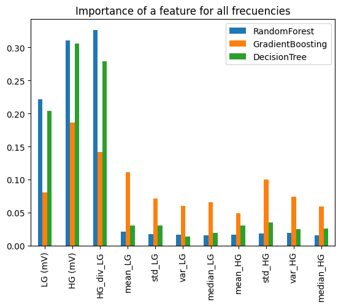
    


```python
mat_y_pred_tr = np.mat([y_pred_gb, y_pred_neigh, y_pred_rnd, y_pred_tree])
np_y_tr = y_tr.values
mat_y_pred_tr[0][0]
np.add()
```


```python
y_tr_sol = y_tr.copy() 
y_tr_sol['y_pred'] = y_pred 
y_tr_sol['true_pred'] = np.where(y_tr_sol['y_pred'] == y_tr_sol['target'],1,0)

X_tr_freq = pd.concat([y_tr_sol,X_tr_freq_target[['freq']]], axis=1)
X_tr_freq.head()
```


```python
%history
df_tmp = pd.DataFrame(
    {"False": X_tr_freq[X_tr_freq.true_pred==0]['freq'].value_counts().sort_index().values,
     "True": X_tr_freq[X_tr_freq.true_pred==1]['freq'].value_counts().sort_index().values},
    index = X_tr_freq[X_tr_freq.true_pred==0]['freq'].value_counts().sort_index().index.tolist())
df_tmp['total'] = df_tmp['True'] + df_tmp['False']
df_tmp['Accuracy'] = df_tmp['True']/df_tmp['total']
```

Study best classifier to best frequency


```python
from sklearn.metrics import confusion_matrix, ConfusionMatrixDisplay
```


```python
cm = confusion_matrix(y_va_350.target.to_numpy(), y_pred_350, labels=neigh_clf_350.classes_)
disp = ConfusionMatrixDisplay(confusion_matrix=cm, display_labels=neigh_clf_350.classes_)
fig, ax = plt.subplots(figsize=(10, 10))
ax.set_title('Confusion Matrix to k-nearest neighbor to 350 Ghz')
disp.plot(ax=ax)
```


```python
train_mo = train_pr_shifted.copy().rename(columns = {'Frequency (GHz)':'freq'})
train_mo_350 = train_mo[train_mo.freq == 350].drop(columns=['freq_target']) 
train_mo_350.info()
```


```python
train_mo_350['exp(HG)'] = train_mo_350['HG (mV)'].apply(lambda x: np.expm1(x/1000))
train_mo_350.head()
```

Binning, Discretization, Linear Models, and Trees


```python
warnings.filterwarnings('ignore')
freq = 350
ncols = 5
nrows = 3
nums_plastics = 0

fig, axes = plt.subplots(nrows, ncols, figsize=(12, 8))
for r in range(nrows):
    for c in range (ncols):
        t = train_mo_350['target'].value_counts().index.sort_values().tolist()
        df_tmp = train_mo_350[(train_mo_350.freq == freq) & (train_mo_350.target == t[nums_plastics])]
        sns.kdeplot(x=df_tmp['LG (mV)'], ax=axes[r, c], color='#F8766D', label='LG (mV)',  fill =True )
        sns.kdeplot(x=df_tmp['HG (mV)'], ax=axes[r, c], color='#00BFC4', label='HG (mV)',  fill =True )
        axes[r ,c].legend(fontsize="xx-small")
        axes[r, c].set_ylabel('')
        axes[r, c].set_xlabel('')
        axes[r, c].set_title(f"Type {t[nums_plastics]} (mV)",fontsize=7)
        axes[r, c].tick_params(labelsize=5, width=0.5)
        axes[r, c].xaxis.offsetText.set_fontsize(6)
        axes[r, c].yaxis.offsetText.set_fontsize(4)
        nums_plastics = nums_plastics +1
plt.suptitle(f"All samples. Distribution of LG (mV) and HG (mV) of each plastic to {freq} Ghz", y=0.93,fontsize=10)
plt.show()   
```


```python
train_set_350, validate_set_350 = train_test_split(train_mo_350, test_size=0.2, random_state=42)

y_tr_350 = train_set_350.target
y_va_350 = validate_set_350[['target']]

X_tr_350 = train_set_350.drop(columns=['target'])
X_va_350 = validate_set_350.drop(columns=['target'])
X_tr_350.info()
```


```python
neigh_clf_350 = KNeighborsClassifier().fit(X_tr_350.to_numpy(), y_tr_350.to_numpy())
y_pred_350 = neigh_clf_350.predict(X_va_350.to_numpy())
neigh_score_350 = accuracy_score(y_va_350.target.to_numpy(), y_pred_350) #0.5896686159844055
```


```python

cm = confusion_matrix(y_va_350.target.to_numpy(), y_pred_350, labels=neigh_clf_350.classes_)
disp = ConfusionMatrixDisplay(confusion_matrix=cm, display_labels=neigh_clf_350.classes_)
fig, ax = plt.subplots(figsize=(10, 10))
ax.set_title('Confusion Matrix to k-nearest neighbor to 350 Ghz')
disp.plot(ax=ax)
```

Columns are type produced and rows are type preceved. 

* `Type 0`: 256 samples are produced and perceived well. 97 are perceived like type 2, 48 samples as type 4, and so on
* `Type 1`: 261 samples are produced and perceived well. 173 are perceived like type 9, 43 samples as type 12, and so on
* etc.


```python
freq = 350
ncols = 2
nrows = 10
i = 0
fig, axes = plt.subplots(nrows, ncols, figsize=(12, 28))
for r in range(nrows):
    for c in range (ncols):
        t = [0, 2, 0, 7, 1, 9, 1, 14, 2, 4, 4, 8, 5, 12, 8, 13, 9, 14, 12, 14]
        df_tmp = train_mo_350[(train_mo_350.freq == freq) & (train_mo_350.target == t[i])]
        sns.kdeplot(x=df_tmp['LG (mV)'], ax=axes[r, c], color='#F8766D', label='LG (mV)',  fill =True )
        sns.kdeplot(x=df_tmp['HG (mV)'], ax=axes[r, c], color='#00BFC4', label='HG (mV)',  fill =True )
        #sns.kdeplot(x=df_tmp['HG (mV)'], ax=axes[r, c], color='#00BFC4', label='HG (mV)x2',  fill =True )
        axes[r ,c].legend(fontsize="xx-small")
        axes[r, c].set_ylabel('')
        axes[r, c].set_xlabel('')
        axes[r, c].set_title(f"Type {t[i]} (mV)",fontsize=7)
        axes[r, c].tick_params(labelsize=5, width=0.5)
        axes[r, c].xaxis.offsetText.set_fontsize(6)
        axes[r, c].yaxis.offsetText.set_fontsize(4)
        i = i + 1
plt.suptitle(f"Major mistakes produced and preceved of each plastic at {freq} Ghz", y=0.93,fontsize=10)
plt.show()   
```


```python
train_mo_350_t12 = train_mo_350[train_mo_350.target==12]['HG (mV)']
sns.kdeplot(train_mo_350_t12,color='#00BFC4', label='HG (mV)', fill =True)
```


```python
from sklearn.preprocessing import KBinsDiscretizer
kb = KBinsDiscretizer(n_bins=5, strategy='quantile', encode='onehot-dense')
kb.fit(train_mo_350_t12.values.reshape(-1, 1))
train_mo_350_binned = kb.transform(train_mo_350_t12.values.reshape(-1, 1))
kb.bin_edges_[0]
```


```python
temp = np.array([1,2,3])
temp.reshape(-1, 1)
temp.reshape(1, -1)

np.random.random((1,10))[0]
```

# Fine-tune the classifiers
## Fine-tune the hyperparameters
Finding the values of the important parameters of a model to provide the best 
generalization performanc to `neigh`, `rnd`, `gb` and `tree` get the best score)


```python
from sklearn.model_selection import RandomizedSearchCV, GridSearchCV
#RandomizedSearchCV()
#GridSearchCV()
param_grid = {'weights':('uniform', 'distance'), 'n_neighbors': np.arange(5, 10, 1)}
neigh_clf = GridSearchCV(neigh_clf,param_grid, cv=3)
neigh_search = neigh_clf.fit(X_tr.to_numpy(), y_tr.to_numpy())

#pd.DataFrame(neigh_search.cv_results_).columns
pd.DataFrame(neigh_search.cv_results_).sort_values(by='rank_test_score')[['mean_test_score','params']]
neigh_search.best_params_ #{'n_neighbors': 9, 'weights': 'uniform'}

```

# Present your solution


```python
train_sol = train_mo.copy()
train_sol.head()
```


<div>
<style scoped>
    .dataframe tbody tr th:only-of-type {
        vertical-align: middle;
    }

    .dataframe tbody tr th {
        vertical-align: top;
    }

    .dataframe thead th {
        text-align: right;
    }
</style>
<table border="1" class="dataframe">
  <thead>
    <tr style="text-align: right;">
      <th></th>
      <th>target</th>
      <th>freq</th>
      <th>LG (mV)</th>
      <th>HG (mV)</th>
      <th>HG_div_LG</th>
      <th>mean_LG</th>
      <th>std_LG</th>
      <th>var_LG</th>
      <th>median_LG</th>
      <th>mean_HG</th>
      <th>std_HG</th>
      <th>var_HG</th>
      <th>median_HG</th>
    </tr>
  </thead>
  <tbody>
    <tr>
      <th>597517</th>
      <td>2.0</td>
      <td>520.0</td>
      <td>1.098767</td>
      <td>47.369063</td>
      <td>1.457674</td>
      <td>0.056159</td>
      <td>0.761093</td>
      <td>0.579263</td>
      <td>0.030521</td>
      <td>43.755141</td>
      <td>20.781453</td>
      <td>431.868799</td>
      <td>42.455133</td>
    </tr>
    <tr>
      <th>611923</th>
      <td>2.0</td>
      <td>550.0</td>
      <td>1.709193</td>
      <td>25.027469</td>
      <td>1.229264</td>
      <td>0.037977</td>
      <td>0.745830</td>
      <td>0.556263</td>
      <td>0.030521</td>
      <td>30.607121</td>
      <td>19.817076</td>
      <td>392.716506</td>
      <td>26.492491</td>
    </tr>
    <tr>
      <th>96631</th>
      <td>0.0</td>
      <td>330.0</td>
      <td>0.488341</td>
      <td>2.075481</td>
      <td>1.015794</td>
      <td>1.078801</td>
      <td>0.829439</td>
      <td>0.687969</td>
      <td>1.098767</td>
      <td>374.372043</td>
      <td>334.837927</td>
      <td>112116.437293</td>
      <td>475.766113</td>
    </tr>
    <tr>
      <th>139325</th>
      <td>0.0</td>
      <td>430.0</td>
      <td>-0.122085</td>
      <td>211.573660</td>
      <td>3.119545</td>
      <td>0.203515</td>
      <td>0.798163</td>
      <td>0.637064</td>
      <td>0.183128</td>
      <td>172.146408</td>
      <td>59.957931</td>
      <td>3594.953537</td>
      <td>179.083736</td>
    </tr>
    <tr>
      <th>102384</th>
      <td>0.0</td>
      <td>340.0</td>
      <td>0.000000</td>
      <td>589.305329</td>
      <td>6.893053</td>
      <td>0.788821</td>
      <td>0.829749</td>
      <td>0.688484</td>
      <td>0.824075</td>
      <td>430.525467</td>
      <td>242.106955</td>
      <td>58615.777431</td>
      <td>515.428495</td>
    </tr>
  </tbody>
</table>
</div>


## Explain why your solution achieves the objective
To `neigh`, `rnd`, `gb` and `tree` get how works generalized classifiers

### Evaluate the accuracy of a classification of the best classificator

Compare true target with predictions to evaluate solutions

### K Neighbors


```python
y_pred = neigh_clf.predict(X_va.to_numpy())
y_pred_neigh = y_pred.copy()
y_va_sol = y_va.copy() 
y_va_sol['y_pred'] = y_pred 
y_va_sol['true_pred'] = np.where(y_va_sol['y_pred'] == y_va_sol['target'],1,0)
X_va_freq = pd.concat([y_va_sol,X_va_freq_target[['freq']]], axis=1)
X_va_freq_neigh = X_va_freq.copy()
X_va_freq.head()

```


<div>
<style scoped>
    .dataframe tbody tr th:only-of-type {
        vertical-align: middle;
    }

    .dataframe tbody tr th {
        vertical-align: top;
    }

    .dataframe thead th {
        text-align: right;
    }
</style>
<table border="1" class="dataframe">
  <thead>
    <tr style="text-align: right;">
      <th></th>
      <th>target</th>
      <th>y_pred</th>
      <th>true_pred</th>
      <th>freq</th>
    </tr>
  </thead>
  <tbody>
    <tr>
      <th>104878</th>
      <td>0.0</td>
      <td>0.0</td>
      <td>1</td>
      <td>350.0</td>
    </tr>
    <tr>
      <th>597203</th>
      <td>2.0</td>
      <td>0.0</td>
      <td>0</td>
      <td>520.0</td>
    </tr>
    <tr>
      <th>624310</th>
      <td>2.0</td>
      <td>0.0</td>
      <td>0</td>
      <td>580.0</td>
    </tr>
    <tr>
      <th>3975</th>
      <td>0.0</td>
      <td>0.0</td>
      <td>1</td>
      <td>100.0</td>
    </tr>
    <tr>
      <th>151963</th>
      <td>0.0</td>
      <td>0.0</td>
      <td>1</td>
      <td>460.0</td>
    </tr>
  </tbody>
</table>
</div>


```python
fig, ax = plt.subplots()
fig.set_size_inches(14, 6)
_ = ax.hist(X_va_freq[X_va_freq.true_pred==0]['freq'].apply(lambda x: np.sum([x, +2])).values, bins=408, label="fails", color="red")
_ = ax.hist(X_va_freq[X_va_freq.true_pred==1]['freq'].values, bins=408, label="trues", color="blue")
_ = ax.hist(X_va_freq['freq'].apply(lambda x: np.sum([x, -2])).values, bins=408, label="total", color="gray")
ax.legend()
ax.set_xlabel('Frequency (GHz)')
ticks = ax.set_xticks(np.arange(100, 601, 20))
ax.set_ylabel('Nums. of inaccurate samples')
ax.set_title('Total, Trues and fails predictions vs Frecuency to K Neighbors')
plt.tight_layout()
plt.show()
```


    
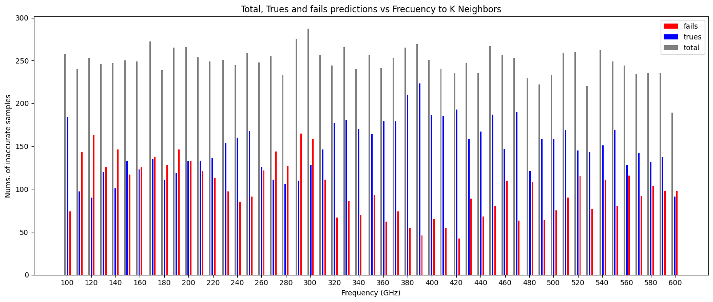
    


### Random Forest

**Notice**: Type of plastic are changed by numbers so `A1`, `B1`, `C1`, `D1`, `E1`, `E2`, `E3`, `F1`, `G1`, `H1`, `I1`, `J1`, `K1`, `L1`, `M1`, `N1`, `REF` are `0`, `1`, `2`, `3`, `4`, etc. and so on


```python
y_pred = rnd_clf.predict(X_va.to_numpy())
y_pred_rnd = y_pred.copy()
y_va_sol = y_va.copy() 
y_va_sol['y_pred'] = y_pred 
y_va_sol['true_pred'] = np.where(y_va_sol['y_pred'] == y_va_sol['target'],1,0)
X_va_freq = pd.concat([y_va_sol,X_va_freq_target[['freq']]], axis=1)
X_va_freq_rnd = X_va_freq.copy()
#X_va_freq.head()


fig, ax = plt.subplots()
fig.set_size_inches(14, 6)
_ = ax.hist(X_va_freq[X_va_freq.true_pred==0]['freq'].apply(lambda x: np.sum([x, +2])).values, bins=408, label="fails", color="red")
_ = ax.hist(X_va_freq[X_va_freq.true_pred==1]['freq'].values, bins=408, label="trues", color="blue")
_ = ax.hist(X_va_freq['freq'].apply(lambda x: np.sum([x, -2])).values, bins=408, label="total", color="gray")
ax.legend()
ax.set_xlabel('Frequency (GHz)')
ticks = ax.set_xticks(np.arange(100, 601, 20))
ax.set_ylabel('Nums. of inaccurate samples')
ax.set_title('Total, Trues and fails predictions vs Frecuency to Random Forest')
plt.tight_layout()
plt.show()
```


    

    


### Gradient Boosting


```python
y_pred = gb_clf.predict(X_va.to_numpy())
y_pred_gb = y_pred.copy()
y_va_sol = y_va.copy() 
y_va_sol['y_pred'] = y_pred 
y_va_sol['true_pred'] = np.where(y_va_sol['y_pred'] == y_va_sol['target'],1,0)
X_va_freq = pd.concat([y_va_sol,X_va_freq_target[['freq']]], axis=1)
X_va_freq_gb = X_va_freq.copy()
#X_va_freq.head()


fig, ax = plt.subplots()
fig.set_size_inches(14, 6)
_ = ax.hist(X_va_freq[X_va_freq.true_pred==0]['freq'].apply(lambda x: np.sum([x, +2])).values, bins=408, label="fails", color="red")
_ = ax.hist(X_va_freq[X_va_freq.true_pred==1]['freq'].values, bins=408, label="trues", color="blue")
_ = ax.hist(X_va_freq['freq'].apply(lambda x: np.sum([x, -2])).values, bins=408, label="total", color="gray")
ax.legend()
ax.set_xlabel('Frequency (GHz)')
ticks = ax.set_xticks(np.arange(100, 601, 20))
ax.set_ylabel('Nums. of inaccurate samples')
ax.set_title('Total, Trues and fails predictions vs Frecuency to Gradient Boosting')
plt.tight_layout()
plt.show()
```


    
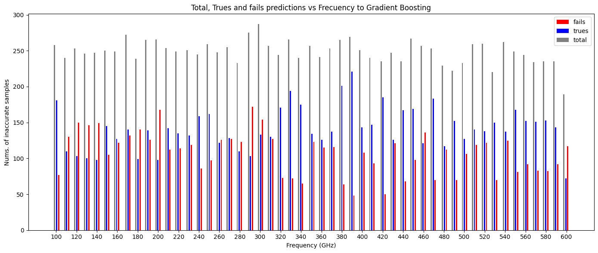
    


### Decision Tree


```python
y_pred = tree_clf.predict(X_va.to_numpy())
y_pred_tree = y_pred.copy()
y_va_sol = y_va.copy() 
y_va_sol['y_pred'] = y_pred 
y_va_sol['true_pred'] = np.where(y_va_sol['y_pred'] == y_va_sol['target'],1,0)
X_va_freq = pd.concat([y_va_sol,X_va_freq_target[['freq']]], axis=1)
X_va_freq_tree = X_va_freq.copy()
#X_va_freq.head()


fig, ax = plt.subplots()
fig.set_size_inches(14, 6)
_ = ax.hist(X_va_freq[X_va_freq.true_pred==0]['freq'].apply(lambda x: np.sum([x, +2])).values, bins=408, label="fails", color="red")
_ = ax.hist(X_va_freq[X_va_freq.true_pred==1]['freq'].values, bins=408, label="trues", color="blue")
_ = ax.hist(X_va_freq['freq'].apply(lambda x: np.sum([x, -2])).values, bins=408, label="total", color="gray")
ax.legend()
ax.set_xlabel('Frequency (GHz)')
ticks = ax.set_xticks(np.arange(100, 601, 20))
ax.set_ylabel('Nums. of inaccurate samples')
ax.set_title('Total, Trues and fails predictions vs Frecuency to Decision Tree')
plt.tight_layout()
plt.show()
```


    
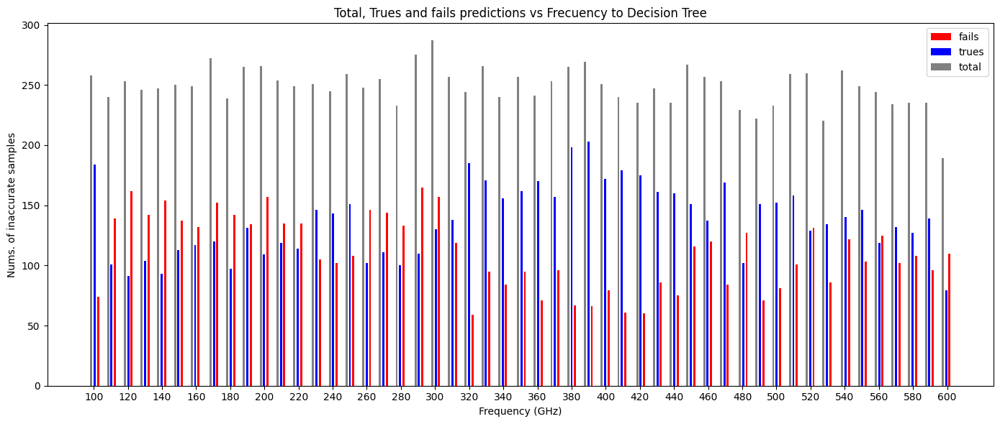
    


**Insights** : 
* Central frecuencies have less fails than lower and upper frecuencies
* The frequency with the highest accuracy can now be identified: `350 Ghz`
get").

### Count the number of times instances of types of plastics are misclassified
To `neigh`, `rnd`, `gb` and `tree` get how works generalized classifiers

**Code_Fixit**: change 


```python
gb_score = accuracy_score(y_va.target.to_numpy(), y_pred)
```


```python
from sklearn.metrics import confusion_matrix, ConfusionMatrixDisplay
cm = confusion_matrix(y_va.target.to_numpy(), y_pred_neigh, labels=neigh_clf.classes_)
disp = ConfusionMatrixDisplay(confusion_matrix=cm, display_labels=ordinal_encoder.categories_[0][0:3].tolist())
fig, ax = plt.subplots(figsize=(10, 10))
ax.set_title('All frecuencies: Confusion Matrix to K Neighbors ')
disp.plot(ax=ax)
```


    <sklearn.metrics._plot.confusion_matrix.ConfusionMatrixDisplay at 0x7aae8b8cbc70>


    
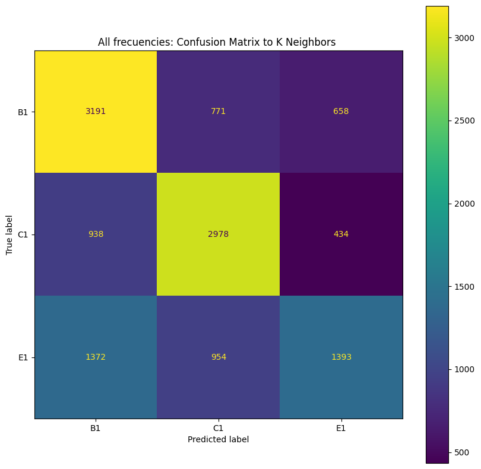
    


```python
cm = confusion_matrix(y_va.target.to_numpy(), y_pred_rnd, labels=neigh_clf.classes_)
disp = ConfusionMatrixDisplay(confusion_matrix=cm, display_labels=ordinal_encoder.categories_[0][0:3].tolist())
fig, ax = plt.subplots(figsize=(10, 10))
ax.set_title('All frecuencies: Confusion Matrix to Random Forest ')
disp.plot(ax=ax)
```


    <sklearn.metrics._plot.confusion_matrix.ConfusionMatrixDisplay at 0x7aae89e9c280>


    

    


```python
cm = confusion_matrix(y_va.target.to_numpy(), y_pred_gb, labels=neigh_clf.classes_)
disp = ConfusionMatrixDisplay(confusion_matrix=cm, display_labels=ordinal_encoder.categories_[0][0:3].tolist())
fig, ax = plt.subplots(figsize=(10, 10))
ax.set_title('All frecuencies: Confusion Matrix to Gradient Boost')
disp.plot(ax=ax)
```


    <sklearn.metrics._plot.confusion_matrix.ConfusionMatrixDisplay at 0x7aae8a01ce50>


    
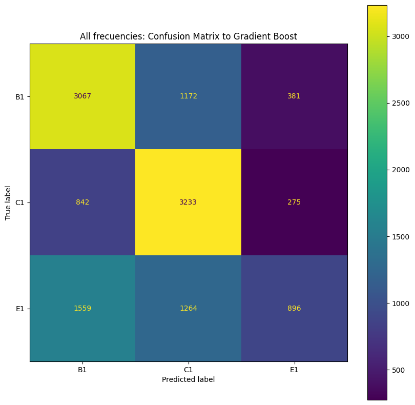
    


```python
cm = confusion_matrix(y_va.target.to_numpy(), y_pred_tree, labels=neigh_clf.classes_)
disp = ConfusionMatrixDisplay(confusion_matrix=cm, display_labels=ordinal_encoder.categories_[0][0:3].tolist())
fig, ax = plt.subplots(figsize=(10, 10))
ax.set_title('All frecuencies: Confusion Matrix to Decision Tree')
disp.plot(ax=ax)
```


    <sklearn.metrics._plot.confusion_matrix.ConfusionMatrixDisplay at 0x7aae8b8c8ee0>


    
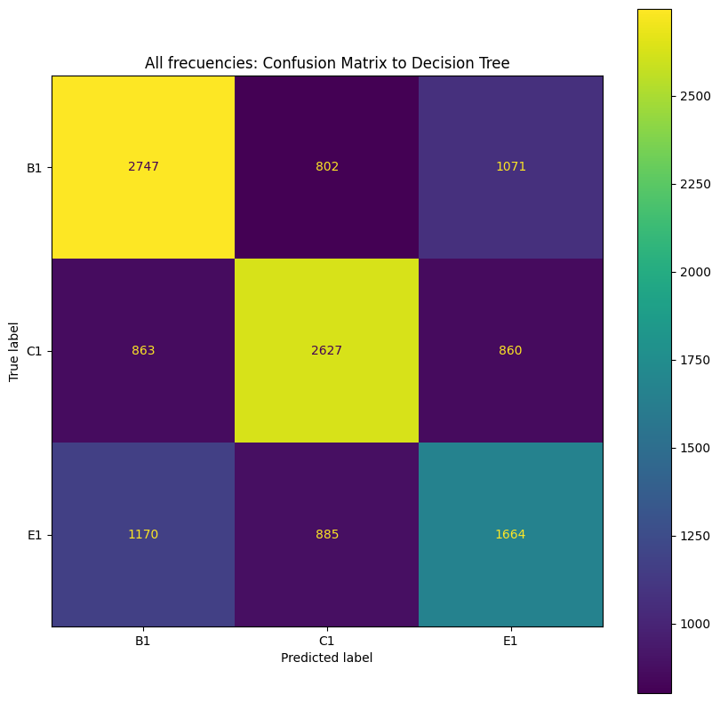
    


**Insights**:
* Count the number of times instances of class `0` (or `A1`) are classified as otherone class `1`, `2` and so on. The first row of this matrix shows 418 (of 1224 samples) were correctly classified and non class 806 (115+89+57+116+38+54+47+53+27+25+30+34+47+74) were wrongly classified. 115 as type 1,  89 as type 2 and so on. 
* Besides, the first columns shows that class `0`  were wrongly classified 1795 (159+170+119+197+85+119+112+127+99+86+119+121+114+168) by other class. He might be the plastic which was most often confused by other plastic.


### Of validate dataset, explore what frecuencies classified by target 
#### K Neighbors


```python
X_va_inaccurate = X_va_freq_neigh[X_va_freq.true_pred==0]

lst_temp = ordinal_encoder.categories_[0][0:4].tolist()
ncols = 2
nrows = 2
t = 0
fig, axes = plt.subplots(nrows, ncols, figsize=(12, 8))
for r in range(nrows):
     for c in range(ncols):

        x_fail = X_va_freq[(X_va_freq.true_pred==1) & (X_va_freq.target == t)]['freq'].apply(lambda x: np.sum([x, -2]))
        counts_f, bins_f = np.histogram(x_fail, bins=3*len(lst_freq))
        _ =  axes[r ,c].hist(bins_f[:-1], bins_f, weights=counts_f, histtype='bar', label="true", color="blue")
        
        x_total = X_va_freq[(X_va_freq.true_pred==0) & (X_va_freq.target == t)]['freq'].apply(lambda x: np.sum([x, +2]))
        counts_t, bins_t = np.histogram(x_total, bins=3*len(lst_freq))
        _ =  axes[r ,c].hist(bins_t[:-1], bins_t, weights=counts_t, histtype='bar', label="fail", color="red")
         
        lst_temp[t]
        ticks = axes[r ,c].set_xticks(np.arange(100, 601, 30))
        axes[r ,c].legend(fontsize="x-small")
        axes[r, c].set_ylabel('Nums. of fails')
        axes[r, c].set_title(f'True and fails of plastic type {lst_temp[t]} vs freqs',fontsize=9)
        axes[r, c].tick_params(labelsize=8, width=0.5)
        axes[r, c].xaxis.offsetText.set_fontsize(6)
        axes[r, c].yaxis.offsetText.set_fontsize(6)
        t = t +1
plt.suptitle(f"Predictions by target vs Frecuency. K Neighbors", y=0.93,fontsize=14)
plt.legend()
plt.show()           
```


    
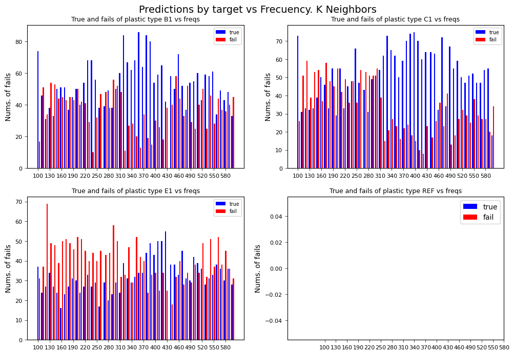
    


```python
X_va_freq = X_va_freq_neigh.copy()
df_tmp = pd.DataFrame(
    {"False": X_va_freq[X_va_freq.true_pred==0]['freq'].value_counts().sort_index().values,
     "True": X_va_freq[X_va_freq.true_pred==1]['freq'].value_counts().sort_index().values},
    index = X_va_freq[X_va_freq.true_pred==0]['freq'].value_counts().sort_index().index.tolist())
df_tmp['total'] = df_tmp['True'] + df_tmp['False']
df_tmp['Accuracy'] = df_tmp['True']/df_tmp['total']
lst_best_freq = df_tmp.sort_values(by='Accuracy',ascending= False).index.tolist()[:15]
print(f"The best frecuencies K Neighbors are: {lst_best_freq}")
lst_best_freq_neigh = lst_best_freq.copy()
```

    The best frecuencies K Neighbors are: [390.0, 420.0, 380.0, 410.0, 470.0, 360.0, 400.0, 320.0, 100.0, 490.0, 440.0, 340.0, 370.0, 450.0, 550.0]
    

#### Random Forest


```python
X_va_inaccurate = X_va_freq_rnd[X_va_freq.true_pred==0]

lst_temp = ordinal_encoder.categories_[0][0:4].tolist()
ncols = 2
nrows = 2
t = 0
fig, axes = plt.subplots(nrows, ncols, figsize=(12, 8))
for r in range(nrows):
     for c in range(ncols):

        x_fail = X_va_freq[(X_va_freq.true_pred==1) & (X_va_freq.target == t)]['freq'].apply(lambda x: np.sum([x, -2]))
        counts_f, bins_f = np.histogram(x_fail, bins=3*len(lst_freq))
        _ =  axes[r ,c].hist(bins_f[:-1], bins_f, weights=counts_f, histtype='bar', label="true", color="blue")
        
        x_total = X_va_freq[(X_va_freq.true_pred==0) & (X_va_freq.target == t)]['freq'].apply(lambda x: np.sum([x, +2]))
        counts_t, bins_t = np.histogram(x_total, bins=3*len(lst_freq))
        _ =  axes[r ,c].hist(bins_t[:-1], bins_t, weights=counts_t, histtype='bar', label="fail", color="red")
         
        lst_temp[t]
        ticks = axes[r ,c].set_xticks(np.arange(100, 601, 30))
        axes[r ,c].legend(fontsize="x-small")
        axes[r, c].set_ylabel('Nums. of fails')
        axes[r, c].set_title(f'True and fails of plastic type {lst_temp[t]} vs freqs',fontsize=9)
        axes[r, c].tick_params(labelsize=8, width=0.5)
        axes[r, c].xaxis.offsetText.set_fontsize(6)
        axes[r, c].yaxis.offsetText.set_fontsize(6)
        t = t +1
plt.suptitle(f"Predictions by target vs Frecuency. Random Forest", y=0.93,fontsize=14)
plt.legend()
plt.show()           
```


    
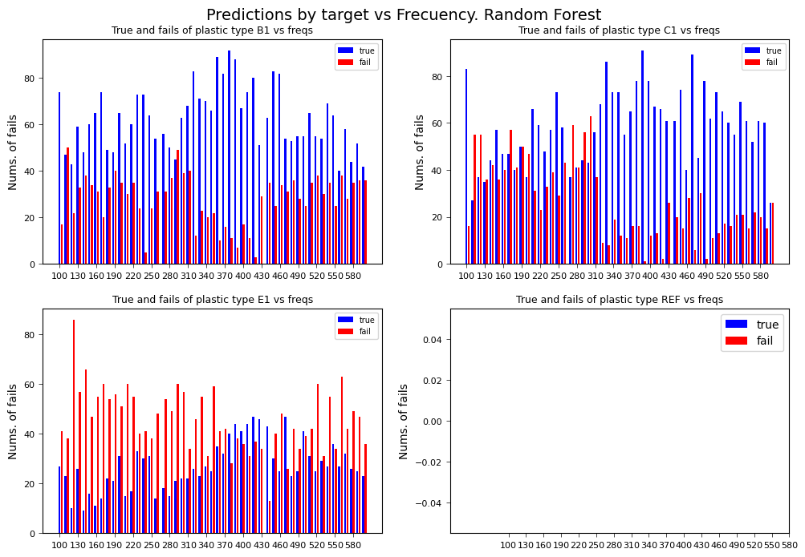
    


```python
X_va_freq = X_va_freq_rnd.copy()
df_tmp = pd.DataFrame(
    {"False": X_va_freq[X_va_freq.true_pred==0]['freq'].value_counts().sort_index().values,
     "True": X_va_freq[X_va_freq.true_pred==1]['freq'].value_counts().sort_index().values},
    index = X_va_freq[X_va_freq.true_pred==0]['freq'].value_counts().sort_index().index.tolist())
df_tmp['total'] = df_tmp['True'] + df_tmp['False']
df_tmp['Accuracy'] = df_tmp['True']/df_tmp['total']
lst_best_freq = df_tmp.sort_values(by='Accuracy',ascending= False).index.tolist()[:15]
print(f"The best frecuencies Random Forest are: {lst_best_freq}")
lst_best_freq_rnd = lst_best_freq.copy()
```

    The best frecuencies Random Forest are: [390.0, 420.0, 380.0, 410.0, 320.0, 100.0, 440.0, 470.0, 370.0, 400.0, 490.0, 360.0, 340.0, 330.0, 350.0]
    

#### Gradient Boost


```python
X_va_inaccurate = X_va_freq_gb[X_va_freq.true_pred==0]

lst_temp = ordinal_encoder.categories_[0][0:4].tolist()
ncols = 2
nrows = 2
t = 0
fig, axes = plt.subplots(nrows, ncols, figsize=(12, 8))
for r in range(nrows):
     for c in range(ncols):

        x_fail = X_va_freq[(X_va_freq.true_pred==1) & (X_va_freq.target == t)]['freq'].apply(lambda x: np.sum([x, -2]))
        counts_f, bins_f = np.histogram(x_fail, bins=3*len(lst_freq))
        _ =  axes[r ,c].hist(bins_f[:-1], bins_f, weights=counts_f, histtype='bar', label="true", color="blue")
        
        x_total = X_va_freq[(X_va_freq.true_pred==0) & (X_va_freq.target == t)]['freq'].apply(lambda x: np.sum([x, +2]))
        counts_t, bins_t = np.histogram(x_total, bins=3*len(lst_freq))
        _ =  axes[r ,c].hist(bins_t[:-1], bins_t, weights=counts_t, histtype='bar', label="fail", color="red")
         
        lst_temp[t]
        ticks = axes[r ,c].set_xticks(np.arange(100, 601, 30))
        axes[r ,c].legend(fontsize="x-small")
        axes[r, c].set_ylabel('Nums. of fails')
        axes[r, c].set_title(f'True and fails of plastic type {lst_temp[t]} vs freqs',fontsize=9)
        axes[r, c].tick_params(labelsize=8, width=0.5)
        axes[r, c].xaxis.offsetText.set_fontsize(6)
        axes[r, c].yaxis.offsetText.set_fontsize(6)
        t = t +1
plt.suptitle(f"Predictions by target vs Frecuency. Gradient Boost", y=0.93,fontsize=14)
plt.legend()
plt.show()           
```


    
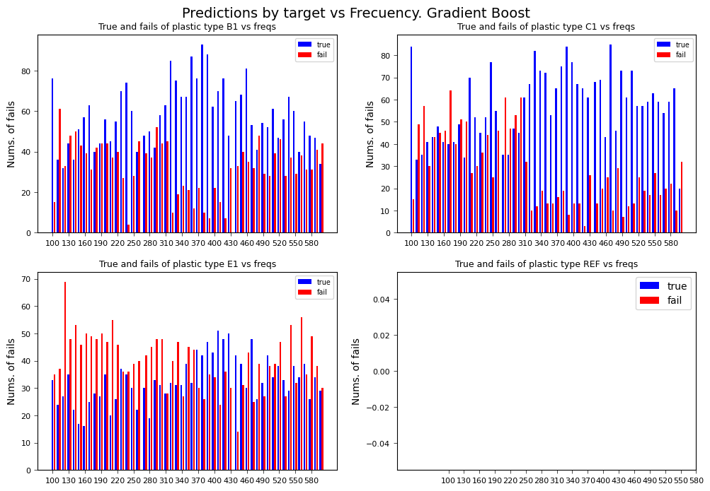
    


```python
X_va_freq = X_va_freq_gb.copy()
df_tmp = pd.DataFrame(
    {"False": X_va_freq[X_va_freq.true_pred==0]['freq'].value_counts().sort_index().values,
     "True": X_va_freq[X_va_freq.true_pred==1]['freq'].value_counts().sort_index().values},
    index = X_va_freq[X_va_freq.true_pred==0]['freq'].value_counts().sort_index().index.tolist())
df_tmp['total'] = df_tmp['True'] + df_tmp['False']
df_tmp['Accuracy'] = df_tmp['True']/df_tmp['total']
lst_best_freq = df_tmp.sort_values(by='Accuracy',ascending= False).index.tolist()[:15]
print(f"The best frecuencies Gradient Boost are: {lst_best_freq}")
lst_best_freq_gb = lst_best_freq.copy()
```

    The best frecuencies Gradient Boost are: [390.0, 420.0, 380.0, 330.0, 340.0, 470.0, 440.0, 100.0, 320.0, 490.0, 530.0, 550.0, 580.0, 240.0, 570.0]
    

#### Decision Tree


```python
X_va_inaccurate = X_va_freq_tree[X_va_freq.true_pred==0]

lst_temp = ordinal_encoder.categories_[0][0:4].tolist()
ncols = 2
nrows = 2
t = 0
fig, axes = plt.subplots(nrows, ncols, figsize=(12, 8))
for r in range(nrows):
     for c in range(ncols):

        x_fail = X_va_freq[(X_va_freq.true_pred==1) & (X_va_freq.target == t)]['freq'].apply(lambda x: np.sum([x, -2]))
        counts_f, bins_f = np.histogram(x_fail, bins=3*len(lst_freq))
        _ =  axes[r ,c].hist(bins_f[:-1], bins_f, weights=counts_f, histtype='bar', label="true", color="blue")
        
        x_total = X_va_freq[(X_va_freq.true_pred==0) & (X_va_freq.target == t)]['freq'].apply(lambda x: np.sum([x, +2]))
        counts_t, bins_t = np.histogram(x_total, bins=3*len(lst_freq))
        _ =  axes[r ,c].hist(bins_t[:-1], bins_t, weights=counts_t, histtype='bar', label="fail", color="red")
         
        lst_temp[t]
        ticks = axes[r ,c].set_xticks(np.arange(100, 601, 30))
        axes[r ,c].legend(fontsize="x-small")
        axes[r, c].set_ylabel('Nums. of fails')
        axes[r, c].set_title(f'True and fails of plastic type {lst_temp[t]} vs freqs',fontsize=9)
        axes[r, c].tick_params(labelsize=8, width=0.5)
        axes[r, c].xaxis.offsetText.set_fontsize(6)
        axes[r, c].yaxis.offsetText.set_fontsize(6)
        t = t +1
plt.suptitle(f"Predictions by target vs Frecuency. Decision Tree", y=0.93,fontsize=14)
plt.legend()
plt.show()           
```


    
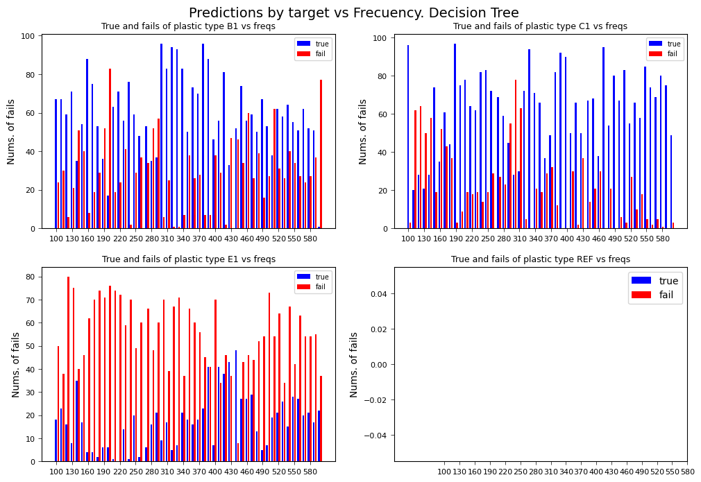
    


```python
X_va_freq = X_va_freq_tree.copy()
df_tmp = pd.DataFrame(
    {"False": X_va_freq[X_va_freq.true_pred==0]['freq'].value_counts().sort_index().values,
     "True": X_va_freq[X_va_freq.true_pred==1]['freq'].value_counts().sort_index().values},
    index = X_va_freq[X_va_freq.true_pred==0]['freq'].value_counts().sort_index().index.tolist())
df_tmp['total'] = df_tmp['True'] + df_tmp['False']
df_tmp['Accuracy'] = df_tmp['True']/df_tmp['total']
lst_best_freq = df_tmp.sort_values(by='Accuracy',ascending= False).index.tolist()[:15]
print(f"The best frecuencies Gradient Boost are: {lst_best_freq}")
lst_best_freq_tree = lst_best_freq.copy()
```

    The best frecuencies Gradient Boost are: [320.0, 390.0, 380.0, 410.0, 420.0, 100.0, 360.0, 400.0, 440.0, 490.0, 470.0, 500.0, 430.0, 340.0, 330.0]
    


```python
print (f" \nK Neighbors frecuencies: \t{lst_best_freq_neigh} \nRandom Forest frecuencies: \t{lst_best_freq_rnd} \nGradient Boost frecuencies: \t{lst_best_freq_gb} \nDecision Tree frecuencies: \t{lst_best_freq_tree}")
```

     
    K Neighbors frecuencies: 	[390.0, 420.0, 380.0, 410.0, 470.0, 360.0, 400.0, 320.0, 100.0, 490.0, 440.0, 340.0, 370.0, 450.0, 550.0] 
    Random Forest frecuencies: 	[390.0, 420.0, 380.0, 410.0, 320.0, 100.0, 440.0, 470.0, 370.0, 400.0, 490.0, 360.0, 340.0, 330.0, 350.0] 
    Gradient Boost frecuencies: 	[390.0, 420.0, 380.0, 330.0, 340.0, 470.0, 440.0, 100.0, 320.0, 490.0, 530.0, 550.0, 580.0, 240.0, 570.0] 
    Decision Tree frecuencies: 	[320.0, 390.0, 380.0, 410.0, 420.0, 100.0, 360.0, 400.0, 440.0, 490.0, 470.0, 500.0, 430.0, 340.0, 330.0]
    

**Insights**: 
'B1', 'C1', 'E1', 'REF' 

* The material that is detected with the highest accuracy can now be identified: Type 3, 4, 11, 12, and 14 at various frequencies, type 8 and 15 at 350, type 13 at 250.
* The material with the lowest accuracy can now be identified, type 2 and 9 show failures at all frequencies.
