# Get the Data


```python
import numpy as np # linear algebra
import pandas as pd # data processing, CSV file I/O (e.g. pd.read_csv)
```


```python
#train = pd.read_csv('/kaggle/input/fi-optimun-frecuency/merged_2.csv', sep=';')
train = pd.read_csv('/kaggle/input/fi-optimun-frecuency/e1_merged.csv', sep=';')
train.head()
```


<div>
<style scoped>
    .dataframe tbody tr th:only-of-type {
        vertical-align: middle;
    }

    .dataframe tbody tr th {
        vertical-align: top;
    }

    .dataframe thead th {
        text-align: right;
    }
</style>
<table border="1" class="dataframe">
  <thead>
    <tr style="text-align: right;">
      <th></th>
      <th>Sample</th>
      <th>Frequency (GHz)</th>
      <th>LG (mV)</th>
      <th>HG (mV)</th>
      <th>Thickness (mm)</th>
    </tr>
  </thead>
  <tbody>
    <tr>
      <th>0</th>
      <td>A1</td>
      <td>100.0</td>
      <td>-7.080942</td>
      <td>-0.854611</td>
      <td>0.2</td>
    </tr>
    <tr>
      <th>1</th>
      <td>A1</td>
      <td>100.0</td>
      <td>67.024785</td>
      <td>0.244141</td>
      <td>0.2</td>
    </tr>
    <tr>
      <th>2</th>
      <td>A1</td>
      <td>100.0</td>
      <td>124.893178</td>
      <td>-1.098776</td>
      <td>0.2</td>
    </tr>
    <tr>
      <th>3</th>
      <td>A1</td>
      <td>100.0</td>
      <td>91.075571</td>
      <td>0.000000</td>
      <td>0.2</td>
    </tr>
    <tr>
      <th>4</th>
      <td>A1</td>
      <td>100.0</td>
      <td>48.956174</td>
      <td>0.122094</td>
      <td>0.2</td>
    </tr>
  </tbody>
</table>
</div>


Samples has serveral Thickness


```python
train['Thickness (mm)'].value_counts().index.sort_values().tolist()
```


    [0.0, 0.04, 0.07, 0.1, 0.2, 0.29, 0.36, 0.57, 1.85, 2.05, 2.25, 3.0]


51 frecuencies (Ghz)


```python
train['Frequency (GHz)'].value_counts().index.sort_values()
```


    Index([100.0, 110.0, 120.0, 130.0, 140.0, 150.0, 160.0, 170.0, 180.0, 190.0,
           200.0, 210.0, 220.0, 230.0, 240.0, 250.0, 260.0, 270.0, 280.0, 290.0,
           300.0, 310.0, 320.0, 330.0, 340.0, 350.0, 360.0, 370.0, 380.0, 390.0,
           400.0, 410.0, 420.0, 430.0, 440.0, 450.0, 460.0, 470.0, 480.0, 490.0,
           500.0, 510.0, 520.0, 530.0, 540.0, 550.0, 560.0, 570.0, 580.0, 590.0,
           600.0],
          dtype='float64', name='Frequency (GHz)')


15 types of plastic


```python
train['Sample'].value_counts().index.sort_values()
```


    Index(['A1', 'B1', 'C1', 'D1', 'E1', 'F1', 'G1', 'H1', 'I1', 'J1', 'K1', 'L1',
           'M1', 'N1', 'REF'],
          dtype='object', name='Sample')


### Add data of Experiments 2, 3 and 4
**TODO**: Add temparature and RH to experiments 3 and 4


```python
train_e1 = train.copy()
train_e1 = train_e1.drop(columns=['Thickness (mm)']) # Remove `Thickness (mm)`

train_e1['num_experiment'] = 'e1'
train_e1['Sample_original'] = 'None'
train_e1['Integration_Time_(msg)'] = 5

# ['E1', 'H1', 'REF']
train_e2 = pd.read_csv('/kaggle/input/fi-optimun-frecuency/e2_merged.csv', sep=';') 
train_e2['num_experiment'] = 'e2'
train_e2['Sample_original'] = 'None'
train_e2['Integration_Time_(msg)'] = 5

# ['REF_1', 'REF_10', 'REF_11', 'REF_12', 'REF_13', 'REF_14', 'REF_15', 'REF_2', 'REF_3', 'REF_4', 'REF_5', 'REF_6', 'REF_7', 'REF_8', 'REF_9']
train_e3 = pd.read_csv('/kaggle/input/fi-optimun-frecuency/e3_merged.csv', sep=',') 
train_e3['num_experiment'] = 'e3'
train_e3['Sample_original'] = train_e3['Sample']
train_e3['Sample'] = 'REF'
train_e3['Integration_Time_(msg)'] = 5

# ['B1_12', 'B1_2', 'B1_5', 'B1_9', 'C1_11', 'C1_14', 'C1_4', 'C1_7', 'E3_10', 'E3_13', 'E3_3', 'E3_6', 'REF_1', 'REF_15', 'REF_8']
train_e4 = pd.read_csv('/kaggle/input/fi-optimun-frecuency/e4_merged.csv', sep=',')
train_e4['num_experiment'] = 'e4'
train_e4['Sample_original'] = train_e4['Sample']
train_e4['Integration_Time_(msg)'] = 20

# ['B1_17', 'B1_20', 'C1_19', 'C1_22', 'E3_18', 'E3_21', 'REF_16', 'REF_23']
train_e4_v2 = pd.read_csv('/kaggle/input/fi-optimun-frecuency/e4_v2_merged.csv', sep=',')
train_e4_v2['num_experiment'] = 'e4_v2'
train_e4_v2['Sample_original'] = train_e4_v2['Sample']
train_e4_v2['Integration_Time_(msg)'] = 20

# ['A1_1', 'A2_13', 'A3_25', 'A4_43', 'A5_55', 'B1_2', 'B2_14', 'B3_26', 'B4_44', 'B5_56', 'C1_3', 'C2_15', 'C3_27', 'C4_45', 'C5_57', 'D1_4', 'D2_16', 'D3_28', 'D4_46', 'D5_58', 'E1_5', 'E2_17', 'E3_29', 'E4_47', 'E5_59', 'F1_6', 'F2_18', 'F3_30', 'F4_48', 'F5_60', 'G1_7', 'G2_19', 'G3_31', 'G4_37', 'G5_49', 'H1_8', 'H2_20', 'H3_32', 'H4_38', 'H5_50', 'I1_9', 'I2_21', 'I3_33', 'I4_39', 'I5_51', 'J1_10', 'J2_22', 'J3_34', 'J4_40', 'J5_52', 'L1_11', 'L2_23', 'L3_35', 'L4_41', 'L5_53', 'O1_12', 'O2_24', 'O3_36', 'O4_42', 'O5_54']
train_e5  = pd.read_csv('/kaggle/input/fi-optimun-frecuency/e5_merged.csv', sep=',')
train_e5['num_experiment'] = 'e5'
train_e5['Sample_original'] = train_e5['Sample']
train_e5['Integration_Time_(msg)'] = 5
```


```python
train_all_experiments = pd.concat([train_e1, train_e2, train_e3, train_e4, train_e4_v2, train_e5])
train_all_experiments.reset_index(inplace=True)
train_all_experiments = train_all_experiments.rename(columns = {'index':'index_original'})

train_all_experiments.head() # 8414389 rows x 8 columns
```


<div>
<style scoped>
    .dataframe tbody tr th:only-of-type {
        vertical-align: middle;
    }

    .dataframe tbody tr th {
        vertical-align: top;
    }

    .dataframe thead th {
        text-align: right;
    }
</style>
<table border="1" class="dataframe">
  <thead>
    <tr style="text-align: right;">
      <th></th>
      <th>index_original</th>
      <th>Sample</th>
      <th>Frequency (GHz)</th>
      <th>LG (mV)</th>
      <th>HG (mV)</th>
      <th>num_experiment</th>
      <th>Sample_original</th>
      <th>Integration_Time_(msg)</th>
    </tr>
  </thead>
  <tbody>
    <tr>
      <th>0</th>
      <td>0</td>
      <td>A1</td>
      <td>100.0</td>
      <td>-7.080942</td>
      <td>-0.854611</td>
      <td>e1</td>
      <td>None</td>
      <td>5</td>
    </tr>
    <tr>
      <th>1</th>
      <td>1</td>
      <td>A1</td>
      <td>100.0</td>
      <td>67.024785</td>
      <td>0.244141</td>
      <td>e1</td>
      <td>None</td>
      <td>5</td>
    </tr>
    <tr>
      <th>2</th>
      <td>2</td>
      <td>A1</td>
      <td>100.0</td>
      <td>124.893178</td>
      <td>-1.098776</td>
      <td>e1</td>
      <td>None</td>
      <td>5</td>
    </tr>
    <tr>
      <th>3</th>
      <td>3</td>
      <td>A1</td>
      <td>100.0</td>
      <td>91.075571</td>
      <td>0.000000</td>
      <td>e1</td>
      <td>None</td>
      <td>5</td>
    </tr>
    <tr>
      <th>4</th>
      <td>4</td>
      <td>A1</td>
      <td>100.0</td>
      <td>48.956174</td>
      <td>0.122094</td>
      <td>e1</td>
      <td>None</td>
      <td>5</td>
    </tr>
  </tbody>
</table>
</div>


```python
lst_queries = ['Sample.str.startswith("B")', 'Sample.str.startswith("C")', 'Sample.str.startswith("D")', 'Sample.str.startswith("E")', 'Sample.str.startswith("F")', 'Sample.str.startswith("G")', 'Sample.str.startswith("H")', 'Sample.str.startswith("I")', 'Sample.str.startswith("J")', 'Sample.str.startswith("K")', 'Sample.str.startswith("L")', 'Sample.str.startswith("M")', 'Sample.str.startswith("N")', 'Sample.str.startswith("O")', 'Sample.str.startswith("REF")']
lst_types_to_queries = ['B', 'C', 'D', 'E', 'F', 'G', 'H', 'I', 'J', 'K', 'L', 'M', 'N', 'O', 'REF']

df_temp = train_all_experiments.query('Sample.str.startswith("A")', engine="python")
df_temp = df_temp.drop(columns=['Sample'])
df_temp['Sample'] = 'A'
for i, q in enumerate(lst_queries):
    df_temp2 = train_all_experiments.query(lst_queries[i], engine="python")
    df_temp2 = df_temp2.drop(columns=['Sample'])
    df_temp2['Sample'] = lst_types_to_queries[i]
    df_temp = pd.concat([df_temp, df_temp2]) # 3892248 (?) rows x 7 columns
df_temp.sort_index(inplace=True)
df_temp['index_original'] = train_all_experiments.index
train_all_experiments = df_temp.copy() # 8414389 rows x 8 columns
#train_all_experiments.to_csv('train_all_experiments.csv', index=False)
```


```python
ser_temp = train_all_experiments['Sample_original'].value_counts()
lst_Sample_original = ser_temp.index.sort_values().tolist()
```

**Doubts**: Was the REF measured in experiment 5? I use REF measured in experiment 4


```python
train_all_experiments['LG (mV)'].groupby([train_all_experiments['Sample'],
                                          train_all_experiments['num_experiment']
                                         ]).count()
```


    Sample  num_experiment
    A       e1                172103
            e5                385121
    B       e1                152817
            e4                106800
            e4_v2              83890
            e5                323182
    C       e1                166224
            e4                107855
            e4_v2              56757
            e5                301648
    D       e1                170548
            e5                312413
    E       e1                157089
            e2                428593
            e4                112603
            e4_v2              56729
            e5                319174
    F       e1                154569
            e5                313698
    G       e1                166421
            e5                322293
    H       e1                155589
            e2                423405
            e5                308851
    I       e1                157814
            e5                327847
    J       e1                158264
            e5                328208
    K       e1                152038
    L       e1                173344
            e5                329057
    M       e1                170676
    N       e1                159814
    O       e5                320756
    REF     e1                153315
            e2                134226
            e3                424998
            e4                112390
            e4_v2              53270
    Name: LG (mV), dtype: int64


```python
train_e4_REF = train_all_experiments[(train_all_experiments.num_experiment=='e4') & (train_all_experiments.Sample=='REF')]
```


```python
train_all_experiments_e5 = train_all_experiments[train_all_experiments.num_experiment=='e5']

train_get = train_all_experiments_e5[(train_all_experiments_e5.Sample_original == 'A1_1') | (train_all_experiments_e5.Sample_original == 'B1_2') | (train_all_experiments_e5.Sample_original == 'C1_3') | (train_all_experiments_e5.Sample_original == 'D1_4') | (train_all_experiments_e5.Sample_original == 'E1_5') | (train_all_experiments_e5.Sample_original == 'F1_6') | (train_all_experiments_e5.Sample_original == 'G1_7') | (train_all_experiments_e5.Sample_original == 'H1_8') | (train_all_experiments_e5.Sample_original == 'I1_9') | (train_all_experiments_e5.Sample_original == 'J1_10') | (train_all_experiments_e5.Sample_original == 'L1_11') | (train_all_experiments_e5.Sample_original == 'O1_12')]
train_get = pd.concat([train_get, train_e4_REF]).drop(columns=['index_original']) #927303 rows x 7 columns
```


```python
train_get_day_2 = train_all_experiments_e5[(train_all_experiments_e5.Sample_original == 'A2_13') | (train_all_experiments_e5.Sample_original == 'B2_14') | (train_all_experiments_e5.Sample_original == 'C2_15') | (train_all_experiments_e5.Sample_original == 'D2_16') | (train_all_experiments_e5.Sample_original == 'E2_17') | (train_all_experiments_e5.Sample_original == 'F2_18') | (train_all_experiments_e5.Sample_original == 'G2_19') | (train_all_experiments_e5.Sample_original == 'H2_20') | (train_all_experiments_e5.Sample_original == 'I2_21') | (train_all_experiments_e5.Sample_original == 'J2_22') | (train_all_experiments_e5.Sample_original == 'L2_23') | (train_all_experiments_e5.Sample_original == 'O2_24')].drop(columns=['index_original']) # 774450 rows x 7 columns
train_get_day_2.head()
```


<div>
<style scoped>
    .dataframe tbody tr th:only-of-type {
        vertical-align: middle;
    }

    .dataframe tbody tr th {
        vertical-align: top;
    }

    .dataframe thead th {
        text-align: right;
    }
</style>
<table border="1" class="dataframe">
  <thead>
    <tr style="text-align: right;">
      <th></th>
      <th>Frequency (GHz)</th>
      <th>LG (mV)</th>
      <th>HG (mV)</th>
      <th>num_experiment</th>
      <th>Sample_original</th>
      <th>Integration_Time_(msg)</th>
      <th>Sample</th>
    </tr>
  </thead>
  <tbody>
    <tr>
      <th>4651221</th>
      <td>100.0</td>
      <td>0.000000</td>
      <td>36.625564</td>
      <td>e5</td>
      <td>A2_13</td>
      <td>5</td>
      <td>A</td>
    </tr>
    <tr>
      <th>4651222</th>
      <td>100.0</td>
      <td>-0.488341</td>
      <td>17.214015</td>
      <td>e5</td>
      <td>A2_13</td>
      <td>5</td>
      <td>A</td>
    </tr>
    <tr>
      <th>4651223</th>
      <td>100.0</td>
      <td>0.000000</td>
      <td>35.160542</td>
      <td>e5</td>
      <td>A2_13</td>
      <td>5</td>
      <td>A</td>
    </tr>
    <tr>
      <th>4651224</th>
      <td>100.0</td>
      <td>1.587108</td>
      <td>32.840922</td>
      <td>e5</td>
      <td>A2_13</td>
      <td>5</td>
      <td>A</td>
    </tr>
    <tr>
      <th>4651225</th>
      <td>100.0</td>
      <td>2.075449</td>
      <td>46.636552</td>
      <td>e5</td>
      <td>A2_13</td>
      <td>5</td>
      <td>A</td>
    </tr>
  </tbody>
</table>
</div>


```python
train_day_1_to_4_e5 = train_all_experiments_e5[(train_all_experiments_e5.Sample_original != 'A5_55') | (train_all_experiments_e5.Sample_original != 'B5_56') | (train_all_experiments_e5.Sample_original != 'C5_57') | (train_all_experiments_e5.Sample_original != 'D5_58') | (train_all_experiments_e5.Sample_original != 'E5_59') | (train_all_experiments_e5.Sample_original != 'F5_60') | (train_all_experiments_e5.Sample_original != 'G5_49') | (train_all_experiments_e5.Sample_original != 'H5_50') | (train_all_experiments_e5.Sample_original != 'I5_51') | (train_all_experiments_e5.Sample_original != 'J5_52') | (train_all_experiments_e5.Sample_original != 'L5_53') | (train_all_experiments_e5.Sample_original != 'O5_54')] # 3892248 rows x 8 columns
train_day_5_e5 = train_all_experiments_e5[(train_all_experiments_e5.Sample_original == 'A5_55') | (train_all_experiments_e5.Sample_original == 'B5_56') | (train_all_experiments_e5.Sample_original == 'C5_57') | (train_all_experiments_e5.Sample_original == 'D5_58') | (train_all_experiments_e5.Sample_original == 'E5_59') | (train_all_experiments_e5.Sample_original == 'F5_60') | (train_all_experiments_e5.Sample_original == 'G5_49') | (train_all_experiments_e5.Sample_original == 'H5_50') | (train_all_experiments_e5.Sample_original == 'I5_51') | (train_all_experiments_e5.Sample_original == 'J5_52') | (train_all_experiments_e5.Sample_original == 'L5_53') | (train_all_experiments_e5.Sample_original == 'O5_54')] # 783703 rows x 8 columns
```


```python
train_get = train_day_1_to_4_e5.copy()
test_get = train_day_5_e5.copy()
train_get.drop(columns=['index_original'], inplace=True)
test_get.drop(columns=['index_original'], inplace=True)

train_get.head()

```


<div>
<style scoped>
    .dataframe tbody tr th:only-of-type {
        vertical-align: middle;
    }

    .dataframe tbody tr th {
        vertical-align: top;
    }

    .dataframe thead th {
        text-align: right;
    }
</style>
<table border="1" class="dataframe">
  <thead>
    <tr style="text-align: right;">
      <th></th>
      <th>Frequency (GHz)</th>
      <th>LG (mV)</th>
      <th>HG (mV)</th>
      <th>num_experiment</th>
      <th>Sample_original</th>
      <th>Integration_Time_(msg)</th>
      <th>Sample</th>
    </tr>
  </thead>
  <tbody>
    <tr>
      <th>4522141</th>
      <td>100.0</td>
      <td>0.366256</td>
      <td>24.172872</td>
      <td>e5</td>
      <td>A1_1</td>
      <td>5</td>
      <td>A</td>
    </tr>
    <tr>
      <th>4522142</th>
      <td>100.0</td>
      <td>-0.244170</td>
      <td>37.846416</td>
      <td>e5</td>
      <td>A1_1</td>
      <td>5</td>
      <td>A</td>
    </tr>
    <tr>
      <th>4522143</th>
      <td>100.0</td>
      <td>-1.831278</td>
      <td>42.241484</td>
      <td>e5</td>
      <td>A1_1</td>
      <td>5</td>
      <td>A</td>
    </tr>
    <tr>
      <th>4522144</th>
      <td>100.0</td>
      <td>1.220852</td>
      <td>36.015138</td>
      <td>e5</td>
      <td>A1_1</td>
      <td>5</td>
      <td>A</td>
    </tr>
    <tr>
      <th>4522145</th>
      <td>100.0</td>
      <td>0.610426</td>
      <td>41.997313</td>
      <td>e5</td>
      <td>A1_1</td>
      <td>5</td>
      <td>A</td>
    </tr>
  </tbody>
</table>
</div>


## Convert the data to a format you can easily manipulate


```python
train_get = train_get.rename(columns = {'Sample':'target', 'Frequency (GHz)': 'freq', 'Integration_Time_(msg)': 'int_time' })
train_get.head() #927303 rows x 7 columns

test_get = test_get.rename(columns = {'Sample':'target', 'Frequency (GHz)': 'freq', 'Integration_Time_(msg)': 'int_time' })
```

**Doubt**: I wonder why there are more type A measures


```python
train_get['D'].value_counts().sort_index()

```

## Sample a test set, put it aside, and never look at it
The test set is used after the model has been fully trained to assess the model's performance on completely unseen data

Data is split in a stratified fashion, using this at  theTarget as  class labels  
**Conjecture**: It is assumed that there is time independence in the laser measurement.


```python
lst_best_freq = [250.0, 320.0, 330.0]
```


```python
#n_best_freqs = 3

#set_freq = set(lst_best_freq_rnd[:n_best_freqs] + lst_best_freq_gb[:n_best_freqs] + lst_best_freq_neigh[:n_best_freqs] + lst_best_freq_tree[:n_best_freqs])
#lst_best_freq = list(set_freq)
```


```python
for i, f in enumerate(lst_best_freq):
    df_tmp = train_get[train_get.freq == lst_best_freq[i]]
    if i == 0:
        train_get_temp = df_tmp.copy()
    else:
        train_get_temp = pd.concat([train_get_temp, df_tmp])

train_get = train_get_temp.copy() #238375 rows x 7 columns

```


```python
for i, f in enumerate(lst_best_freq):
    df_tmp = test_get[test_get.freq == lst_best_freq[i]]
    if i == 0:
        test_get_temp = df_tmp.copy()
    else:
        test_get_temp = pd.concat([test_get_temp, df_tmp])

test_get = test_get_temp.copy() #47929 rows x 7 columns

```


```python
train_get = train_get[(train_get.target=='A') | (train_get.target=='B') | (train_get.target=='C') | (train_get.target=='D')]
test_get = test_get[(test_get.target=='A') | (test_get.target=='B') | (test_get.target=='C') | (test_get.target=='D')]
```


```python
train_get['LG (mV)'].groupby(train_get['freq']).count()
```


```python
train_get['LG (mV)'].groupby(train_get['target']).count()
```


```python
from sklearn.model_selection import train_test_split
train_set, test_set = train_test_split(train_get, test_size=0.2, random_state=42, stratify=train_get.target)
```

Check the target distribution of target in a plotted bar. The frequency or proportion are uniform in train and test dataset


```python
import matplotlib.pylab as plt
ax = train_set['target'].value_counts().transpose().plot.bar(figsize=(8, 4), legend=False)
ax.set_xlabel('Data Distribution of target for train dataset')
ax.set_ylabel('Number of Samples')
plt.tight_layout()
plt.show()
```


    
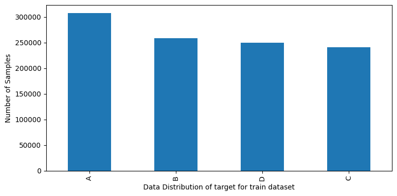
    


```python
ax = test_set['target'].value_counts().transpose().plot.bar(figsize=(8, 4), legend=False)
ax.set_xlabel('Data Distribution of target for test dataset')
ax.set_ylabel('Number of Samples')
plt.tight_layout()
plt.show()
```


    
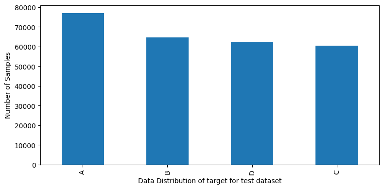
    


 # Explore the data


```python
train_ex = train_get.copy() 
test_ex = test_get.copy()
train_ex.head()
```


<div>
<style scoped>
    .dataframe tbody tr th:only-of-type {
        vertical-align: middle;
    }

    .dataframe tbody tr th {
        vertical-align: top;
    }

    .dataframe thead th {
        text-align: right;
    }
</style>
<table border="1" class="dataframe">
  <thead>
    <tr style="text-align: right;">
      <th></th>
      <th>freq</th>
      <th>LG (mV)</th>
      <th>HG (mV)</th>
      <th>num_experiment</th>
      <th>Sample_original</th>
      <th>int_time</th>
      <th>target</th>
    </tr>
  </thead>
  <tbody>
    <tr>
      <th>4522141</th>
      <td>100.0</td>
      <td>0.366256</td>
      <td>24.172872</td>
      <td>e5</td>
      <td>A1_1</td>
      <td>5</td>
      <td>A</td>
    </tr>
    <tr>
      <th>4522142</th>
      <td>100.0</td>
      <td>-0.244170</td>
      <td>37.846416</td>
      <td>e5</td>
      <td>A1_1</td>
      <td>5</td>
      <td>A</td>
    </tr>
    <tr>
      <th>4522143</th>
      <td>100.0</td>
      <td>-1.831278</td>
      <td>42.241484</td>
      <td>e5</td>
      <td>A1_1</td>
      <td>5</td>
      <td>A</td>
    </tr>
    <tr>
      <th>4522144</th>
      <td>100.0</td>
      <td>1.220852</td>
      <td>36.015138</td>
      <td>e5</td>
      <td>A1_1</td>
      <td>5</td>
      <td>A</td>
    </tr>
    <tr>
      <th>4522145</th>
      <td>100.0</td>
      <td>0.610426</td>
      <td>41.997313</td>
      <td>e5</td>
      <td>A1_1</td>
      <td>5</td>
      <td>A</td>
    </tr>
  </tbody>
</table>
</div>


## Visualize one HG (mV) a one freq like time series  


```python
train_get.groupby([train_get['target'], train_get['num_experiment']]).count()
```


```python
import seaborn as sns
import warnings
warnings.filterwarnings('ignore')

for f in train_ex['freq'].value_counts().index.sort_values().tolist():
    freq = f
    ncols = 4
    nrows = 1
    nums_plastics = 0
    
    fig, axes = plt.subplots(nrows, ncols, figsize=(12, 2))
    for r in range(nrows):
        for c in range (ncols):
            t = train_ex['target'].value_counts().index.sort_values().tolist()
            #t.remove('REF')
            df_tmp = train_ex[(train_ex.freq == freq) & (train_ex.target == t[nums_plastics])]
            df_tmp.reset_index(inplace=True, drop=True)
            sns.lineplot(data=df_tmp['LG (mV)'], ax=axes[c], color='#F8766D', label='LG (mV)' )
            sns.lineplot(data=df_tmp['HG (mV)'], ax=axes[c], color='#00BFC4', label='HG (mV)' )
            axes[c].legend(fontsize="xx-small")
            axes[c].set_ylabel('')
            axes[c].set_xlabel('')
            axes[c].set_title(f"Type {lst_tmp[nums_plastics]} (mV)",fontsize=5)
            axes[c].tick_params(labelsize=5, width=0.5)
            axes[c].xaxis.offsetText.set_fontsize(6)
            axes[c].yaxis.offsetText.set_fontsize(4)
            nums_plastics = nums_plastics +1
    plt.suptitle(f"Train of four days. Line of LG (mV) and HG (mV) to {freq} Ghz", y=0.999,fontsize=6)
    plt.show()        
```


    
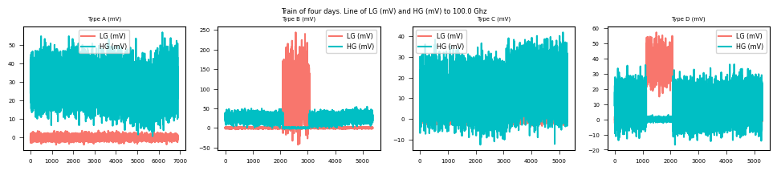
    


    
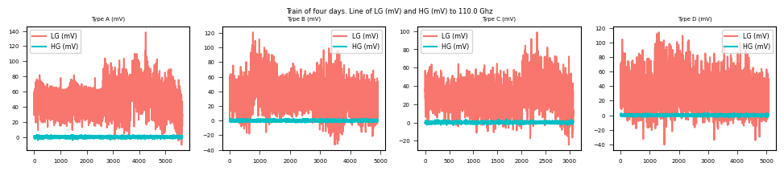
    


    
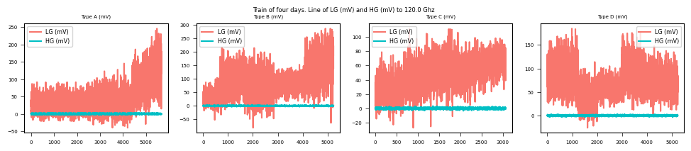
    


    
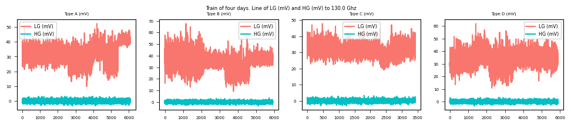
    


    
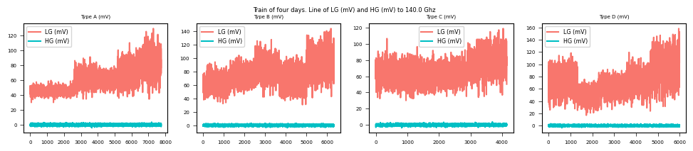
    


    
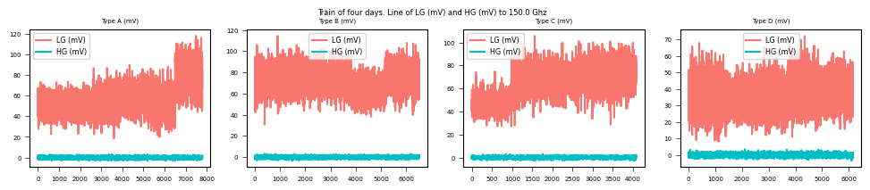
    


    
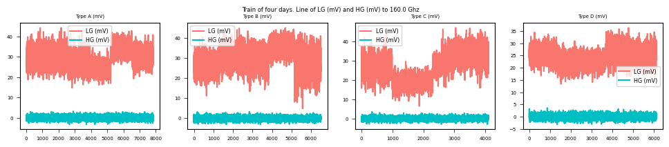
    


    
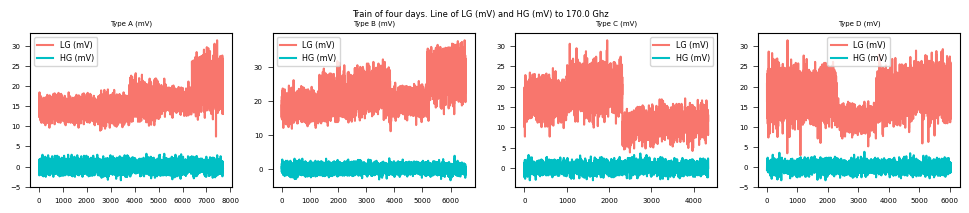
    


    
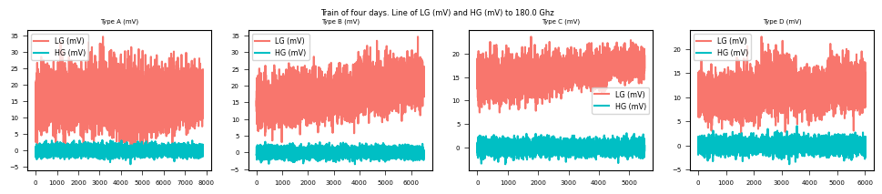
    


    
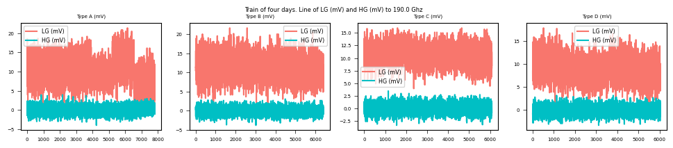
    


    

    


    
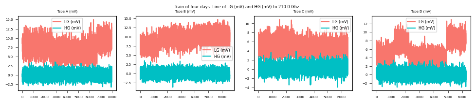
    


    
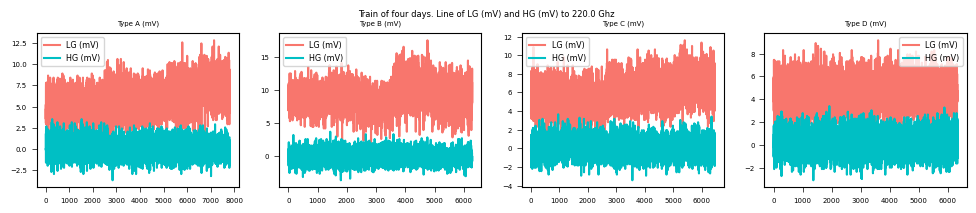
    


    
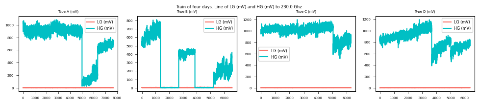
    


    
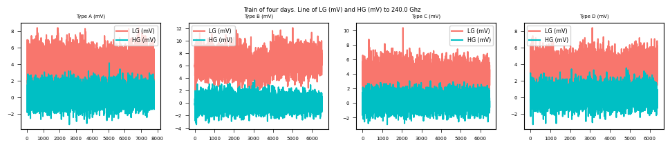
    


    
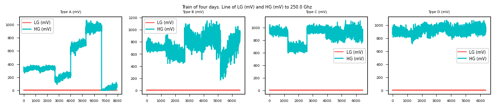
    


    
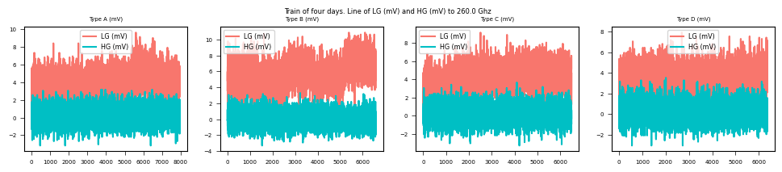
    


    
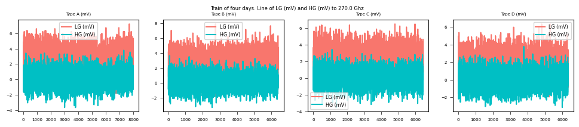
    


    
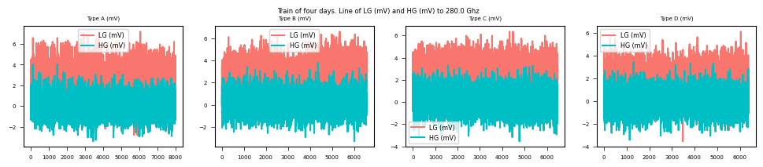
    


    
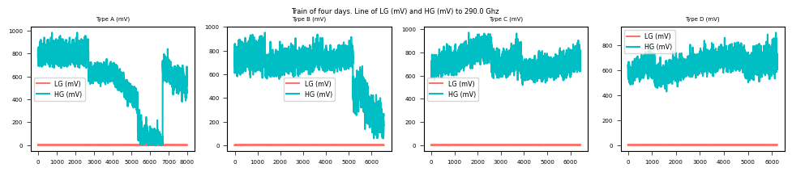
    


    
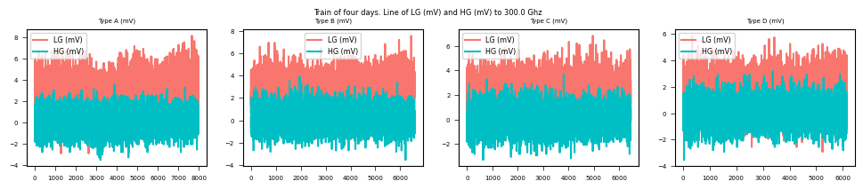
    


    
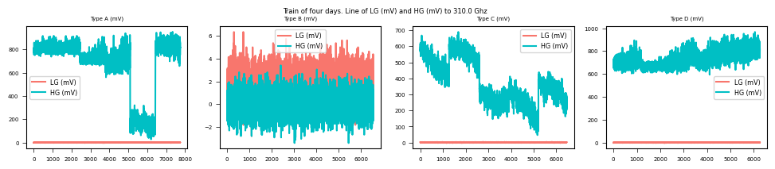
    


    
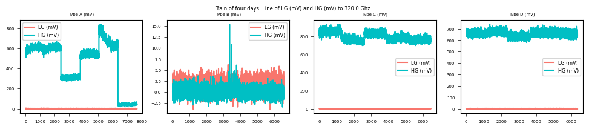
    


    
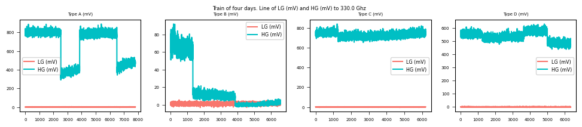
    


    
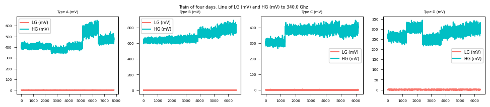
    


    

    


    

    


    

    


    
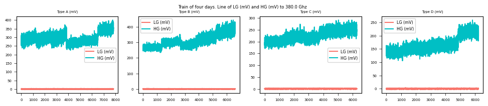
    


    
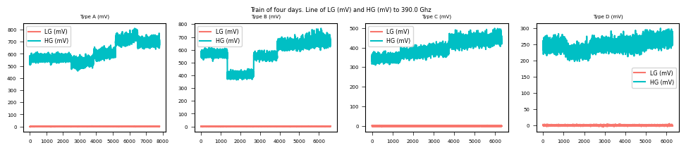
    


    
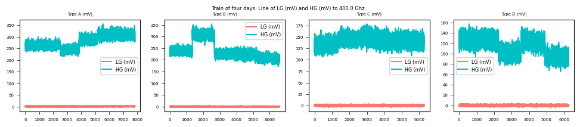
    


    
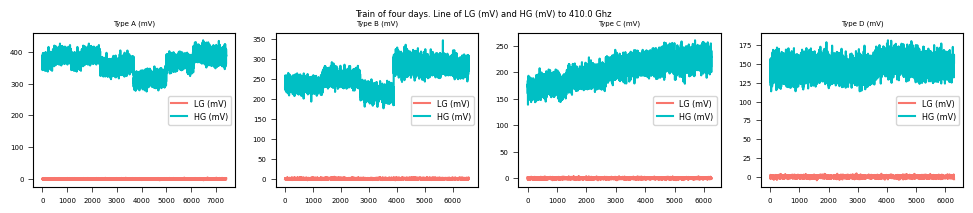
    


    
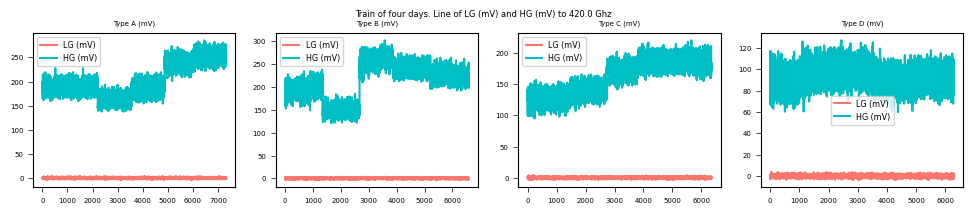
    


    
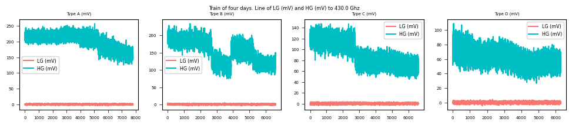
    


    
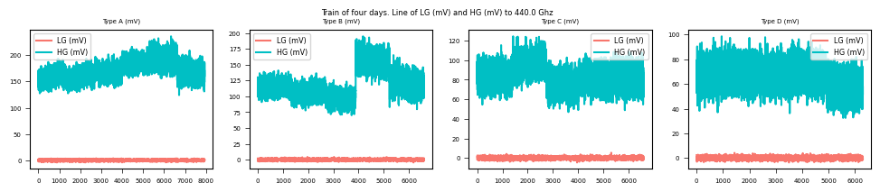
    


    
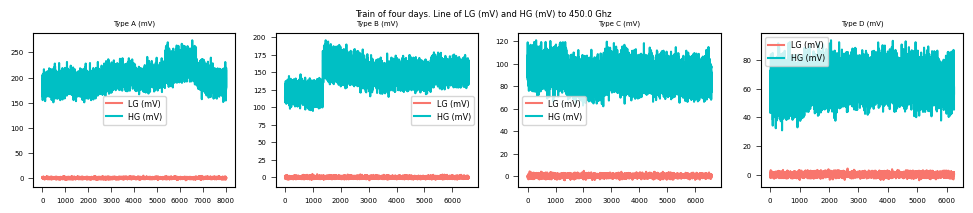
    


    
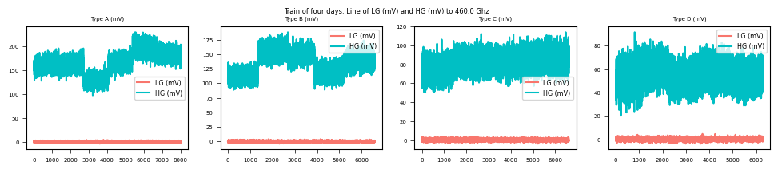
    


    
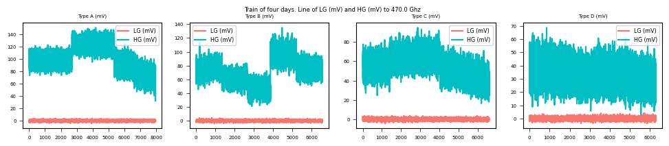
    


    
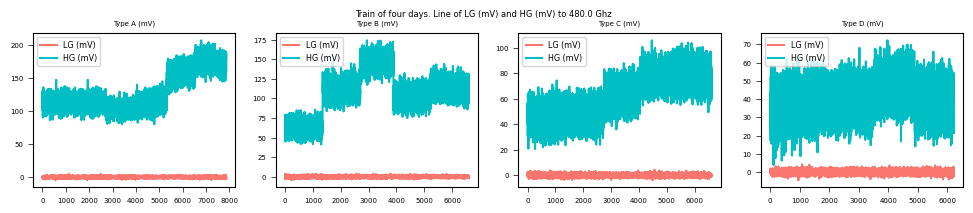
    


    
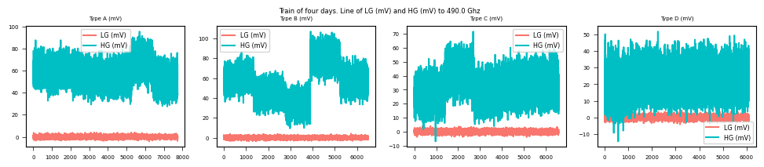
    


    
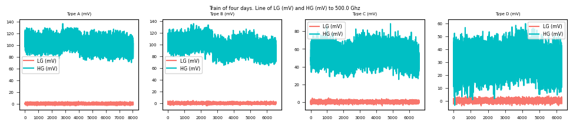
    


    
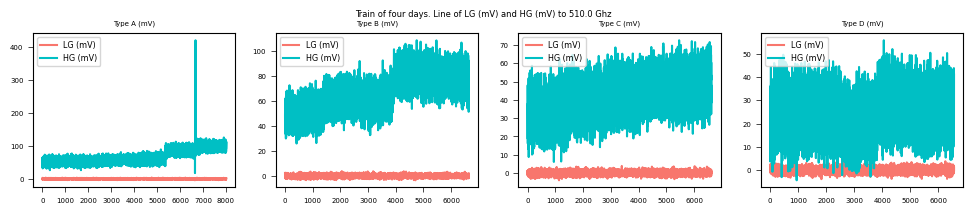
    


    
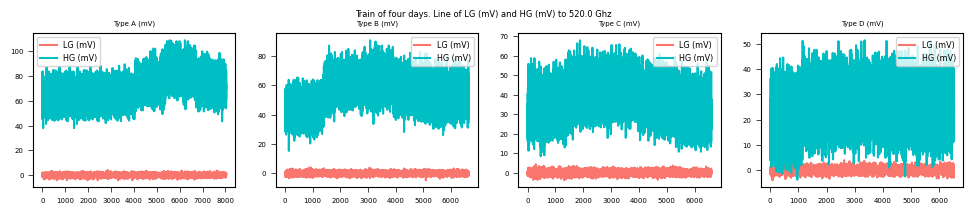
    


    
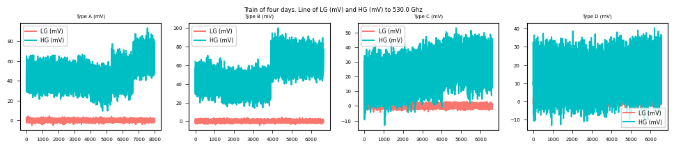
    


    
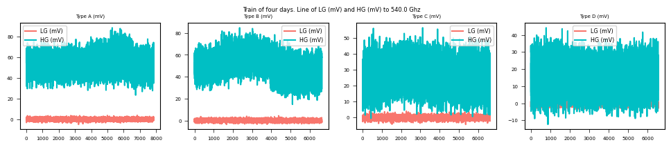
    


    
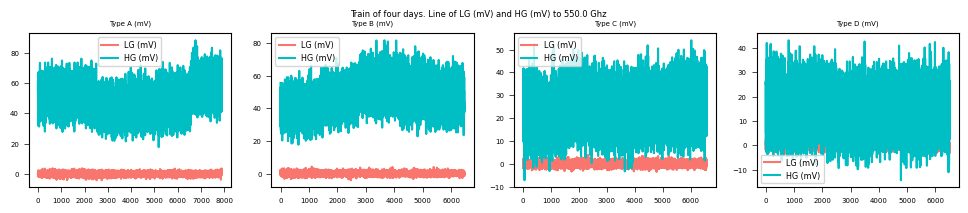
    


    
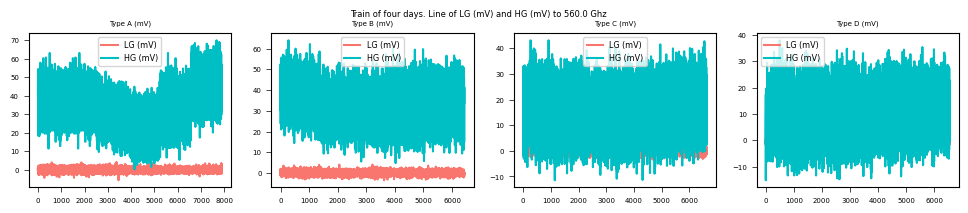
    


    
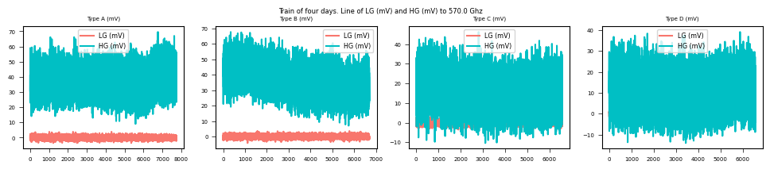
    


    
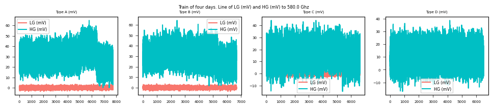
    


    
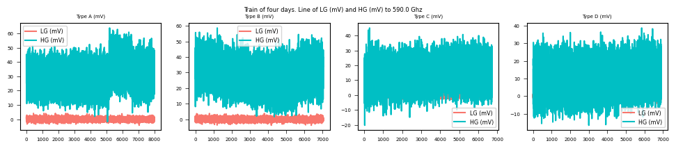
    


```python
import seaborn as sns
import warnings
warnings.filterwarnings('ignore')

for f in test_ex['freq'].value_counts().index.sort_values().tolist():
    freq = f
    ncols = 4
    nrows = 1
    nums_plastics = 0
    
    fig, axes = plt.subplots(nrows, ncols, figsize=(12, 2))
    for r in range(nrows):
        for c in range (ncols):
            t = test_ex['target'].value_counts().index.sort_values().tolist()
            #t.remove('REF')
            df_tmp = test_ex[(test_ex.freq == freq) & (test_ex.target == t[nums_plastics])]
            df_tmp.reset_index(inplace=True, drop=True)
            sns.lineplot(data=df_tmp['LG (mV)'], ax=axes[c], color='#F8766D', label='LG (mV)' )
            sns.lineplot(data=df_tmp['HG (mV)'], ax=axes[c], color='#00BFC4', label='HG (mV)' )
            axes[c].legend(fontsize="xx-small")
            axes[c].set_ylabel('')
            axes[c].set_xlabel('')
            axes[c].set_title(f"Type {lst_tmp[nums_plastics]} (mV)",fontsize=5)
            axes[c].tick_params(labelsize=5, width=0.5)
            axes[c].xaxis.offsetText.set_fontsize(6)
            axes[c].yaxis.offsetText.set_fontsize(4)
            nums_plastics = nums_plastics +1
    plt.suptitle(f"Test of one day. Line of LG (mV) and HG (mV) to {freq} Ghz", y=0.999,fontsize=6)
    plt.show()        
```


    
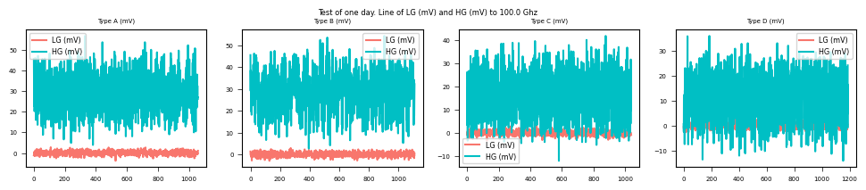
    


    
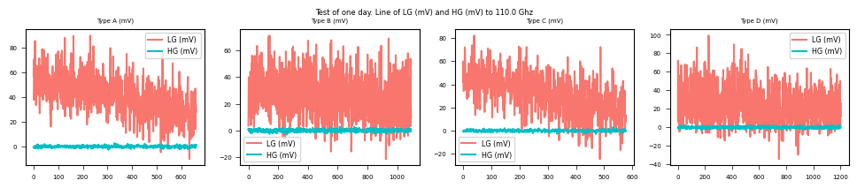
    


    

    


    

    


    

    


    

    


    

    


    

    


    

    


    

    


    

    


    

    


    

    


    

    


    

    


    

    


    

    


    

    


    

    


    

    


    

    


    

    


    

    


    

    


    

    


    

    


    

    


    

    


    

    


    

    


    

    


    

    


    

    


    

    


    

    


    

    


    

    


    

    


    

    


    

    


    

    


    

    


    

    


    

    


    

    


    

    


    

    


    

    


    

    


    

    


```python
import seaborn as sns

df_temp = pd.DataFrame(
    {"E_320_e5_hg": Y_e4[:1000],
    "E_320_e5_lg": Y_e4_lg[:1000]}
)
plt.figure(figsize=(12,4))
sns.lineplot(data=df_temp,ls="-")

_ = plt.xlabel('Num of sample')
_ = plt.ylabel('HG (mV)')
_ = plt.title('Plastic type E for HG (mV) and LG (mV) into intervals')
```


<div>
<style scoped>
    .dataframe tbody tr th:only-of-type {
        vertical-align: middle;
    }

    .dataframe tbody tr th {
        vertical-align: top;
    }

    .dataframe thead th {
        text-align: right;
    }
</style>
<table border="1" class="dataframe">
  <thead>
    <tr style="text-align: right;">
      <th></th>
      <th>E_320_e5_hg</th>
      <th>E_320_e5_lg</th>
    </tr>
  </thead>
  <tbody>
    <tr>
      <th>0</th>
      <td>256.134820</td>
      <td>2.441704</td>
    </tr>
    <tr>
      <th>1</th>
      <td>207.178617</td>
      <td>2.441704</td>
    </tr>
    <tr>
      <th>2</th>
      <td>246.612144</td>
      <td>2.685875</td>
    </tr>
    <tr>
      <th>3</th>
      <td>244.048357</td>
      <td>1.465023</td>
    </tr>
    <tr>
      <th>4</th>
      <td>254.425597</td>
      <td>1.831278</td>
    </tr>
    <tr>
      <th>...</th>
      <td>...</td>
      <td>...</td>
    </tr>
    <tr>
      <th>995</th>
      <td>259.431100</td>
      <td>0.610426</td>
    </tr>
    <tr>
      <th>996</th>
      <td>256.378984</td>
      <td>1.831278</td>
    </tr>
    <tr>
      <th>997</th>
      <td>267.610788</td>
      <td>1.465023</td>
    </tr>
    <tr>
      <th>998</th>
      <td>270.662975</td>
      <td>1.465023</td>
    </tr>
    <tr>
      <th>999</th>
      <td>274.813890</td>
      <td>2.807960</td>
    </tr>
  </tbody>
</table>
<p>1000 rows × 2 columns</p>
</div>


```python
import seaborn as sns

df_temp = pd.DataFrame(
    {"E_250_e5": Y_e1[:1000],
    "E_330_e5": Y_e2[:1000],
    "E_320_e5": Y_e4[:1000]}
)
plt.figure(figsize=(12,4))
sns.lineplot(data=df_temp,ls="-")

_ = plt.xlabel('Num of sample')
_ = plt.ylabel('HG (mV)')
_ = plt.title('HG (mV) to plastic type E in different frecuencies')
```

 #### Savitzky-Golay filter


```python
from scipy.signal import savgol_filter

Y_e1_sg = savgol_filter(Y_e1[:1000], 25, 2)
Y_e2_sg = savgol_filter(Y_e2[:1000], 25, 2)
Y_e4_sg = savgol_filter(Y_e4[:1000], 25, 2)
```


```python
f = lambda x: savgol_filter(x, 5, 2)
df_temp_sg = df_temp.apply(f)
```


```python
plt.figure(figsize=(12,4))
sns.lineplot(data=df_temp_sg)

_ = plt.xlabel('Num of sample')
_ = plt.ylabel('HG (mV)')
_ = plt.title('Savitzky-Golay filter to HG (mV) Plastic E type to for HG (mV) into intervals')
```


```python
# 250.0, 330.0, 320.0, 410.0
Y_e1 = train_ex[(train_ex.target=='E')&(train_ex.freq==250.0)&(train_ex.num_experiment=='e5')]['HG (mV)'].values
Y_e2 = train_ex[(train_ex.target=='E')&(train_ex.freq==330.0)&(train_ex.num_experiment=='e5')]['HG (mV)'].values
Y_e4 = train_ex[(train_ex.target=='E')&(train_ex.freq==320.0)&(train_ex.num_experiment=='e5')]['HG (mV)'].values

```

#### Visualice Bin continuous data into intervals


```python
from sklearn.preprocessing import KBinsDiscretizer
est = KBinsDiscretizer(n_bins=5, encode='ordinal', strategy='quantile')
est.fit(Y_e1.reshape(-1, 1))
Y_e1_bined = est.transform(Y_e1.reshape(-1, 1))
Y_e1_bined_trans = est.inverse_transform(Y_e1_bined)

df_tmp = pd.DataFrame(np.hstack((Y_e1[:1000].reshape(-1, 1),Y_e1_bined[:1000], Y_e1_bined_trans[:1000])),
                      columns=['Y_e1', 'Y_e1_bined', 'Y_e1_bined_trans' ],
                      index=np.arange(0, 1000, 1))

_ = df_tmp[['Y_e1','Y_e1_bined_trans']].plot(figsize=(12,4), xlim = ([0,1000]), 
                ylabel = 'HG (mV)',
                xlabel = 'Num of sample',
                title= 'HG (mV) Plastic E type to for HG (mV) into intervals' )
                      
```


```python
_ = df_tmp['Y_e1_bined'].plot(figsize=(12,4), xlim = ([0,1000]), 
                ylabel = 'HG (mV)',
                xlabel = 'Num of sample',
                title= 'HG (mV) Plastic E type to for three freqs' )
```


```python
train_ts_low_quan = train_ts[(train_ts.target=='E1')&(train_ts.freq==350.0)&(train_ts.num_experiment=='e1')]['HG (mV)'].quantile(0.05)
train_ts_high_quan = train_ts[(train_ts.target=='E1')&(train_ts.freq==350.0)&(train_ts.num_experiment=='e1')]['HG (mV)'].quantile(0.95)
train_ts_filtering = np.where(train_ts[(train_ts.target=='E1')&(train_ts.freq==350.0)&(train_ts.num_experiment=='e1')]['HG (mV)'] < train_ts_low_quan,
                                train_ts_low_quan,
                                train_ts[(train_ts.target=='E1')&(train_ts.freq==350.0)&(train_ts.num_experiment=='e1')]['HG (mV)'])

train_ts_filtering = pd.Series(train_ts_filtering, index=train_ts[(train_ts.target=='E1')&(train_ts.freq==350.0)&(train_ts.num_experiment=='e1')]['HG (mV)'].index.to_numpy())
train_ts_filtering = np.where(train_ts_filtering > train_ts_high_quan,
                              train_ts_high_quan,
                              train_ts_filtering)

fig, ax = plt.subplots(figsize=(12, 4))
ax.plot(X, train_ts_filtering)
ax.set_ylim([380, 525])
ax.set_title('Filtering Outliers of time series of 350 GHz to HG (mV) of plastic type E1 of Experiment 1')
fig.show()

```

## Visualize distributions
Knowledge of various sampling and data generating distributions allows us to quantify potential errors in an estimate that might be due to random variation.


```python
train_ex = train_ex.astype({"freq": int,})
train_ex.info()

```

    <class 'pandas.core.frame.DataFrame'>
    Index: 385121 entries, 4522141 to 4907261
    Data columns (total 7 columns):
     #   Column           Non-Null Count   Dtype  
    ---  ------           --------------   -----  
     0   freq             385121 non-null  int64  
     1   LG (mV)          385121 non-null  float64
     2   HG (mV)          385121 non-null  float64
     3   num_experiment   385121 non-null  object 
     4   Sample_original  385121 non-null  object 
     5   int_time         385121 non-null  int64  
     6   target           385121 non-null  object 
    dtypes: float64(2), int64(2), object(3)
    memory usage: 23.5+ MB
    


```python
lst_tmp = train_ex['target'].value_counts().index.sort_values().tolist()
lst_tmp.remove('REF')
lst_tmp
```


```python
import seaborn as sns
import warnings
warnings.filterwarnings('ignore')

for f in train_ex['freq'].value_counts().index.sort_values().tolist():
    freq = f
    ncols = 4
    nrows = 1
    nums_plastics = 0
    
    fig, axes = plt.subplots(nrows, ncols, figsize=(12, 2))
    for r in range(nrows):
        for c in range (ncols):
            t = train_ex['target'].value_counts().index.sort_values().tolist()
            #t.remove('REF')
            df_tmp = train_ex[(train_ex.freq == freq) & (train_ex.target == t[nums_plastics])]
            sns.kdeplot(x=df_tmp['LG (mV)'], ax=axes[c], color='#F8766D', label='LG (mV)',  fill =True )
            sns.kdeplot(x=df_tmp['HG (mV)'], ax=axes[c], color='#00BFC4', label='HG (mV)',  fill =True )
            axes[c].legend(fontsize="xx-small")
            axes[c].set_ylabel('')
            axes[c].set_xlabel('')
            axes[c].set_title(f"Type {lst_tmp[nums_plastics]} (mV)",fontsize=5)
            axes[c].tick_params(labelsize=5, width=0.5)
            axes[c].xaxis.offsetText.set_fontsize(6)
            axes[c].yaxis.offsetText.set_fontsize(4)
            nums_plastics = nums_plastics +1
    plt.suptitle(f"Train of four days. Distribution of LG (mV) and HG (mV) to {freq} Ghz", y=0.999,fontsize=6)
    plt.show()        
```


    

    


    

    


    

    


    

    


    

    


    

    


    

    


    

    


    

    


    

    


    

    


    

    


    

    


    

    


    

    


    

    


    

    


    

    


    

    


    

    


    

    


    

    


    

    


    

    


    

    


    

    


    

    


    

    


    

    


    

    


    

    


    

    


    

    


    

    


    

    


    

    


    

    


    

    


    

    


    

    


    

    


    

    


    

    


    

    


    

    


    

    


    

    


    

    


    

    


    

    


```python
for f in test_ex['freq'].value_counts().index.sort_values().tolist():
    freq = f
    ncols = 2
    nrows = 6
    nums_plastics = 0
    
    fig, axes = plt.subplots(nrows, ncols, figsize=(12, 16))
    for r in range(nrows):
        for c in range (ncols):
            t = test_ex['target'].value_counts().index.sort_values().tolist()
            #t.remove('REF')
            df_tmp = test_ex[(test_ex.freq == freq) & (test_ex.target == t[nums_plastics])]
            sns.kdeplot(x=df_tmp['LG (mV)'], ax=axes[r, c], color='#F8766D', label='LG (mV)',  fill =True )
            sns.kdeplot(x=df_tmp['HG (mV)'], ax=axes[r, c], color='#00BFC4', label='HG (mV)',  fill =True )
            axes[r ,c].legend(fontsize="xx-small")
            axes[r, c].set_ylabel('')
            axes[r, c].set_xlabel('')
            axes[r, c].set_title(f"Type {t[nums_plastics]} (mV)",fontsize=7)
            axes[r, c].tick_params(labelsize=5, width=0.5)
            axes[r, c].xaxis.offsetText.set_fontsize(6)
            axes[r, c].yaxis.offsetText.set_fontsize(4)
            nums_plastics = nums_plastics +1
    plt.suptitle(f"Test of 5th day. Distribution of LG (mV) and HG (mV) of each plastic to {freq} Ghz", y=0.93,fontsize=10)
    plt.show()        
```

## Study Type of distribution to one frecuency


```python
for f in [320]:
    freq = f
    ncols = 2
    nrows = 2
    nums_plastics = 0
    
    fig, axes = plt.subplots(nrows, ncols, figsize=(12, 8))
    for r in range(nrows):
        for c in range (ncols):
            t = train_ex['target'].value_counts().index.sort_values().tolist()
            df_tmp = train_ex[(train_ex.freq == freq) & (train_ex.target == t[nums_plastics])]
            sns.kdeplot(x=df_tmp['LG (mV)'], ax=axes[r, c], color='#F8766D', label='LG (mV)',  fill =True )
            sns.kdeplot(x=df_tmp['HG (mV)'], ax=axes[r, c], color='#00BFC4', label='HG (mV)',  fill =True )
            axes[r, c].legend(fontsize="xx-small")
            axes[r, c].set_ylabel('')
            axes[r, c].set_xlabel('')
            axes[r, c].set_title(f"Type {t[nums_plastics]} (mV)",fontsize=7)
            axes[r, c].tick_params(labelsize=5, width=0.5)
            axes[r, c].xaxis.offsetText.set_fontsize(6)
            axes[r, c].yaxis.offsetText.set_fontsize(4)
            nums_plastics = nums_plastics +1
    plt.suptitle(f"Distributions of density estimation to {freq} Ghz", y=0.93,fontsize=10)
    plt.show()   
```


    

    


#### Summary of the numerical attributes
Compute mean of groups


```python

df_tmp = train_ex[(train_ex.freq == freq)]
grouped = df_tmp['HG (mV)'].groupby(df_tmp['target'])

ax = grouped.mean().plot.bar(figsize=(8, 4), legend=False)
plt.suptitle(f'Mean (mV) by HG filter of each plastic to {freq} Ghz')
ax.set_xlabel(f'Type of plastic')
ax.set_ylabel('mV')
plt.tight_layout()
plt.show()

```


```python

df_tmp = train_ex[(train_ex.freq == freq)]
grouped = df_tmp['LG (mV)'].groupby(df_tmp['target'])

ax = grouped.mean().plot.bar(figsize=(8, 4), legend=False)
plt.suptitle(f'Mean (mV) by LG filter of each plastic to {freq} Ghz')
ax.set_xlabel(f'Type of plastic')
ax.set_ylabel('mV')
plt.tight_layout()
plt.show()

```


```python
ax = grouped.std().plot.bar(figsize=(8, 4), legend=False)
plt.suptitle(f'Standard deviation (mV) by LG filter of each plastic to {freq} Ghz')
ax.set_xlabel(f'Type of plastic')
ax.set_ylabel('mV')
plt.tight_layout()
plt.show()
```

**Insights**: Assuming a normal distribution can lead to underestimation of extreme events 

#### Predicts that anamolous measures
The tails of a distribution correspond to the extreme values (small and large). Long tails, and guarding against them, are widely recognized in practical work. Nassim Taleb has proposed the black swan theory, which predicts that anamolous events, such as a stock market crash, are much more likely to occur than would be predicted by the normal distribution. 


```python
from scipy import stats
temp_t = t[13]
fig, ax = plt.subplots(figsize=(4, 4))
df_tmp = train_ex[(train_ex.freq == freq) & (train_ex.target == temp_t)]
#stats.probplot(df_tmp['LG (mV)'], plot=ax)
stats.probplot(df_tmp['LG (mV)'], plot=ax)

plt.suptitle(f"Sample of {temp_t} data against the quantiles of a specified theoretical distribution {freq} Ghz", y=0.93,fontsize=10)
plt.tight_layout()
plt.show()

```

**Insights**: The points are far below the line for low values and far 
above the line for high value. Theree are much more likely t 
observe extreme values than would be expected if the data had a norm l
distribution

## Promising transformations you may want to apply
### Apply OrdinalEncoder to transform categorical features as an integer
Target variable takes only a limited number of values. Encode target (categorical features) as an integer array.  
**Question**: How does doing this in the previous phase (Convert the data to a format you can easily manipulate) affect the classifier?


```python
from sklearn.preprocessing import OrdinalEncoder
label_train_ex = train_ex.copy() #238375/3
label_test_ex = test_ex.copy() #47929/3
ordinal_encoder = OrdinalEncoder()
ordinal_encoder.fit(train_ex[['target']])
label_train_ex['target'] = ordinal_encoder.transform(train_ex[['target']])
label_test_ex['target'] = ordinal_encoder.transform(test_ex[['target']])
```


```python
ordinal_encoder.categories_
```


    [array(['A', 'B', 'C'], dtype=object)]


### % of missing values
No missing values in each column of training data


```python
print(label_train_ex.shape)
missing_val_count_by_column = (label_train_ex.isnull().sum())
print(missing_val_count_by_column[missing_val_count_by_column > 0])
```

### Type of distribution in frecuency
Representation of the distribution of nums of sample by frecuency. 


```python
ax = label_train_ex['freq'].plot.hist(figsize=(10, 4), bins=408)
ax.set_xlabel('Frequency (GHz)')
ax.set_ylabel('Nums of sample by frecuency')
plt.tight_layout()
plt.show()
```

### Balanced samples of frecuency by min


```python
min = int(np.round((label_train_ex.groupby(['target', 'freq']).size().min())/5))
# Function to reduce samples to the min value
def reduce_to_min(df, target, frequency, min):
    # Filter the DataFrame for the specific sample and frequency
    freq_df = df[(df['target'] == target) & (df['freq'] == frequency)]
    # If the number of samples is greater than the min, sample down to the min
    return freq_df.sample(n=min, random_state=42)

# Apply the function to reduce target for each combination of Sample and Frequency (GHz)
tmp_balanced_data = []
for (target, frequency), group in label_train_ex.groupby(['target', 'freq']):
    tmp_balanced_data.append(reduce_to_min(label_train_ex, target, frequency, min))

# Combine the balanced samples into a single DataFrame
balanced_train_ex = pd.concat(tmp_balanced_data)
```


```python
min = int(np.round((label_test_ex.groupby(['target', 'freq']).size().min())/5))
tmp_balanced_data = []
for (target, frequency), group in label_test_ex.groupby(['target', 'freq']):
    tmp_balanced_data.append(reduce_to_min(label_test_ex, target, frequency, min))

# Combine the balanced samples into a single DataFrame
balanced_test_ex = pd.concat(tmp_balanced_data)
```

Check count values within each target and frequency


```python
ax = balanced_train_ex['freq'].plot.hist(figsize=(10, 4), bins=408)
ax.set_xlabel('Frequency (GHz)')
ax.set_ylabel('Nums of sample by frecuency')
ax.set_title('Balanced samples of frecuency by min')
plt.tight_layout()
plt.show()
```


    

    


```python
balanced_train_ex.head() 
```


```python
grouped = balanced_train_ex.groupby([balanced_train_ex["target"], balanced_train_ex["freq"]]).count()
```

 ## Study the correlations between attributes

Encodes target labels with values between 0 and ``n_classes-1, so `A1` are `0`, `B1` are `1`,... and so on all categories

`A1`, `B1`, `C1`, `D1`, `E1`, `E2`, `E3`, `F1`, `G1`, `H1`, `I1`, `J1`, `K1`, `L1`, `M1`, `N1`, `REF`


```python
balanced_train_ex.head()
```

It is start to analice PE/tie/EVOH/tie/PE/Adhesivo/PE/tie/EVOH/tie/PE (0.2mm) `A1` category `0`


```python
df_tmp = balanced_train_ex[balanced_train_ex.target==0]

from pandas.plotting import scatter_matrix
attributes = ['freq', 'LG (mV)', 'HG (mV)']
ax = scatter_matrix(df_tmp[attributes], figsize=(12, 8))
```

**Insights**: The correlation coefficient ranges from –1 to 1. When it is close to 1, it means that there is a strong positive correlation; for example, the `HG (mV)` value tends to go up slightly when the `Frequency (GHz)` goes up. When the coefficient is close to –1, it means that there is a strong negative correlation; you can see a big negative correlation between `LG (mV)` and the `Frequency (GHz)` 

**Evidende**: It can be interpreted that to measured plastic PE/tie/EVOH/tie/PE/Adhesivo/PE/tie/EVOH/tie/PE (0.2mm) `A1` category `0` getaworse response to since high frecuencies in the `LG (mV)`. So the measurement obtained in the low-pass filter is lower `LG (mV)` is better to low frecuencies, although it obtains response peaks at 600 GHz that would have to be explained why they occur


7oat64


```python
corr_matrix = df_tmp.corr()
corr_matrix['freq'].sort_values(ascending=False)
```

# Prepare the data to better expose the underlying data patterns

**Doubts**: How does unbalanced test affect to turn out?


```python
#From 503181 to 218580 (or 57936) to apply balanced target samples by min
train_pr = balanced_train_ex.copy() 
test_pr = balanced_test_ex.copy() 

test_pr.head()
```


<div>
<style scoped>
    .dataframe tbody tr th:only-of-type {
        vertical-align: middle;
    }

    .dataframe tbody tr th {
        vertical-align: top;
    }

    .dataframe thead th {
        text-align: right;
    }
</style>
<table border="1" class="dataframe">
  <thead>
    <tr style="text-align: right;">
      <th></th>
      <th>freq</th>
      <th>LG (mV)</th>
      <th>HG (mV)</th>
      <th>num_experiment</th>
      <th>Sample_original</th>
      <th>int_time</th>
      <th>target</th>
    </tr>
  </thead>
  <tbody>
    <tr>
      <th>4844430</th>
      <td>100.0</td>
      <td>0.976682</td>
      <td>16.481504</td>
      <td>e5</td>
      <td>A5_55</td>
      <td>5</td>
      <td>0.0</td>
    </tr>
    <tr>
      <th>4844166</th>
      <td>100.0</td>
      <td>1.831278</td>
      <td>46.514466</td>
      <td>e5</td>
      <td>A5_55</td>
      <td>5</td>
      <td>0.0</td>
    </tr>
    <tr>
      <th>4843924</th>
      <td>100.0</td>
      <td>-0.610426</td>
      <td>30.032963</td>
      <td>e5</td>
      <td>A5_55</td>
      <td>5</td>
      <td>0.0</td>
    </tr>
    <tr>
      <th>4844536</th>
      <td>100.0</td>
      <td>-0.732511</td>
      <td>45.904040</td>
      <td>e5</td>
      <td>A5_55</td>
      <td>5</td>
      <td>0.0</td>
    </tr>
    <tr>
      <th>4844750</th>
      <td>100.0</td>
      <td>-1.587108</td>
      <td>28.690025</td>
      <td>e5</td>
      <td>A5_55</td>
      <td>5</td>
      <td>0.0</td>
    </tr>
  </tbody>
</table>
</div>


## Data Clean
### Fill in missing values of test data


```python
from sklearn.impute import SimpleImputer


my_imputer = SimpleImputer(missing_values=np.nan, strategy='mean')

test_pr_imputed = pd.DataFrame(my_imputer.fit_transform(test_pr[['LG (mV)', 'HG (mV)']]))
test_pr_imputed.rename(columns = {0:'LG (mV)', 1:'HG (mV)'}, inplace=True)
test_pr_imputed.index = test_pr.index
test_pr.drop(columns=['LG (mV)', 'HG (mV)'], inplace=True)
test_pr = pd.concat([test_pr,test_pr_imputed], axis=1)
test_pr.isnull().any()
```

### Remove outliers


```python
train_ts_low_quan = train_ts[(train_ts.target=='E1')&(train_ts.freq==350.0)]['HG (mV)'].quantile(0.05)
train_ts_high_quan = train_ts[(train_ts.target=='E1')&(train_ts.freq==350.0)]['HG (mV)'].quantile(0.95)
train_ts_filtering = np.where(train_ts[(train_ts.target=='E1')&(train_ts.freq==350.0)]['HG (mV)'] < train_ts_low_quan,
                                train_ts_low_quan,
                                train_ts[(train_ts.target=='E1')&(train_ts.freq==350.0)]['HG (mV)'])

train_ts_filtering = pd.Series(train_ts_filtering, index=train_ts[(train_ts.target=='E1')&(train_ts.freq==350.0)]['HG (mV)'].index.to_numpy())
train_ts_filtering = np.where(train_ts_filtering > train_ts_high_quan,
                              train_ts_high_quan,
                              train_ts_filtering)

fig, ax = plt.subplots(figsize=(12, 4))
ax.plot(X, train_ts_filtering)
ax.set_ylim([380, 525])
ax.set_title(' Filtering Outliers of time series of 350 GHz to HG (mV) of plastic type E1')
fig.show()

```

## Feature engineering


```python
train_pr = train_pr_sg.copy()
test_pr = test_pr_sg.copy()
train_pr.head()
```

### Discretize continuous features
Bin continuous data into intervals


```python
from sklearn.preprocessing import KBinsDiscretizer

est = KBinsDiscretizer(n_bins=5, encode='ordinal', strategy='uniform')
np_hstack_tr = np.array([0])

for f in lst_best_freq:
    np_tr_tmp = train_pr[train_pr.freq==f]['LG (mV)'].values
    idx_tr_tmp = train_pr[train_pr.freq==f]['LG (mV)'].index
    np_te_tmp = test_pr[test_pr.freq==f]['LG (mV)'].values
    idx_te_tmp = test_pr[test_pr.freq==f]['LG (mV)'].index    
    
    est.fit(np_tr_tmp.reshape(-1, 1))
    np_bin_tr_tmp = est.transform(np_tr_tmp.reshape(-1, 1))
    np_bin_inv_tr_tmp = est.inverse_transform(np_bin_tr_tmp)
    np_bin_te_tmp = est.transform(np_te_tmp.reshape(-1, 1))
    np_bin_inv_te_tmp = est.inverse_transform(np_bin_te_tmp)
    
    if np_hstack_tr.all():
        np_hstack_tr = np.hstack((np_hstack_tr, np_bin_inv_tr_tmp.reshape(1, -1)[0]))
        np_idx_hstack_tr = np.hstack((np_idx_hstack_tr, idx_tr_tmp.to_numpy()))
        np_hstack_te = np.hstack((np_hstack_te, np_bin_inv_te_tmp.reshape(1, -1)[0]))
        np_idx_hstack_te = np.hstack((np_idx_hstack_te, idx_te_tmp.to_numpy()))
    else:
        np_hstack_tr = np_bin_inv_tr_tmp.reshape(1, -1)[0]
        np_idx_hstack_tr = idx_tr_tmp.to_numpy()
        np_hstack_te = np_bin_inv_te_tmp.reshape(1, -1)[0]
        np_idx_hstack_te = idx_te_tmp.to_numpy()

df_tr_tmp = pd.DataFrame(
        {"bined_lg" : np_hstack_tr},
        index=np_idx_hstack_tr)
                           
df_te_tmp = pd.DataFrame(
        {"bined_lg" : np_hstack_te},
        index=np_idx_hstack_te)

train_pr_bined = pd.concat([train_pr,df_tr_tmp], axis=1)
test_pr_bined = pd.concat([test_pr,df_te_tmp], axis=1)

```


```python
np_hstack_tr = np.array([0])

for f in lst_best_freq:
    np_tr_tmp = train_pr[train_pr.freq==f]['HG (mV)'].values
    idx_tr_tmp = train_pr[train_pr.freq==f]['HG (mV)'].index
    np_te_tmp = test_pr[test_pr.freq==f]['HG (mV)'].values
    idx_te_tmp = test_pr[test_pr.freq==f]['HG (mV)'].index    
    
    est.fit(np_tr_tmp.reshape(-1, 1))
    np_bin_tr_tmp = est.transform(np_tr_tmp.reshape(-1, 1))
    np_bin_inv_tr_tmp = est.inverse_transform(np_bin_tr_tmp)
    np_bin_te_tmp = est.transform(np_te_tmp.reshape(-1, 1))
    np_bin_inv_te_tmp = est.inverse_transform(np_bin_te_tmp)
    
    if np_hstack_tr.all():
        np_hstack_tr = np.hstack((np_hstack_tr, np_bin_inv_tr_tmp.reshape(1, -1)[0]))
        np_idx_hstack_tr = np.hstack((np_idx_hstack_tr, idx_tr_tmp.to_numpy()))
        np_hstack_te = np.hstack((np_hstack_te, np_bin_inv_te_tmp.reshape(1, -1)[0]))
        np_idx_hstack_te = np.hstack((np_idx_hstack_te, idx_te_tmp.to_numpy()))
    else:
        np_hstack_tr = np_bin_inv_tr_tmp.reshape(1, -1)[0]
        np_idx_hstack_tr = idx_tr_tmp.to_numpy()
        np_hstack_te = np_bin_inv_te_tmp.reshape(1, -1)[0]
        np_idx_hstack_te = idx_te_tmp.to_numpy()

df_tr_tmp = pd.DataFrame(
        {"bined_hg" : np_hstack_tr},
        index=np_idx_hstack_tr)
                           
df_te_tmp = pd.DataFrame(
        {"bined_hg" : np_hstack_te},
        index=np_idx_hstack_te)

train_pr_bined = pd.concat([train_pr_bined,df_tr_tmp], axis=1)
test_pr_bined = pd.concat([test_pr_bined,df_te_tmp], axis=1)
```

#### Visualize binded vs real measures


```python
str_filter_pr = 'HG (mV)'
str_bined_filter_pr = 'bined_hg'
np_freq_pr = 330.0
np_target_pr = 6
lst_xlim_pr = [0,min]
df_tmp = train_pr_bined[(train_pr_bined.freq==np_freq_pr)&(train_pr_bined.target==np_target_pr)][str_bined_filter_pr]
df_tmp = df_tmp.reset_index()
_ = df_tmp[str_bined_filter_pr].plot(figsize=(12,4), xlim = lst_xlim_pr,
                ylabel = 'LG (mV)',
                xlabel = 'Num of sample',
                title= 'Binded ' + str_filter_pr + ' Plastic '+ str(np_target_pr) +' type to for ' + str(np_freq_pr) +' Ghz')
```


```python
df_tmp = train_pr_bined[(train_pr_bined.freq==np_freq_pr)&(train_pr_bined.target==np_target_pr)][str_filter_pr]
df_tmp = df_tmp.reset_index()
_ = df_tmp[str_filter_pr].plot(figsize=(12,4), xlim = lst_xlim_pr,
                ylabel = 'LG (mV)',
                xlabel = 'Num of sample',
                title= 'Original ' + str_filter_pr + ' Plastic '+ str(np_target_pr) +' type to for ' + str(np_freq_pr) +' Ghz' )
```

### Add promising transformations of features


```python
train_pr = train_pr.astype({"freq": int, "target": int})

#https://stackoverflow.com/questions/43131715/pandas-new-column-by-combining-numbers-of-two-columns-as-strings
train_pr['freq_target'] = train_pr['freq'].astype(str) + train_pr['target'].astype(str)
train_pr['freq_target'].nunique() # train_pr['freq'].nunique() * train_pr['target'].nunique() 765 different measures


```


```python
train_pr['freq_target'] = train_pr['freq_target'].astype(int)
#train_pr = train_pr.rename(columns = {'freq':'Frequency (GHz)'})

train_pr.info()
```

**Doubts**: Normalize freq_target?

## Add transformations of features

#### Aggregate features into promising new features: descriptive statistics for each freq


```python
#Create train_pr_stats
grouped = train_pr.groupby(train_pr["freq"])
grouped_LG_mV = grouped['LG (mV)']
grouped_HG_mV = grouped['HG (mV)']
# https://stackoverflow.com/questions/32938060/reverting-from-multiindex-to-single-index-dataframe-in-pandas
df_grouped_LG_mV = grouped_LG_mV.agg(['mean','std','var','median']).reset_index(level=[0])
df_grouped_HG_mV = grouped_HG_mV.agg(['mean','std','var','median']).reset_index(level=[0])

# df_grouped_LG_mV.head()

train_pr_shifted = train_pr.copy()
#train_pr_shifted = train_pr.drop(columns=['LG (mV)_shifted', 'HG (mV)_shifted'])
# train_pr_shifted.head()


train_pr_stats = pd.merge(train_pr_shifted, df_grouped_LG_mV, how='left', on='freq').rename(columns = {'mean':'mean_LG',
                                                                                                       'std':'std_LG',
                                                                                                       'var':'var_LG',
                                                                                                       'median':'median_LG'})
train_pr_stats = pd.merge(train_pr_stats, df_grouped_HG_mV, how='left', on='freq').rename(columns = {'mean':'mean_HG', 
                                                                                                     'std': 'std_HG',
                                                                                                     'var':'var_HG',
                                                                                                     'median':'median_HG'})

```


```python
#train_pr_stats.tail()
train_pr_stats.info() #218580 (or 57936)
```

    <class 'pandas.core.frame.DataFrame'>
    RangeIndex: 92100 entries, 0 to 92099
    Data columns (total 15 columns):
     #   Column           Non-Null Count  Dtype  
    ---  ------           --------------  -----  
     0   freq             92100 non-null  float64
     1   LG (mV)          92100 non-null  float64
     2   HG (mV)          92100 non-null  float64
     3   num_experiment   92100 non-null  object 
     4   Sample_original  92100 non-null  object 
     5   int_time         92100 non-null  int64  
     6   target           92100 non-null  float64
     7   mean_LG          92100 non-null  float64
     8   std_LG           92100 non-null  float64
     9   var_LG           92100 non-null  float64
     10  median_LG        92100 non-null  float64
     11  mean_HG          92100 non-null  float64
     12  std_HG           92100 non-null  float64
     13  var_HG           92100 non-null  float64
     14  median_HG        92100 non-null  float64
    dtypes: float64(12), int64(1), object(2)
    memory usage: 10.5+ MB
    


```python
#Create test_pr_stats
grouped = test_pr.groupby(test_pr["freq"])
grouped_LG_mV = grouped['LG (mV)']
grouped_HG_mV = grouped['HG (mV)']
# https://stackoverflow.com/questions/32938060/reverting-from-multiindex-to-single-index-dataframe-in-pandas
df_grouped_LG_mV = grouped_LG_mV.agg(['mean','std','var','median']).reset_index(level=[0])
df_grouped_HG_mV = grouped_HG_mV.agg(['mean','std','var','median']).reset_index(level=[0])

# df_grouped_LG_mV.head()

test_pr_shifted = test_pr.copy()
#test_pr_shifted = test_pr.drop(columns=['LG (mV)_shifted', 'HG (mV)_shifted'])
# test_pr_shifted.head()


test_pr_stats = pd.merge(test_pr_shifted, df_grouped_LG_mV, how='left', on='freq').rename(columns = {'mean':'mean_LG',
                                                                                                       'std':'std_LG',
                                                                                                       'var':'var_LG',
                                                                                                       'median':'median_LG'})
test_pr_stats = pd.merge(test_pr_stats, df_grouped_HG_mV, how='left', on='freq').rename(columns = {'mean':'mean_HG', 
                                                                                                     'std': 'std_HG',
                                                                                                     'var':'var_HG',
                                                                                                     'median':'median_HG'})

```


```python
test_pr_stats.info() 
```

    <class 'pandas.core.frame.DataFrame'>
    RangeIndex: 16350 entries, 0 to 16349
    Data columns (total 15 columns):
     #   Column           Non-Null Count  Dtype  
    ---  ------           --------------  -----  
     0   freq             16350 non-null  float64
     1   LG (mV)          16350 non-null  float64
     2   HG (mV)          16350 non-null  float64
     3   num_experiment   16350 non-null  object 
     4   Sample_original  16350 non-null  object 
     5   int_time         16350 non-null  int64  
     6   target           16350 non-null  float64
     7   mean_LG          16350 non-null  float64
     8   std_LG           16350 non-null  float64
     9   var_LG           16350 non-null  float64
     10  median_LG        16350 non-null  float64
     11  mean_HG          16350 non-null  float64
     12  std_HG           16350 non-null  float64
     13  var_HG           16350 non-null  float64
     14  median_HG        16350 non-null  float64
    dtypes: float64(12), int64(1), object(2)
    memory usage: 1.9+ MB
    


```python
train_pr_stats.drop(columns=['num_experiment', 'Sample_original','int_time'], inplace=True)
test_pr_stats.drop(columns=['num_experiment', 'Sample_original','int_time'], inplace=True)
train_pr_stats.head()
```


<div>
<style scoped>
    .dataframe tbody tr th:only-of-type {
        vertical-align: middle;
    }

    .dataframe tbody tr th {
        vertical-align: top;
    }

    .dataframe thead th {
        text-align: right;
    }
</style>
<table border="1" class="dataframe">
  <thead>
    <tr style="text-align: right;">
      <th></th>
      <th>freq</th>
      <th>LG (mV)</th>
      <th>HG (mV)</th>
      <th>target</th>
      <th>mean_LG</th>
      <th>std_LG</th>
      <th>var_LG</th>
      <th>median_LG</th>
      <th>mean_HG</th>
      <th>std_HG</th>
      <th>var_HG</th>
      <th>median_HG</th>
    </tr>
  </thead>
  <tbody>
    <tr>
      <th>0</th>
      <td>100.0</td>
      <td>0.976682</td>
      <td>31.253815</td>
      <td>0.0</td>
      <td>5.529559</td>
      <td>25.57351</td>
      <td>654.004393</td>
      <td>0.122085</td>
      <td>22.240851</td>
      <td>12.375869</td>
      <td>153.162137</td>
      <td>23.318276</td>
    </tr>
    <tr>
      <th>1</th>
      <td>100.0</td>
      <td>-0.244170</td>
      <td>31.009644</td>
      <td>0.0</td>
      <td>5.529559</td>
      <td>25.57351</td>
      <td>654.004393</td>
      <td>0.122085</td>
      <td>22.240851</td>
      <td>12.375869</td>
      <td>153.162137</td>
      <td>23.318276</td>
    </tr>
    <tr>
      <th>2</th>
      <td>100.0</td>
      <td>-1.220852</td>
      <td>26.248321</td>
      <td>0.0</td>
      <td>5.529559</td>
      <td>25.57351</td>
      <td>654.004393</td>
      <td>0.122085</td>
      <td>22.240851</td>
      <td>12.375869</td>
      <td>153.162137</td>
      <td>23.318276</td>
    </tr>
    <tr>
      <th>3</th>
      <td>100.0</td>
      <td>0.488341</td>
      <td>19.289464</td>
      <td>0.0</td>
      <td>5.529559</td>
      <td>25.57351</td>
      <td>654.004393</td>
      <td>0.122085</td>
      <td>22.240851</td>
      <td>12.375869</td>
      <td>153.162137</td>
      <td>23.318276</td>
    </tr>
    <tr>
      <th>4</th>
      <td>100.0</td>
      <td>0.000000</td>
      <td>39.555609</td>
      <td>0.0</td>
      <td>5.529559</td>
      <td>25.57351</td>
      <td>654.004393</td>
      <td>0.122085</td>
      <td>22.240851</td>
      <td>12.375869</td>
      <td>153.162137</td>
      <td>23.318276</td>
    </tr>
  </tbody>
</table>
</div>


## Apply a Savitzky-Golay filter

El filtro de **Savitzky-Golay** es un método de suavizado basado en el ajuste de polinomios locales mediante mínimos cuadrados. Se usa para preservar características como picos y derivadas en señales ruidosas.  

La formulación matemática se basa en encontrar coeficientes $c_i$ que minimizan el error del ajuste de un polinomio de grado $p$ en una ventana de tamaño $2m+1$:  

$
\min \sum_{i=-m}^{m} \left( y_{n+i} - \sum_{j=0}^{p} a_j (i)^j \right)^2$

Los coeficientes $c_i$ del filtro convolucional se obtienen resolviendo:

$
\mathbf{C} = (\mathbf{A}^T \mathbf{A})^{-1} \mathbf{A}^T$

donde **$\mathbf{A}$** es la matriz de potencias de los índices en la ventana.  

El suavizado se aplica mediante la convolución:

$
y'_n = \sum_{i=-m}^{m} c_i y_{n+i}$

Este método es útil en espectroscopía y procesamiento de señales debido a su capacidad de suavizar sin distorsionar características importantes.

**Ejemplo: Suavizado con una ventana de 5 puntos y un polinomio cuadrático $( p = 2$)**

1. **Definimos una señal discreta:**  
   Supongamos que tenemos los puntos de la señal:  
   $   y = [3, 5, 8, 10, 9]$
   
2. **Construimos la matriz de diseño $A$** con los índices centrados en $x = 0$:  
   $   A =
   \begin{bmatrix}
   1 & -2 & 4 \\
   1 & -1 & 1 \\
   1 &  0 & 0 \\
   1 &  1 & 1 \\
   1 &  2 & 4
   \end{bmatrix}$
   
   En el filtro **Savitzky-Golay**, la matriz $A$ tiene los índices centrados en $x = 0$ para que el ajuste polinómico se realice de manera simétrica alrededor del punto central de la ventana de suavizado.  

Si la ventana tiene un tamaño $2m+1$, los índices de los puntos de la ventana se definen como:  

$x = [-m, -m+1, ..., 0, ..., m-1, m]$

Esto garantiza que el polinomio ajustado sea **equilibrado**, sin sesgarse hacia un extremo de la ventana. Además, facilita el cálculo de los coeficientes $c_i$, ya que los términos del polinomio ($x^0, x^1, x^2, ...$) se evalúan en una base simétrica, lo que minimiza el error de ajuste en toda la ventana.
   
3. **Calculamos los coeficientes del filtro** resolviendo:  
   $   C = (A^T A)^{-1} A^T$
   que da como resultado los coeficientes para la convolución:  
   $   c = \frac{1}{35} [ -3, 12, 17, 12, -3 ]$

4. **Aplicamos la convolución discreta para suavizar la señal:**
   $   y'_n = \sum_{i=-2}^{2} c_i y_{n+i}$

   Por ejemplo, para el tercer punto $( y_3$):  
   $   y'_3 = \frac{1}{35} (-3(3) + 12(5) + 17(8) + 12(10) -3(9))$

   $   y'_3 = \frac{1}{35} ( -9 + 60 + 136 + 120 - 27 ) = \frac{280}{35} = 8$

El resultado suavizado mantiene la forma original pero reduce el ruido. Este filtro es muy útil en espectroscopía y procesamiento de señales.


```python

train_pr_sg_lg = savgol_filter(train_pr['LG (mV)'].values, 3, 2) #43848
train_pr_sg_hg = savgol_filter(train_pr['HG (mV)'].values, 3, 2) #43848

test_pr_sg_lg = savgol_filter(test_pr['LG (mV)'].values, 3, 2)
test_pr_sg_hg = savgol_filter(test_pr['HG (mV)'].values, 3, 2)
```


```python
train_pr_sg = pd.DataFrame(
    {"LG (mV) savgol" :train_pr_sg_lg, #43848
     "HG (mV) savgol" : train_pr_sg_hg},
    index=train_pr.index
)

test_pr_sg = pd.DataFrame(
    {"LG (mV) savgol" :test_pr_sg_lg, #47929
     "HG (mV) savgol" : test_pr_sg_hg},
    index=test_pr.index
)


train_pr_sg = pd.concat([train_pr,train_pr_sg],axis=1)
test_pr_sg = pd.concat([test_pr,test_pr_sg],axis=1)

test_pr_sg.head()
```


```python
train_pr_sg.drop(columns=['LG (mV)', 'HG (mV)'], inplace=True )
train_pr_sg.rename(columns={'LG (mV) savgol': 'LG (mV)',
                           'HG (mV) savgol': 'HG (mV)'}, inplace=True)

test_pr_sg.drop(columns=['LG (mV)', 'HG (mV)'], inplace=True )
test_pr_sg.rename(columns={'LG (mV) savgol': 'LG (mV)',
                           'HG (mV) savgol': 'HG (mV)'}, inplace=True)

test_pr_sg.head()
```

## Feature scaling standardize
### Check if Feature Scaling is an important preprocessing step


```python
train_pr_stats.head() 
```

**Doubt**: `fit` and them `transform` vs `fit_transform`


```python
from sklearn.preprocessing import StandardScaler
scaler = StandardScaler().set_output(transform="pandas")
train_pr_feats = train_pr_stats.drop(columns=['target', 'freq', 'num_experiment', 'Sample_original', 'int_time'])
train_pr_feats_scaled = scaler.fit_transform(train_pr_feats)

test_pr_feats = test_pr_stats.drop(columns=['target', 'freq', 'num_experiment', 'Sample_original', 'int_time'])
test_pr_feats_scaled = scaler.fit_transform(test_pr_feats)
```


<div>
<style scoped>
    .dataframe tbody tr th:only-of-type {
        vertical-align: middle;
    }

    .dataframe tbody tr th {
        vertical-align: top;
    }

    .dataframe thead th {
        text-align: right;
    }
</style>
<table border="1" class="dataframe">
  <thead>
    <tr style="text-align: right;">
      <th></th>
      <th>LG (mV)</th>
      <th>HG (mV)</th>
      <th>mean_LG</th>
      <th>std_LG</th>
      <th>var_LG</th>
      <th>median_LG</th>
      <th>mean_HG</th>
      <th>std_HG</th>
      <th>var_HG</th>
      <th>median_HG</th>
    </tr>
  </thead>
  <tbody>
    <tr>
      <th>0</th>
      <td>0.976682</td>
      <td>16.481504</td>
      <td>0.057496</td>
      <td>1.014690</td>
      <td>1.029596</td>
      <td>0.122085</td>
      <td>25.953375</td>
      <td>11.068230</td>
      <td>122.505721</td>
      <td>26.614577</td>
    </tr>
    <tr>
      <th>1</th>
      <td>1.831278</td>
      <td>46.514466</td>
      <td>0.057496</td>
      <td>1.014690</td>
      <td>1.029596</td>
      <td>0.122085</td>
      <td>25.953375</td>
      <td>11.068230</td>
      <td>122.505721</td>
      <td>26.614577</td>
    </tr>
    <tr>
      <th>2</th>
      <td>-0.610426</td>
      <td>30.032963</td>
      <td>0.057496</td>
      <td>1.014690</td>
      <td>1.029596</td>
      <td>0.122085</td>
      <td>25.953375</td>
      <td>11.068230</td>
      <td>122.505721</td>
      <td>26.614577</td>
    </tr>
    <tr>
      <th>3</th>
      <td>-0.732511</td>
      <td>45.904040</td>
      <td>0.057496</td>
      <td>1.014690</td>
      <td>1.029596</td>
      <td>0.122085</td>
      <td>25.953375</td>
      <td>11.068230</td>
      <td>122.505721</td>
      <td>26.614577</td>
    </tr>
    <tr>
      <th>4</th>
      <td>-1.587108</td>
      <td>28.690025</td>
      <td>0.057496</td>
      <td>1.014690</td>
      <td>1.029596</td>
      <td>0.122085</td>
      <td>25.953375</td>
      <td>11.068230</td>
      <td>122.505721</td>
      <td>26.614577</td>
    </tr>
    <tr>
      <th>...</th>
      <td>...</td>
      <td>...</td>
      <td>...</td>
      <td>...</td>
      <td>...</td>
      <td>...</td>
      <td>...</td>
      <td>...</td>
      <td>...</td>
      <td>...</td>
    </tr>
    <tr>
      <th>16345</th>
      <td>0.732511</td>
      <td>17.824441</td>
      <td>-0.020908</td>
      <td>1.076539</td>
      <td>1.158935</td>
      <td>-0.122085</td>
      <td>26.437982</td>
      <td>11.629587</td>
      <td>135.247284</td>
      <td>27.713344</td>
    </tr>
    <tr>
      <th>16346</th>
      <td>-1.220852</td>
      <td>23.562446</td>
      <td>-0.020908</td>
      <td>1.076539</td>
      <td>1.158935</td>
      <td>-0.122085</td>
      <td>26.437982</td>
      <td>11.629587</td>
      <td>135.247284</td>
      <td>27.713344</td>
    </tr>
    <tr>
      <th>16347</th>
      <td>-0.122085</td>
      <td>37.235990</td>
      <td>-0.020908</td>
      <td>1.076539</td>
      <td>1.158935</td>
      <td>-0.122085</td>
      <td>26.437982</td>
      <td>11.629587</td>
      <td>135.247284</td>
      <td>27.713344</td>
    </tr>
    <tr>
      <th>16348</th>
      <td>1.709193</td>
      <td>15.993163</td>
      <td>-0.020908</td>
      <td>1.076539</td>
      <td>1.158935</td>
      <td>-0.122085</td>
      <td>26.437982</td>
      <td>11.629587</td>
      <td>135.247284</td>
      <td>27.713344</td>
    </tr>
    <tr>
      <th>16349</th>
      <td>0.488341</td>
      <td>11.476010</td>
      <td>-0.020908</td>
      <td>1.076539</td>
      <td>1.158935</td>
      <td>-0.122085</td>
      <td>26.437982</td>
      <td>11.629587</td>
      <td>135.247284</td>
      <td>27.713344</td>
    </tr>
  </tbody>
</table>
<p>16350 rows × 10 columns</p>
</div>


```python
from sklearn.decomposition import PCA

train_pr_pca = PCA(n_components=2).fit(train_pr_feats.to_numpy())
train_pr_pca_scaled = PCA(n_components=2).fit(train_pr_feats_scaled.to_numpy()) 

test_pr_pca = PCA(n_components=2).fit(test_pr_feats.to_numpy())
test_pr_pca_scaled = PCA(n_components=2).fit(test_pr_feats_scaled.to_numpy())
print(f"Train variance lies along the first and second axis: {train_pr_pca_scaled.explained_variance_ratio_}")
```


```python
first_pca_component = pd.DataFrame(
    train_pr_pca.components_[0], index=train_pr_feats.columns, columns=["without scaling"]
)
first_pca_component["with scaling"] = train_pr_pca_scaled.components_[0]
first_pca_component.plot.bar(
    title="Weights of the first principal component", figsize=(6, 4)
)

_ = plt.tight_layout()
```


```python
train_pr_pca_feats_scaled = PCA(n_components=2).fit_transform(train_pr_feats_scaled.to_numpy()) 
train_pr_pca_feats_scaled = pd.DataFrame(train_pr_pca_feats_scaled,
                  index=train_pr_feats_scaled.index,
                  columns =['feats_pca_1', 'feats_pca_2'])

test_pr_pca_feats_scaled = PCA(n_components=2).fit_transform(test_pr_feats_scaled.to_numpy()) 
test_pr_pca_feats_scaled = pd.DataFrame(test_pr_pca_feats_scaled,
                  index=test_pr_feats_scaled.index,
                  columns =['feats_pca_1', 'feats_pca_2'])
```


```python
#train_pr_feats_scaled.head()
train_pr_scaled = pd.concat([train_pr_feats_scaled, train_pr_stats[['target', 'freq', 'num_experiment', 'Sample_original', 'int_time']]], axis=1)
train_pr_pca_feats_scaled = pd.concat([train_pr_pca_feats_scaled, train_pr_stats[['target', 'freq', 'num_experiment', 'Sample_original', 'int_time']]], axis=1)

#test_pr_feats_scaled.head()
test_pr_scaled = pd.concat([test_pr_feats_scaled, test_pr_stats[['target', 'freq', 'num_experiment', 'Sample_original', 'int_time']]], axis=1)
test_pr_pca_feats_scaled = pd.concat([test_pr_pca_feats_scaled, test_pr_stats[['target', 'freq', 'num_experiment', 'Sample_original', 'int_time']]], axis=1)


```

## Spread rows into columns


```python
df_window_tr = train_pr_sg.copy()
df_window_te = test_pr_sg.copy()
```


```python
df_window_tr.drop(columns=['num_experiment', 'Sample_original','int_time'], inplace=True)

# Add a unique identifier column to avoid duplicate entries in the index
df_window_tr['unique_id'] = df_window_tr.groupby(['target', 'freq']).cumcount()
df_window_tr.head()

# Pivot the DataFrame to wide format
df_pivot_tr = df_window_tr.pivot(index=['target', 'unique_id'], columns='freq')

# Flatten the MultiIndex columns - Ordered by Frequency + (HG mean, HG std deviation, LG mean, LG std deviation)
df_pivot_tr.columns = [' '.join([str(col[1]), str(col[0])]) for col in df_pivot_tr.columns]

# Drop columns with all NaN values
df_pivot_tr = df_pivot_tr.dropna(axis=1, how='all')

# Reset index to make 'Sample' and 'unique_id' columns again
df_pivot_tr = df_pivot_tr.reset_index()

# Remove 'unique_id' column
df_pivot_tr = df_pivot_tr.drop(columns=['unique_id'])

train_pr_spread = df_pivot_tr.copy()
train_pr_spread.head()
```


```python

df_window_te.drop(columns=['num_experiment', 'Sample_original','int_time'], inplace=True)

# Add a unique identifier column to avoid duplicate entries in the index
df_window_te['unique_id'] = df_window_te.groupby(['target', 'freq']).cumcount()

# Pivot the DataFrame to wide format
df_pivot_te = df_window_te.pivot(index=['target', 'unique_id'], columns='freq')

# Flatten the MultiIndex columns - Ordered by Frequency + (HG mean, HG std deviation, LG mean, LG std deviation)
df_pivot_te.columns = [' '.join([str(col[1]), str(col[0])]) for col in df_pivot_te.columns]

# Drop columns with all NaN values
df_pivot_te = df_pivot_te.dropna(axis=1, how='all')

# Reset index to make 'Sample' and 'unique_id' columns again
df_pivot_te = df_pivot_te.reset_index()

# Remove 'unique_id' column
df_pivot_te = df_pivot_te.drop(columns=['unique_id'])

test_pr_spread = df_pivot_te.copy()
test_pr_spread.head()
```

### Preprocessing Data


```python
def calculate_averages_and_dispersion(df, data_percentage):

    results = []
    for (sample, freq), group in df.groupby(['Sample', 'Frequency (GHz)']):
        window_size = max(1, int(len(group) * data_percentage / 100))
        # print(f"Processing sample: {sample}, frequency: {freq} with window size: {window_size}")
        for start in range(0, len(group), window_size):
            window_data = group.iloc[start:start + window_size]
            mean_values = window_data[['LG (mV)', 'HG (mV)']].mean()
            std_deviation_values = window_data[['LG (mV)', 'HG (mV)']].std()
            results.append({
                'Frequency (GHz)': freq,
                'LG (mV) mean': mean_values['LG (mV)'],
                'HG (mV) mean': mean_values['HG (mV)'],
                'LG (mV) std deviation': std_deviation_values['LG (mV)'],
                'HG (mV) std deviation': std_deviation_values['HG (mV)'],
                # 'Thickness (mm)': window_data['Thickness (mm)'].iloc[0], ## COMMENT
                'Sample': sample,
            })
    results_df = pd.DataFrame(results)
    # results_df.to_csv(output_file, sep=';', index=False)
    # print(f"Processed {input_file} and saved to {output_file}")
    # print(results_df)
    return results_df
```

### Pivoting Frequency values to columns


```python
def freq_as_variable(df, data_percentage):
    '''Modify df to have Frequency values (100,110,120 and so on) as input variables in the columns'''

    # Remove Thickness column
    if 'Thickness (mm)' in df.columns:
        df = df.drop(columns=['Thickness (mm)'])

    if data_percentage > 0:
        # 1s window_size 100/27s = 3.7% of the data is used for each window
        df_window = calculate_averages_and_dispersion(df, data_percentage) 

        # Add a unique identifier column to avoid duplicate entries in the index
        df_window['unique_id'] = df_window.groupby(['Sample', 'Frequency (GHz)']).cumcount()

        # Pivot the DataFrame to wide format
        df_pivot = df_window.pivot(index=['Sample', 'unique_id'], columns='Frequency (GHz)')

        # Flatten the MultiIndex columns - Ordered by Frequency + (HG mean, HG std deviation, LG mean, LG std deviation)
        df_pivot.columns = [' '.join([str(col[1]), str(col[0])]) for col in df_pivot.columns]

        # Drop columns with all NaN values
        df_pivot = df_pivot.dropna(axis=1, how='all')

        # Reset index to make 'Sample' and 'unique_id' columns again
        df_pivot = df_pivot.reset_index()

        # Remove 'unique_id' column
        df_pivot = df_pivot.drop(columns=['unique_id'])
    else:
        # If data_percentage is 0, do not calculate mean and std deviation, use the original data
        df['unique_id'] = df.groupby(['Sample', 'Frequency (GHz)']).cumcount()
        df_pivot = df.pivot(index=['Sample', 'unique_id'], columns='Frequency (GHz)')
        df_pivot.columns = [' '.join([str(col[1]), str(col[0])]) for col in df_pivot.columns]
        df_pivot = df_pivot.dropna(axis=1, how='all')
        df_pivot = df_pivot.reset_index()
        df_pivot = df_pivot.drop(columns=['unique_id'])

    # Optional - Sort the columns if needed
    df_pivot = df_pivot.reindex(sorted(df_pivot.columns), axis=1)

    return df_pivot
```

### Data Windowing


```python
time_window_s = 0.1
stabilised_time_s = 12 * 4
data_percentage = (100/(stabilised_time_s)) * time_window_s
train_rows_to_cols = freq_as_variable(train_dani, data_percentage)
train_rows_to_cols.dropna(inplace=True)
train_rows_to_cols.rename(columns = {'Sample':'target'}, inplace=True)

test_rows_to_cols = freq_as_variable(test_dani, data_percentage)
test_rows_to_cols.dropna(inplace=True)

```

# Explore different models


```python
#Remove REF. Check if is the last category
lst_tmp = ordinal_encoder.categories_[0].tolist()
#n = len(lst_tmp)-1
#lst_tmp[n]
```


    array(['A', 'B', 'C'], dtype=object)


```python
train_mo = train_pr_stats.copy()
train_mo['target'].value_counts()
train_mo.info()
```

    <class 'pandas.core.frame.DataFrame'>
    RangeIndex: 92100 entries, 0 to 92099
    Data columns (total 12 columns):
     #   Column     Non-Null Count  Dtype  
    ---  ------     --------------  -----  
     0   freq       92100 non-null  float64
     1   LG (mV)    92100 non-null  float64
     2   HG (mV)    92100 non-null  float64
     3   target     92100 non-null  float64
     4   mean_LG    92100 non-null  float64
     5   std_LG     92100 non-null  float64
     6   var_LG     92100 non-null  float64
     7   median_LG  92100 non-null  float64
     8   mean_HG    92100 non-null  float64
     9   std_HG     92100 non-null  float64
     10  var_HG     92100 non-null  float64
     11  median_HG  92100 non-null  float64
    dtypes: float64(12)
    memory usage: 8.4 MB
    


```python
test_mo = test_pr_stats.copy()
test_mo['target'].value_counts() #
```


    target
    0.0    5450
    1.0    5450
    2.0    5450
    Name: count, dtype: int64


```python
from sklearn.model_selection import train_test_split

#train_mo_fs_RFE get from 'Have a quick round of feature selection and engineering'
tr_set, va_set = train_test_split(train_mo, test_size=0.2, random_state=42)
te_set = test_mo.copy()

y_tr = tr_set.target
y_va = va_set[['target']]
y_te = te_set.target
```

Apply when spread rows into columns


```python
#Apply when spread rows into columns
X_tr_freq_target = tr_set.copy()
X_tr = tr_set.drop(columns=['target'])
X_te = te_set.drop(columns=['target'])

X_va_freq_target = va_set.copy()
X_va = va_set.drop(columns=[ 'target'])
X_te_freq_target = te_set.copy()
```

## Train many quick and dirty models 


```python
from sklearn.metrics import precision_score
import time
start_time = time.time()
```


```python
from sklearn.dummy import DummyClassifier
dummy_clf = DummyClassifier(strategy="most_frequent").fit(X_tr.to_numpy(), y_tr.to_numpy())
y_pred = dummy_clf.predict(X_va.to_numpy())

from sklearn.metrics import accuracy_score
dummy_score = precision_score(y_va.target.to_numpy(), y_pred, average='macro')
```

    /opt/conda/lib/python3.10/site-packages/sklearn/metrics/_classification.py:1344: UndefinedMetricWarning: Precision is ill-defined and being set to 0.0 in labels with no predicted samples. Use `zero_division` parameter to control this behavior.
      _warn_prf(average, modifier, msg_start, len(result))
    


```python
from sklearn.linear_model import LogisticRegression
logit_clf = LogisticRegression().fit(X_tr.to_numpy(), y_tr.to_numpy())
y_pred = logit_clf.predict(X_va.to_numpy())
logit_score = precision_score(y_va.target.to_numpy(), y_pred, average='macro')
```

    /opt/conda/lib/python3.10/site-packages/sklearn/linear_model/_logistic.py:458: ConvergenceWarning: lbfgs failed to converge (status=1):
    STOP: TOTAL NO. of ITERATIONS REACHED LIMIT.
    
    Increase the number of iterations (max_iter) or scale the data as shown in:
        https://scikit-learn.org/stable/modules/preprocessing.html
    Please also refer to the documentation for alternative solver options:
        https://scikit-learn.org/stable/modules/linear_model.html#logistic-regression
      n_iter_i = _check_optimize_result(
    


```python
from sklearn.linear_model import SGDClassifier
sgd_clf = SGDClassifier().fit(X_tr.to_numpy(), y_tr.to_numpy())
y_pred = sgd_clf.predict(X_va.to_numpy())
sgd_score = precision_score(y_va.target.to_numpy(), y_pred, average='macro')
```


```python
from sklearn.svm import SVC
svc_clf = SVC().fit(X_tr.to_numpy(), y_tr.to_numpy())
y_pred = svc_clf.predict(X_va.to_numpy())
svc_score = precision_score(y_va.target.to_numpy(), y_pred, average='macro')
```


```python
svc_score_scaled = 0
```


```python
bayes_score=0
from sklearn.naive_bayes import MultinomialNB
#bayes_clf = MultinomialNB().fit(X_tr.to_numpy(), y_tr.to_numpy())
#bayes_score = precision_score(y_va.target.to_numpy(), y_pred, average='macro')

# ValueError: Negative values in data passed to MultinomialNB (input X)
```


```python
from sklearn.linear_model import RidgeClassifier
ridge_clf = RidgeClassifier().fit(X_tr.to_numpy(), y_tr.to_numpy())
y_pred = ridge_clf.predict(X_va.to_numpy())
ridge_score = precision_score(y_va.target.to_numpy(), y_pred, average='macro')
```


```python
from sklearn.neighbors import KNeighborsClassifier
neigh_clf = KNeighborsClassifier().fit(X_tr.to_numpy(), y_tr.to_numpy()) # metric='minkowski'
y_pred = neigh_clf.predict(X_va.to_numpy())
neigh_score = precision_score(y_va.target.to_numpy(), y_pred, average='macro')
y_pred_neigh = y_pred.copy()
```


```python
from sklearn.tree import DecisionTreeClassifier
tree_clf = DecisionTreeClassifier().fit(X_tr.to_numpy(), y_tr.to_numpy())
y_pred = tree_clf.predict(X_va.to_numpy())
tree_score = precision_score(y_va.target.to_numpy(), y_pred, average='macro')
y_pred_tree = y_pred.copy()
```


```python
from sklearn.ensemble import RandomForestClassifier
rnd_clf = RandomForestClassifier().fit(X_tr.to_numpy(), y_tr.to_numpy())
y_pred = rnd_clf.predict(X_va.to_numpy())
rnd_score = precision_score(y_va.target.to_numpy(), y_pred, average='macro')
y_pred_rnd = y_pred.copy()
```


```python
from sklearn.ensemble import GradientBoostingClassifier
gb_clf = GradientBoostingClassifier().fit(X_tr.to_numpy(), y_tr.to_numpy())
y_pred = gb_clf.predict(X_va.to_numpy())
gb_score = precision_score(y_va.target.to_numpy(), y_pred, average='macro')
y_pred_gb = y_pred.copy()
```


```python
#15 types and 51 freqs with train_pr_scaled with 10950 samples 1357.91sg
#15 types and 14 freqs with train_pr_scaled with 11494 samples 1017.84sg
#15 types and 4 freqs (320.0, 250.0, 330.0, 410.0) with train_pr_scaled with 3556 samples 124.13sg
run_time = time.time() - start_time
print(f"Run Time: {run_time:.2f}s")

```

    Run Time: 477.25s
    


```python
lst_accuracy_score = [bayes_score, dummy_score, gb_score, logit_score, neigh_score, ridge_score, rnd_score, sgd_score, svc_score, svc_score_scaled, tree_score]
lst_name_clf = ['bayes', 'dummy', 'gb', 'logit', 'neigh', 'ridge', 'rnd', 'sgd', 'svc', 'svc_scaled', 'tree' ]


df_scores_tr = pd.DataFrame({
"name_clf" : lst_name_clf,
"accuracy_score" : lst_accuracy_score
})

df_scores_tr.sort_values(by='accuracy_score',ascending = False)
```


<div>
<style scoped>
    .dataframe tbody tr th:only-of-type {
        vertical-align: middle;
    }

    .dataframe tbody tr th {
        vertical-align: top;
    }

    .dataframe thead th {
        text-align: right;
    }
</style>
<table border="1" class="dataframe">
  <thead>
    <tr style="text-align: right;">
      <th></th>
      <th>name_clf</th>
      <th>accuracy_score</th>
    </tr>
  </thead>
  <tbody>
    <tr>
      <th>4</th>
      <td>neigh</td>
      <td>0.614050</td>
    </tr>
    <tr>
      <th>2</th>
      <td>gb</td>
      <td>0.613883</td>
    </tr>
    <tr>
      <th>6</th>
      <td>rnd</td>
      <td>0.605973</td>
    </tr>
    <tr>
      <th>10</th>
      <td>tree</td>
      <td>0.585924</td>
    </tr>
    <tr>
      <th>8</th>
      <td>svc</td>
      <td>0.529797</td>
    </tr>
    <tr>
      <th>7</th>
      <td>sgd</td>
      <td>0.425944</td>
    </tr>
    <tr>
      <th>5</th>
      <td>ridge</td>
      <td>0.402137</td>
    </tr>
    <tr>
      <th>3</th>
      <td>logit</td>
      <td>0.387018</td>
    </tr>
    <tr>
      <th>1</th>
      <td>dummy</td>
      <td>0.110423</td>
    </tr>
    <tr>
      <th>0</th>
      <td>bayes</td>
      <td>0.000000</td>
    </tr>
    <tr>
      <th>9</th>
      <td>svc_scaled</td>
      <td>0.000000</td>
    </tr>
  </tbody>
</table>
</div>


```python
df_scores_tr.sort_values('accuracy_score', ascending=True, inplace=True)
plt.barh(np.arange(len(lst_name_clf)), df_scores_tr.accuracy_score, color='chocolate')
plt.yticks(np.arange(len(lst_name_clf)), df_scores_tr.name_clf)
#plt.xlim(0, 1.2)
plt.title('Training: Model comparison (larger bar is better)')
plt.xlabel('Accuracy classification score')
plt.show()
```


    

    


## Measure and compare classifiers performance and frecuencies

`neigh`, `rnd`, `gb` and `tree` get the best score

### Cross-validation
Statistical method to evaluate generalization performance in a more stable and thorough way than using a split into training and test set.


```python
from sklearn.model_selection import cross_validate, cross_val_score

#Run Time: 531.77s to 3, 4 CV
#Run Time 204.71s spreaded

start_fold = 3
finish_fold = 5

lst_cv_neigh_tr, lst_cv_rnd_tr, lst_cv_gb_tr, lst_cv_tree_tr = [], [], [], []
lst_cv_neigh_va, lst_cv_rnd_va, lst_cv_gb_va, lst_cv_tree_va = [], [], [], []
lst_cv_neigh_te, lst_cv_rnd_te, lst_cv_gb_te, lst_cv_tree_te = [], [], [], []

start_time = time.time()


for cv in np.arange(start_fold,finish_fold,1):
    scores = cross_validate(neigh_clf, X_tr, y_tr, cv=cv, return_train_score=True, scoring='precision_macro')
    lst_cv_neigh_tr.append(scores['train_score'])
    lst_cv_neigh_va.append(scores['test_score'])
    
    y_pred_temp = neigh_clf.predict(X_te)
    scores_te = precision_score(y_te, y_pred_temp, average='macro')
    lst_cv_neigh_te.append(scores_te)

    
    scores = cross_validate(rnd_clf, X_tr, y_tr, cv=cv, return_train_score=True, scoring='precision_macro')
    lst_cv_rnd_tr.append(scores['train_score'])
    lst_cv_rnd_va.append(scores['test_score'])

    y_pred_temp = rnd_clf.predict(X_te)
    scores_te = precision_score(y_te, y_pred_temp, average='macro')
    lst_cv_rnd_te.append(scores_te)
    #print (f"Rnd\t cv:{cv}, Std:{scores.std()}, Mean:{scores.mean()})\nscores: {scores}")
    
    scores = cross_validate(gb_clf, X_tr, y_tr, cv=cv, return_train_score=True, scoring='precision_macro')
    lst_cv_gb_tr.append(scores['train_score'])
    lst_cv_gb_va.append(scores['test_score'])
    
    y_pred_temp = gb_clf.predict(X_te)
    scores_te = precision_score(y_te, y_pred_temp, average='macro')
    lst_cv_gb_te.append(scores_te)    
    #print (f"gb\t cv:{cv}, Std:{scores.std()}, Mean:{scores.mean()})\nscores: {scores}")
    
    scores = cross_validate(tree_clf, X_tr, y_tr, cv=cv, return_train_score=True, scoring='precision_macro') 
    lst_cv_tree_tr.append(scores['train_score'])
    lst_cv_tree_va.append(scores['test_score'])

    y_pred_temp = tree_clf.predict(X_te)
    scores_te = precision_score(y_te, y_pred_temp, average='macro')
    lst_cv_tree_te.append(scores_te)
    #print (f"tree\t cv:{cv}, Std:{scores.std()}, Mean:{scores.mean()})\nscores: {scores}")
    
    print(f"CV:{cv} ended")

run_time = time.time() - start_time
print(f"Run Time: {run_time:.2f}s")
```

    /opt/conda/lib/python3.10/site-packages/sklearn/base.py:432: UserWarning: X has feature names, but KNeighborsClassifier was fitted without feature names
      warnings.warn(
    /opt/conda/lib/python3.10/site-packages/sklearn/base.py:432: UserWarning: X has feature names, but RandomForestClassifier was fitted without feature names
      warnings.warn(
    /opt/conda/lib/python3.10/site-packages/sklearn/base.py:432: UserWarning: X has feature names, but GradientBoostingClassifier was fitted without feature names
      warnings.warn(
    /opt/conda/lib/python3.10/site-packages/sklearn/base.py:432: UserWarning: X has feature names, but DecisionTreeClassifier was fitted without feature names
      warnings.warn(
    

    CV:3 ended
    

    /opt/conda/lib/python3.10/site-packages/sklearn/base.py:432: UserWarning: X has feature names, but KNeighborsClassifier was fitted without feature names
      warnings.warn(
    /opt/conda/lib/python3.10/site-packages/sklearn/base.py:432: UserWarning: X has feature names, but RandomForestClassifier was fitted without feature names
      warnings.warn(
    /opt/conda/lib/python3.10/site-packages/sklearn/base.py:432: UserWarning: X has feature names, but GradientBoostingClassifier was fitted without feature names
      warnings.warn(
    

    CV:4 ended
    Run Time: 221.25s
    

    /opt/conda/lib/python3.10/site-packages/sklearn/base.py:432: UserWarning: X has feature names, but DecisionTreeClassifier was fitted without feature names
      warnings.warn(
    


```python
n_fold_to_plot = 3


n_fold = n_fold_to_plot - start_fold
df_cv_neigh = pd.DataFrame(
    {"train":lst_cv_neigh_tr[n_fold],
     "val": lst_cv_neigh_va[n_fold],
     "test": lst_cv_neigh_te[n_fold]})
df_cv_neigh['n_fold'] = df_cv_neigh.index
df_cv_neigh['model'] = 'neigh'

df_cv_rnd = pd.DataFrame(
    {"train":lst_cv_rnd_tr[n_fold],
     "val": lst_cv_rnd_va[n_fold],
     "test": lst_cv_rnd_te[n_fold]})
df_cv_rnd['n_fold'] = df_cv_rnd.index
df_cv_rnd['model'] = 'rnd'

df_cv_gb = pd.DataFrame(
    {"train":lst_cv_gb_tr[n_fold],
     "val": lst_cv_gb_va[n_fold],
     "test": lst_cv_gb_te[n_fold]})
df_cv_gb['n_fold'] = df_cv_gb.index
df_cv_gb['model'] = 'gb'

df_cv_tree = pd.DataFrame(
    {"train":lst_cv_tree_tr[n_fold],
     "val": lst_cv_tree_va[n_fold],
     "test": lst_cv_tree_te[n_fold]})
df_cv_tree['n_fold'] = df_cv_tree.index
df_cv_tree['model'] = 'tree'
```


```python
df_cv_total = pd.concat([df_cv_neigh, df_cv_rnd, df_cv_gb, df_cv_tree]).reset_index().drop(columns=['index'])
df_cv_total['n_fold']  = df_cv_total['n_fold'] + 1
df_cv_total[['train', 'val', 'test', 'n_fold', 'model']].sort_values(by='test', ascending = False)

```


<div>
<style scoped>
    .dataframe tbody tr th:only-of-type {
        vertical-align: middle;
    }

    .dataframe tbody tr th {
        vertical-align: top;
    }

    .dataframe thead th {
        text-align: right;
    }
</style>
<table border="1" class="dataframe">
  <thead>
    <tr style="text-align: right;">
      <th></th>
      <th>train</th>
      <th>val</th>
      <th>test</th>
      <th>n_fold</th>
      <th>model</th>
    </tr>
  </thead>
  <tbody>
    <tr>
      <th>3</th>
      <td>0.985606</td>
      <td>0.603521</td>
      <td>0.624217</td>
      <td>1</td>
      <td>rnd</td>
    </tr>
    <tr>
      <th>4</th>
      <td>0.985036</td>
      <td>0.604722</td>
      <td>0.624217</td>
      <td>2</td>
      <td>rnd</td>
    </tr>
    <tr>
      <th>5</th>
      <td>0.985406</td>
      <td>0.605557</td>
      <td>0.624217</td>
      <td>3</td>
      <td>rnd</td>
    </tr>
    <tr>
      <th>6</th>
      <td>0.619054</td>
      <td>0.608389</td>
      <td>0.586995</td>
      <td>1</td>
      <td>gb</td>
    </tr>
    <tr>
      <th>7</th>
      <td>0.621848</td>
      <td>0.609788</td>
      <td>0.586995</td>
      <td>2</td>
      <td>gb</td>
    </tr>
    <tr>
      <th>8</th>
      <td>0.618057</td>
      <td>0.608142</td>
      <td>0.586995</td>
      <td>3</td>
      <td>gb</td>
    </tr>
    <tr>
      <th>0</th>
      <td>0.739326</td>
      <td>0.616467</td>
      <td>0.556527</td>
      <td>1</td>
      <td>neigh</td>
    </tr>
    <tr>
      <th>1</th>
      <td>0.739410</td>
      <td>0.613761</td>
      <td>0.556527</td>
      <td>2</td>
      <td>neigh</td>
    </tr>
    <tr>
      <th>2</th>
      <td>0.740021</td>
      <td>0.619213</td>
      <td>0.556527</td>
      <td>3</td>
      <td>neigh</td>
    </tr>
    <tr>
      <th>9</th>
      <td>0.985821</td>
      <td>0.583689</td>
      <td>0.542474</td>
      <td>1</td>
      <td>tree</td>
    </tr>
    <tr>
      <th>10</th>
      <td>0.985368</td>
      <td>0.580333</td>
      <td>0.542474</td>
      <td>2</td>
      <td>tree</td>
    </tr>
    <tr>
      <th>11</th>
      <td>0.985710</td>
      <td>0.586334</td>
      <td>0.542474</td>
      <td>3</td>
      <td>tree</td>
    </tr>
  </tbody>
</table>
</div>


```python

df_cv_neigh[['train', 'val', 'test']].mean()
```


    train    0.739586
    val      0.616480
    test     0.556527
    dtype: float64


## Analyze the types of errors the models make

`tree`, `gb`, `neih` and `rnd` get the best score

**Doubt**: Does `train_mo.columns.tolist()` belong to `clf.feature_importances_`?


```python
#The importance of a feature is computed as the (normalized)
df_tmp = pd.DataFrame({
    "RandomForest": rnd_clf.feature_importances_,
    #"KNeighbors": neigh_clf.feature_importances_,
    "GradientBoosting": gb_clf.feature_importances_,
    "DecisionTree": tree_clf.feature_importances_},
    index=train_mo.columns.tolist()[1:])
_ = df_tmp.plot.bar(title="Importance of a feature for all frecuencies")

```


    

    


#### Study best classifier


```python
neigh_clf = KNeighborsClassifier().fit(X_tr.to_numpy(), y_tr.to_numpy()) # metric='minkowski'
y_pred = neigh_clf.predict(X_va.to_numpy())
best_clf = neigh_clf
```


```python
from sklearn.metrics import confusion_matrix, ConfusionMatrixDisplay
```


```python
cm = confusion_matrix(y_va.target.to_numpy(), y_pred, labels=best_clf.classes_)
disp = ConfusionMatrixDisplay(confusion_matrix=cm, display_labels=ordinal_encoder.categories_[0])
fig, ax = plt.subplots(figsize=(10, 10))
ax.set_title('Confusion Matrix to Best Classifier neighbor')
disp.plot(ax=ax)
```


    <sklearn.metrics._plot.confusion_matrix.ConfusionMatrixDisplay at 0x7d3b02f8ab60>


    

    


Binning, Discretization, Linear Models, and Trees

## Have a quick round of feature selection and engineering
To improve estimators’ accuracy scores or to boost their performance high-dimensional features datasets


```python
from sklearn.feature_selection import RFE
n_features_to_select = 5
selector_rnd = RFE(rnd_clf, n_features_to_select=n_features_to_select, step=1)
selector_rnd = selector.fit(X_tr.to_numpy(), y_tr.to_numpy())
selector_gb = RFE(gb_clf, n_features_to_select=n_features_to_select, step=1)
selector_gb = selector.fit(X_tr.to_numpy(), y_tr.to_numpy())
selector_tree = RFE(tree_clf, n_features_to_select=n_features_to_select, step=1)
selector_tree = selector.fit(X_tr.to_numpy(), y_tr.to_numpy())
```


    ---------------------------------------------------------------------------

    NameError                                 Traceback (most recent call last)

    Cell In[44], line 4
          2 n_features_to_select = 5
          3 selector_rnd = RFE(rnd_clf, n_features_to_select=n_features_to_select, step=1)
    ----> 4 selector_rnd = selector.fit(X_tr.to_numpy(), y_tr.to_numpy())
          5 selector_gb = RFE(gb_clf, n_features_to_select=n_features_to_select, step=1)
          6 selector_gb = selector.fit(X_tr.to_numpy(), y_tr.to_numpy())
    

    NameError: name 'selector' is not defined


```python
df_temp = pd.DataFrame({
    "Feature": X_tr.columns.tolist(),
    "Random_Forest": selector_rnd.ranking_,
    "Gradient_Boost": selector_gb.ranking_,
    "Decision_Tree": selector_tree.ranking_})
df_temp['Total_Rank'] = df_temp["Random_Forest"] + df_temp["Gradient_Boost"] + df_temp["Decision_Tree"]
df_temp.sort_values(by='Total_Rank', ascending=True, inplace=True)
```


    ---------------------------------------------------------------------------

    AttributeError                            Traceback (most recent call last)

    Cell In[45], line 3
          1 df_temp = pd.DataFrame({
          2     "Feature": X_tr.columns.tolist(),
    ----> 3     "Random_Forest": selector_rnd.ranking_,
          4     "Gradient_Boost": selector_gb.ranking_,
          5     "Decision_Tree": selector_tree.ranking_})
          6 df_temp['Total_Rank'] = df_temp["Random_Forest"] + df_temp["Gradient_Boost"] + df_temp["Decision_Tree"]
          7 df_temp.sort_values(by='Total_Rank', ascending=True, inplace=True)
    

    AttributeError: 'RFE' object has no attribute 'ranking_'


```python
lst_low_ranking_RFE = df_temp["Feature"].tolist()[5:]
```


    ---------------------------------------------------------------------------

    KeyError                                  Traceback (most recent call last)

    File /opt/conda/lib/python3.10/site-packages/pandas/core/indexes/base.py:3805, in Index.get_loc(self, key)
       3804 try:
    -> 3805     return self._engine.get_loc(casted_key)
       3806 except KeyError as err:
    

    File index.pyx:167, in pandas._libs.index.IndexEngine.get_loc()
    

    File index.pyx:196, in pandas._libs.index.IndexEngine.get_loc()
    

    File pandas/_libs/hashtable_class_helper.pxi:7081, in pandas._libs.hashtable.PyObjectHashTable.get_item()
    

    File pandas/_libs/hashtable_class_helper.pxi:7089, in pandas._libs.hashtable.PyObjectHashTable.get_item()
    

    KeyError: 'Feature'

    
    The above exception was the direct cause of the following exception:
    

    KeyError                                  Traceback (most recent call last)

    Cell In[46], line 1
    ----> 1 lst_low_ranking_RFE = df_temp["Feature"].tolist()[5:]
    

    File /opt/conda/lib/python3.10/site-packages/pandas/core/frame.py:4102, in DataFrame.__getitem__(self, key)
       4100 if self.columns.nlevels > 1:
       4101     return self._getitem_multilevel(key)
    -> 4102 indexer = self.columns.get_loc(key)
       4103 if is_integer(indexer):
       4104     indexer = [indexer]
    

    File /opt/conda/lib/python3.10/site-packages/pandas/core/indexes/base.py:3812, in Index.get_loc(self, key)
       3807     if isinstance(casted_key, slice) or (
       3808         isinstance(casted_key, abc.Iterable)
       3809         and any(isinstance(x, slice) for x in casted_key)
       3810     ):
       3811         raise InvalidIndexError(key)
    -> 3812     raise KeyError(key) from err
       3813 except TypeError:
       3814     # If we have a listlike key, _check_indexing_error will raise
       3815     #  InvalidIndexError. Otherwise we fall through and re-raise
       3816     #  the TypeError.
       3817     self._check_indexing_error(key)
    

    KeyError: 'Feature'


```python
train_mo_fs_RFE = train_mo.drop(columns=lst_low_ranking_RFE)
test_mo_fs_RFE = test_mo.drop(columns=lst_low_ranking_RFE)
```


```python
from sklearn.preprocessing import StandardScaler
scaler = StandardScaler()
scaler.fit(train_mo_fs_RFE[['LG (mV)', 'HG (mV)', 'HG_div_LG', 'mean_HG', 'std_HG']].to_numpy())
np_train_mo_scaled = scaler.transform(train_mo_fs_RFE[['LG (mV)', 'HG (mV)', 'HG_div_LG', 'mean_HG', 'std_HG']].to_numpy())
np_test_mo_scaled = scaler.transform(test_mo_fs_RFE[['LG (mV)', 'HG (mV)', 'HG_div_LG', 'mean_HG', 'std_HG']].to_numpy())

train_mo_fs_scaled = pd.DataFrame(np_train_mo_scaled,
                              index=train_mo_fs_RFE.index.tolist(),
                              columns=['LG (mV)_scaled', 'HG (mV)_scaled', 'HG_div_LG_scaled', 'mean_HG_scaled', 'std_HG_scaled'])
train_mo_fs_scaled = pd.concat([train_mo_fs_RFE,train_mo_fs_scaled],axis=1).drop(columns=['LG (mV)', 'HG (mV)', 'HG_div_LG', 'mean_HG', 'std_HG'])


test_mo_fs_scaled = pd.DataFrame(np_test_mo_scaled,
                              index=test_mo_fs_RFE.index.tolist(),
                              columns=['LG (mV)_scaled', 'HG (mV)_scaled', 'HG_div_LG_scaled', 'mean_HG_scaled', 'std_HG_scaled'])
test_mo_fs_scaled = pd.concat([test_mo_fs_RFE,test_mo_fs_scaled],axis=1).drop(columns=['LG (mV)', 'HG (mV)', 'HG_div_LG', 'mean_HG', 'std_HG'])
```


    ---------------------------------------------------------------------------

    NameError                                 Traceback (most recent call last)

    Cell In[47], line 3
          1 from sklearn.preprocessing import StandardScaler
          2 scaler = StandardScaler()
    ----> 3 scaler.fit(train_mo_fs_RFE[['LG (mV)', 'HG (mV)', 'HG_div_LG', 'mean_HG', 'std_HG']].to_numpy())
          4 np_train_mo_scaled = scaler.transform(train_mo_fs_RFE[['LG (mV)', 'HG (mV)', 'HG_div_LG', 'mean_HG', 'std_HG']].to_numpy())
          5 np_test_mo_scaled = scaler.transform(test_mo_fs_RFE[['LG (mV)', 'HG (mV)', 'HG_div_LG', 'mean_HG', 'std_HG']].to_numpy())
    

    NameError: name 'train_mo_fs_RFE' is not defined


```python
train_mo_fs_RFE[['LG (mV)', 'HG (mV)', 'HG_div_LG', 'mean_HG', 'std_HG']].describe()
```


```python
(252.472235-2.659186)/15.072857
```


    16.57370258339212


```python
train_mo_fs_scaled[['LG (mV)_scaled', 'HG (mV)_scaled', 'HG_div_LG_scaled', 'mean_HG_scaled', 'std_HG_scaled']].describe()
```


    ---------------------------------------------------------------------------

    NameError                                 Traceback (most recent call last)

    Cell In[49], line 1
    ----> 1 train_mo_fs_scaled[['LG (mV)_scaled', 'HG (mV)_scaled', 'HG_div_LG_scaled', 'mean_HG_scaled', 'std_HG_scaled']].describe()
    

    NameError: name 'train_mo_fs_scaled' is not defined


## Quick iterations of the previous steps

# Fine-tune the classifiers
## Fine-tune the hyperparameters
Finding the values of the important parameters of a model to provide the best 
generalization performanc to `neigh`, `rnd`, `gb` and `tree` get the best score)


```python
from sklearn.model_selection import RandomizedSearchCV, GridSearchCV
#RandomizedSearchCV()
#GridSearchCV()
param_grid = {'weights':('uniform', 'distance'), 'n_neighbors': np.arange(5, 10, 1)}
neigh_clf = GridSearchCV(neigh_clf,param_grid, cv=3)
neigh_search = neigh_clf.fit(X_tr.to_numpy(), y_tr.to_numpy())

#pd.DataFrame(neigh_search.cv_results_).columns
pd.DataFrame(neigh_search.cv_results_).sort_values(by='rank_test_score')[['mean_test_score','params']]
neigh_search.best_params_ #{'n_neighbors': 9, 'weights': 'uniform'}

```


    {'n_neighbors': 9, 'weights': 'uniform'}


## Measure its performance on the test set 


```python
score_te = []
lst_name_clf_te = []
y_pred_te = neigh_clf.predict(X_te.to_numpy())
neigh_score_te = accuracy_score(y_te.to_numpy(), y_pred_te)
score_te.append(neigh_score_te)
lst_name_clf_te.append('neigh')

y_pred_te = svc_clf.predict(X_te.to_numpy())
svc_score_te = accuracy_score(y_te.to_numpy(), y_pred_te)
score_te.append(svc_score_te)
lst_name_clf_te.append('svc')

y_pred_te = gb_clf.predict(X_te.to_numpy())
gb_score_te = accuracy_score(y_te.to_numpy(), y_pred_te)
score_te.append(gb_score_te)
lst_name_clf_te.append('gb')

y_pred_te = tree_clf.predict(X_te.to_numpy())
tree_score_te = accuracy_score(y_te.to_numpy(), y_pred_te)
score_te.append(tree_score_te)
lst_name_clf_te.append('tree')
```


```python
df_score_te = pd.DataFrame({
    "name_clf_te": lst_name_clf_te,
    "test_score":score_te},
                        )

df_score_te.sort_values(by="test_score", ascending=False)

```


<div>
<style scoped>
    .dataframe tbody tr th:only-of-type {
        vertical-align: middle;
    }

    .dataframe tbody tr th {
        vertical-align: top;
    }

    .dataframe thead th {
        text-align: right;
    }
</style>
<table border="1" class="dataframe">
  <thead>
    <tr style="text-align: right;">
      <th></th>
      <th>name_clf_te</th>
      <th>test_score</th>
    </tr>
  </thead>
  <tbody>
    <tr>
      <th>2</th>
      <td>gb</td>
      <td>0.588807</td>
    </tr>
    <tr>
      <th>0</th>
      <td>neigh</td>
      <td>0.551743</td>
    </tr>
    <tr>
      <th>3</th>
      <td>tree</td>
      <td>0.535719</td>
    </tr>
    <tr>
      <th>1</th>
      <td>svc</td>
      <td>0.352416</td>
    </tr>
  </tbody>
</table>
</div>


```python
df_score_te.sort_values(by="test_score", ascending=True, inplace=True)
plt.barh(np.arange(len(score_te)), df_score_te.test_score, color='chocolate')
plt.yticks(np.arange(len(lst_name_clf_te)), df_score_te.name_clf_te)
#plt.xlim(0, 1.2)
plt.title('Testing: Model comparison (larger bar is better)')
plt.xlabel('Accuracy classification score')
plt.show()
```


    

    


```python
df_score_te['test_score']
```


    1    0.352416
    3    0.535719
    0    0.551743
    2    0.588807
    Name: test_score, dtype: float64


# Present your solution


```python
train_sol = train_mo.copy()
test_sol = test_mo.copy()
train_sol.head()
```


<div>
<style scoped>
    .dataframe tbody tr th:only-of-type {
        vertical-align: middle;
    }

    .dataframe tbody tr th {
        vertical-align: top;
    }

    .dataframe thead th {
        text-align: right;
    }
</style>
<table border="1" class="dataframe">
  <thead>
    <tr style="text-align: right;">
      <th></th>
      <th>freq</th>
      <th>LG (mV)</th>
      <th>HG (mV)</th>
      <th>num_experiment</th>
      <th>Sample_original</th>
      <th>int_time</th>
      <th>target</th>
    </tr>
  </thead>
  <tbody>
    <tr>
      <th>4780849</th>
      <td>100.0</td>
      <td>0.976682</td>
      <td>31.253815</td>
      <td>e5</td>
      <td>A4_43</td>
      <td>5</td>
      <td>0.0</td>
    </tr>
    <tr>
      <th>4523135</th>
      <td>100.0</td>
      <td>-0.244170</td>
      <td>31.009644</td>
      <td>e5</td>
      <td>A1_1</td>
      <td>5</td>
      <td>0.0</td>
    </tr>
    <tr>
      <th>4844065</th>
      <td>100.0</td>
      <td>-1.220852</td>
      <td>26.248321</td>
      <td>e5</td>
      <td>A5_55</td>
      <td>5</td>
      <td>0.0</td>
    </tr>
    <tr>
      <th>4780895</th>
      <td>100.0</td>
      <td>0.488341</td>
      <td>19.289464</td>
      <td>e5</td>
      <td>A4_43</td>
      <td>5</td>
      <td>0.0</td>
    </tr>
    <tr>
      <th>4717158</th>
      <td>100.0</td>
      <td>0.000000</td>
      <td>39.555609</td>
      <td>e5</td>
      <td>A3_25</td>
      <td>5</td>
      <td>0.0</td>
    </tr>
  </tbody>
</table>
</div>


## Explain why your solution achieves the objective
To `neigh`, `rnd`, `gb` and `tree` get how works generalized classifiers

### Evaluate the accuracy of a classification of the best classificator

Compare true target with predictions to evaluate solutions

**TODO**: Displays doesn't works to a few or only one frecuencies 

### K Neighbors


```python
y_pred = neigh_clf.predict(X_va.to_numpy())
y_pred_neigh = y_pred.copy()
y_va_sol = y_va.copy() 
y_va_sol['y_pred'] = y_pred 
y_va_sol['true_pred'] = np.where(y_va_sol['y_pred'] == y_va_sol['target'],1,0)
X_va_freq = pd.concat([y_va_sol,X_va_freq_target[['freq']]], axis=1)
X_va_freq_neigh = X_va_freq.copy()
#X_va_freq.head()


fig, ax = plt.subplots()
fig.set_size_inches(14, 6)
_ = ax.hist(X_va_freq[X_va_freq.true_pred==0]['freq'].apply(lambda x: np.sum([x, +2])).values, bins=408, label="fails", color="red")
_ = ax.hist(X_va_freq[X_va_freq.true_pred==1]['freq'].values, bins=408, label="trues", color="blue")
_ = ax.hist(X_va_freq['freq'].apply(lambda x: np.sum([x, -2])).values, bins=408, label="total", color="gray")
ax.legend()
ax.set_xlabel('Frequency (GHz)')
ticks = ax.set_xticks(np.arange(100, 601, 20))
ax.set_ylabel('Nums. of inaccurate samples')
ax.set_title('Validate Dataset: Total, Trues and fails predictions vs Frecuency to K Neighbors')
plt.tight_layout()
plt.show()
```


    

    


### Support Vector

**Notice**: Type of plastic are changed by numbers so `A1`, `B1`, `C1`, `D1`, `E1`, `E2`, `E3`, `F1`, `G1`, `H1`, `I1`, `J1`, `K1`, `L1`, `M1`, `N1`, `REF` are `0`, `1`, `2`, `3`, `4`, etc. and so on


```python
y_pred = svc_clf.predict(X_va.to_numpy())
y_pred_svc = y_pred.copy()
y_va_sol = y_va.copy() 
y_va_sol['y_pred'] = y_pred 
y_va_sol['true_pred'] = np.where(y_va_sol['y_pred'] == y_va_sol['target'],1,0)
X_va_freq = pd.concat([y_va_sol,X_va_freq_target[['freq']]], axis=1)
X_va_freq_rnd = X_va_freq.copy()
#X_va_freq.head()


fig, ax = plt.subplots()
fig.set_size_inches(14, 6)
_ = ax.hist(X_va_freq[X_va_freq.true_pred==0]['freq'].apply(lambda x: np.sum([x, +2])).values, bins=408, label="fails", color="red")
_ = ax.hist(X_va_freq[X_va_freq.true_pred==1]['freq'].values, bins=408, label="trues", color="blue")
_ = ax.hist(X_va_freq['freq'].apply(lambda x: np.sum([x, -2])).values, bins=408, label="total", color="gray")
ax.legend()
ax.set_xlabel('Frequency (GHz)')
ticks = ax.set_xticks(np.arange(100, 601, 20))
ax.set_ylabel('Nums. of inaccurate samples')
ax.set_title('Validate Dataset: Total, Trues and fails predictions vs Frecuency to Random Forest')
plt.tight_layout()
plt.show()
```


    

    


### Gradient Boosting


```python
y_pred = gb_clf.predict(X_va.to_numpy())
y_pred_gb = y_pred.copy()
y_va_sol = y_va.copy() 
y_va_sol['y_pred'] = y_pred 
y_va_sol['true_pred'] = np.where(y_va_sol['y_pred'] == y_va_sol['target'],1,0)
X_va_freq = pd.concat([y_va_sol,X_va_freq_target[['freq']]], axis=1)
#X_va_freq.head()


fig, ax = plt.subplots()
fig.set_size_inches(14, 6)
_ = ax.hist(X_va_freq[X_va_freq.true_pred==0]['freq'].apply(lambda x: np.sum([x, +2])).values, bins=408, label="fails", color="red")
_ = ax.hist(X_va_freq[X_va_freq.true_pred==1]['freq'].values, bins=408, label="trues", color="blue")
_ = ax.hist(X_va_freq['freq'].apply(lambda x: np.sum([x, -2])).values, bins=408, label="total", color="gray")
ax.legend()
ax.set_xlabel('Frequency (GHz)')
ticks = ax.set_xticks(np.arange(100, 601, 20))
ax.set_ylabel('Nums. of inaccurate samples')
ax.set_title('Validate Dataset: Total, Trues and fails predictions vs Frecuency to Gradient Boosting')
plt.tight_layout()
plt.show()
```


    

    


### Decision Tree


```python
y_pred = tree_clf.predict(X_va.to_numpy())
y_pred_tree = y_pred.copy()
y_va_sol = y_va.copy() 
y_va_sol['y_pred'] = y_pred 
y_va_sol['true_pred'] = np.where(y_va_sol['y_pred'] == y_va_sol['target'],1,0)
X_va_freq = pd.concat([y_va_sol,X_va_freq_target[['freq']]], axis=1)
X_va_freq_tree = X_va_freq.copy()
#X_va_freq.head()


fig, ax = plt.subplots()
fig.set_size_inches(14, 6)
_ = ax.hist(X_va_freq[X_va_freq.true_pred==0]['freq'].apply(lambda x: np.sum([x, +2])).values, bins=408, label="fails", color="red")
_ = ax.hist(X_va_freq[X_va_freq.true_pred==1]['freq'].values, bins=408, label="trues", color="blue")
_ = ax.hist(X_va_freq['freq'].apply(lambda x: np.sum([x, -2])).values, bins=408, label="total", color="gray")
ax.legend()
ax.set_xlabel('Frequency (GHz)')
ticks = ax.set_xticks(np.arange(100, 601, 20))
ax.set_ylabel('Nums. of inaccurate samples')
ax.set_title('Validate Dataset: Total, Trues and fails predictions vs Frecuency to Decision Tree')
plt.tight_layout()
plt.show()
```


    

    


**Insights** : 
* Central frecuencies have less fails than lower and upper frecuencies
* The frequency with the highest accuracy can now be identified: `350 Ghz`
get").

### Count the number of times instances of types of plastics are misclassified
To `neigh`, `rnd`, `gb` and `tree` get how works generalized classifiers

**Code_Fixit**: change 


```python
gb_score = accuracy_score(y_va.target.to_numpy(), y_pred)
```


```python
from sklearn.metrics import confusion_matrix, ConfusionMatrixDisplay
cm = confusion_matrix(y_va.target.to_numpy(), y_pred_neigh, labels=neigh_clf.classes_)
disp = ConfusionMatrixDisplay(confusion_matrix=cm, display_labels=ordinal_encoder.categories_[0][0:12].tolist())
fig, ax = plt.subplots(figsize=(10, 10))
ax.set_title('All frecuencies: Confusion Matrix to K Neighbors ')
disp.plot(ax=ax)
```


    <sklearn.metrics._plot.confusion_matrix.ConfusionMatrixDisplay at 0x7d3a0176d240>


    

    


```python
cm = confusion_matrix(y_va.target.to_numpy(), y_pred_rnd, labels=neigh_clf.classes_)
disp = ConfusionMatrixDisplay(confusion_matrix=cm, display_labels=ordinal_encoder.categories_[0][0:12].tolist())
fig, ax = plt.subplots(figsize=(10, 10))
ax.set_title('All frecuencies: Confusion Matrix to Random Forest ')
disp.plot(ax=ax)
```


    <sklearn.metrics._plot.confusion_matrix.ConfusionMatrixDisplay at 0x7d3b066c3f40>


    

    


```python
cm = confusion_matrix(y_va.target.to_numpy(), y_pred_gb, labels=neigh_clf.classes_)
disp = ConfusionMatrixDisplay(confusion_matrix=cm, display_labels=ordinal_encoder.categories_[0][0:12].tolist())
fig, ax = plt.subplots(figsize=(10, 10))
ax.set_title('All frecuencies: Confusion Matrix to Gradient Boost')
disp.plot(ax=ax)
```


    <sklearn.metrics._plot.confusion_matrix.ConfusionMatrixDisplay at 0x7d3af1b5b340>


    

    


```python
cm = confusion_matrix(y_va.target.to_numpy(), y_pred_tree, labels=neigh_clf.classes_)
disp = ConfusionMatrixDisplay(confusion_matrix=cm, display_labels=ordinal_encoder.categories_[0][0:12].tolist())
fig, ax = plt.subplots(figsize=(10, 10))
ax.set_title('All frecuencies: Confusion Matrix to Decision Tree')
disp.plot(ax=ax)
```


    <sklearn.metrics._plot.confusion_matrix.ConfusionMatrixDisplay at 0x7d3af1b80b80>


    

    

